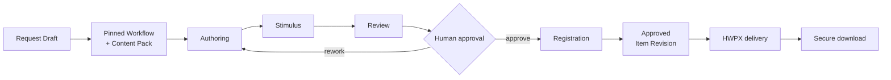
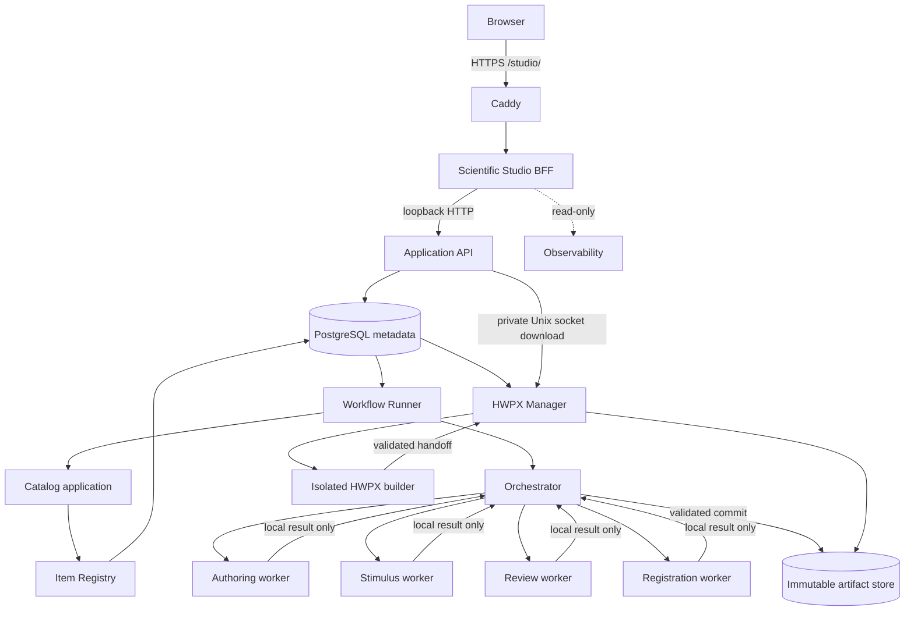

# EOM Scientific Studio

> 스키마 우선(schema-first)으로 문항을 생성·검토·등록하고, 재현 가능한 HWPX로 전달하는
> AI 기반 평가 문항 제작 플랫폼

EOM은 자연어 문항 요청을 곧바로 파일로 출력하는 단일 프롬프트 도구가 아닙니다. 요청을
버전이 고정된 Workflow와 Content Pack으로 실행하고, 격리된 역할별 worker의 결과를
검증하며, 사람의 승인을 거쳐 불변 Item Revision으로 등록한 뒤 HWPX 같은 전달 형식으로
투영합니다.

핵심 목표는 하나의 문항을 여러 번 복사하는 것이 아니라 다음 관계를 보존하는 것입니다.

```text
logical Item
  -> immutable Item Revision
    -> typed component pointers
      -> immutable Artifact Revisions
        -> SHA-256 content hashes
```

이 구조 덕분에 같은 승인 문항을 문항은행, 모의고사, 교재, 웹 미리보기, HWPX가 서로 다른
형식으로 사용하더라도 정본(canonical source)은 하나로 유지됩니다.

## 현재 가능한 일

- Scientific Studio에서 구조화된 새 문항 요청 생성
- Authoring → Stimulus → Review → Human Approval → Registration Workflow 실행
- Source Intake가 없는 샘플에서도 worker의 일반 과학 지식을 사용하는 문항 생성
- 표, 수식, 선택지, 해설, `ㄱ/ㄴ/ㄷ` 진술과 workflow 시점의 PNG 자극 자료 생성
- 승인된 결과를 `assessment-item-content/1.0` Item Revision으로 등록
- 승인된 EOM 문항 템플릿과 Kordoc 4.9.0을 이용한 HWPX 생성 및 보안 다운로드
- Workflow, Item, Revision, Artifact, HWPX build의 운영 상태와 이력 조회
- HTTPS BFF, RBAC, CSRF, HttpOnly/Secure cookie, private Unix socket 경계

현재 기본 생성선은 다음 불변 버전을 사용합니다.

| 경계 | 현재 기본 계약 |
| --- | --- |
| Workflow | `generic-item-development@1.4.0` |
| Role protocol | `workflow-role/1.3.0` |
| Role results | `authoring/image/review/registration-result@4.0` |
| Content Pack | `generated-knowledge-item@1.1.0` |
| Canonical item content | `assessment-item-content/1.0` |
| HWPX delivery profile | `eom-question-template-v1` |

이 버전들은 저장된 실행을 다시 해석하지 않도록 제자리에서 변경하지 않습니다. 계약 변경은
새 Schema, Protocol, Workflow, Content Pack 버전으로 추가합니다.

## 한 문항이 만들어지는 과정



1. 요청은 작은 typed brief로 정규화됩니다.
2. 실행 시점의 Workflow 정의, Content Pack release, Schema와 입력 포인터가 고정됩니다.
3. 역할별 worker는 Orchestrator를 통해서만 실행되고 서로 직접 통신하지 않습니다.
4. worker는 로컬 staged input만 읽고 로컬 structured result만 제출합니다.
5. Orchestrator가 JSON Schema 2020-12와 typed model로 결과를 검증한 뒤 Artifact를 커밋합니다.
6. 사람의 승인 후 Catalog가 하나의 승인된 Item Revision을 등록합니다.
7. HWPX adapter는 그 Revision과 템플릿 Revision을 고정해 새 Artifact Revision을 만듭니다.

## 시스템 구조



브라우저가 접근하는 공개 경계는 Caddy와 Scientific Studio뿐입니다. Application API,
Observability, Scientific Studio upstream, PostgreSQL은 loopback 또는 private socket 경계에
남습니다. worker와 HWPX builder는 DB·NAS·다른 worker에 직접 접근하지 않습니다.

## 설계 원칙

- **Protocol first:** worker 동작보다 JSON Schema 2020-12 계약을 먼저 정의합니다.
- **Pinned provenance:** 논리 ID, Revision ID, Artifact ID, Artifact Revision ID, Hash를
  구분하고 실행 이력은 특정 Revision을 고정합니다.
- **Fail closed:** 누락, stale pointer, schema/media mismatch, hash mismatch를 암묵적으로
  최신값으로 대체하지 않습니다.
- **One canonical artifact:** DB에는 관계와 작은 metadata만 저장하고 HWPX·PNG 같은 binary는
  Artifact Revision으로 관리합니다.
- **Orchestrated isolation:** worker 간 직접 통신과 DB/NAS 쓰기를 금지하고 Orchestrator만
  검증된 결과를 커밋합니다.
- **Explicit state machines:** Workflow, approval, job, HWPX build 상태를 명시적 전이표와
  append-only event로 관리합니다.
- **Idempotent boundaries:** HTTP command, Workflow step, registration, build는 각 경계의 입력
  identity와 hash로 replay를 판별합니다.
- **Human authority:** 자동 평가는 검토 증거이며 최종 승인 권한을 대체하지 않습니다.

## 저장소 구조

| 경로 | 책임 |
| --- | --- |
| `schemas/` | 외부·worker·service protocol의 canonical JSON Schema |
| `packages/` | domain contracts, identifiers, workflow, registry, API DTO |
| `services/` | Orchestrator, Workflow runner, Catalog, HWPX manager/builder |
| `apps/` | Application API, Scientific Studio, observability, `eomctl` |
| `config/workflows/` | 불변 Workflow 정의 |
| `content/packs/` | 버전이 고정된 Content Pack과 profile |
| `migrations/` | PostgreSQL schema revision |
| `infra/` | Conda, systemd, polkit 등 reviewed runtime source |
| `scripts/` | 설치, 검증, release, 격리 테스트 DB 도구 |
| `docs/architecture/` | 경계와 durable design decision |
| `docs/operations/` | 설치·검증·복구 runbook |

## 개발 시작

```bash
git clone git@github.com:teddyok1206/eomai.git
cd eomai
git status --short --branch
```

EOM은 여러 격리 runtime을 사용하는 운영형 저장소입니다. ambient Python이나 system Python에
의존하지 말고 `infra/conda/`의 환경 정의와 해당 runbook을 사용하십시오. 배포 호스트의
일반적인 정적 gate는 다음과 같습니다.

```bash
/srv/eom/conda/envs/eom-api/bin/python -m ruff format --check --no-cache .
/srv/eom/conda/envs/eom-api/bin/python -m ruff check --no-cache .
/srv/eom/conda/envs/eom-api/bin/python -m mypy --cache-dir=/tmp/eom-mypy-cache
scripts/infra/check_repository_boundaries.sh
git diff --check
```

PostgreSQL integration test는 배포 DB가 아니라
[`API_INTEGRATION_TEST_DATABASE.md`](docs/operations/API_INTEGRATION_TEST_DATABASE.md)의 disposable
test DB 절차로만 실행합니다. live Codex, privileged, HWPX reference test는 opt-in marker로
분리되어 있으며 기본 test run이 사용량이나 운영 상태를 소비하지 않습니다.

## “1문제 만들기”를 상위 제품에서 재사용하기

다음 단계의 유력한 출발점은 현재 파이프라인을 복제하는 별도 framework가 아니라
**Single Item Production Capability**라는 application-level 경계로 감싸는 것입니다. 다만 이
문서는 process manager, projection/facade, composite workflow, 향후 별도 coordinator를 확정하지
않고 선택 조건과 전환 경로를 함께 비교합니다. 공통적으로 capability의 주 출력은 HWPX 파일보다
승인된 `ItemRevisionPointer`에 가깝습니다. 단일 HWPX는 선택적 delivery로 둘 수 있고,
교재·모의고사는 여러 Item Revision을 순서대로 고정한 Assembly manifest를 만든 뒤 collection
renderer를 실행할 수 있습니다.

```text
Textbook / Mock exam / Item bank
  -> Single Item Production Capability (N회, bounded concurrency)
    -> existing Workflow + Registry
    -> approved Item Revision pointers
  -> ordered Assessment Assembly Revision
  -> publication profile / HWPX / PDF / Web
```

대안별 계약, 상태 소유권, idempotency, queue/index 설계, 품질 gate, 운영 SLO, 선택 기준과 최신
연구 근거는
[`SINGLE_ITEM_PRODUCTION_CAPABILITY.md`](docs/architecture/SINGLE_ITEM_PRODUCTION_CAPABILITY.md)에
정리되어 있습니다.

## 핵심 문서

- [Assessment Item Content V1](docs/architecture/ASSESSMENT_ITEM_CONTENT_V1.md)
- [Generated Item Authoring Contract v1.3](docs/architecture/GENERATED_ITEM_AUTHORING_CONTRACT_V1_3.md)
- [Knowledge-backed Item Workflow V1](docs/architecture/KNOWLEDGE_ITEM_WORKFLOW_V1.md)
- [Workflow Runtime Execution Boundary](docs/architecture/WORKFLOW_EXECUTION_BOUNDARY.md)
- [Codex Session, Execution Preset, and Worker Capacity Design](docs/architecture/CODEX_SESSION_PRESETS_AND_CAPACITY.md)
- [Education Knowledge and Assessment Item GraphRAG Design](docs/architecture/EDUCATION_KNOWLEDGE_ITEM_GRAPHRAG.md)
- [Codex and Education Knowledge Control Plane Implementation Plan](docs/architecture/CODEX_KNOWLEDGE_CONTROL_PLANE_IMPLEMENTATION_PLAN.md)
- [Item Origin, Organization, and Assessment Occurrence V1 Design](docs/architecture/ITEM_ORIGIN_OCCURRENCE_V1_DESIGN.md)
- [Product, Form, Assembly, Publication, Usage, and Distribution V1 Design](docs/architecture/PRODUCT_FORM_ASSEMBLY_USAGE_V1_DESIGN.md)
- [Knowledge Analysis Intake and Workflow V1](docs/architecture/KNOWLEDGE_ANALYSIS_INTAKE_WORKFLOW_V1.md)
- [Codex Control-Plane MVP Operations](docs/operations/CODEX_CONTROL_PLANE_MVP.md)
- [Codex and Education Knowledge Phase 0 Baseline](docs/architecture/CODEX_KNOWLEDGE_PHASE0_BASELINE.md)
- [Education Graph V0 Acceptance Queries](docs/architecture/EDUCATION_GRAPH_V0_ACCEPTANCE_QUERIES.md)
- [Item Registry V0](docs/architecture/ITEM_REGISTRY_V0.md)
- [HWPX Application API V0](docs/architecture/HWPX_APPLICATION_API_V0.md)
- [Web GUI V0](docs/architecture/WEB_GUI_V0.md)
- [Application API V0](docs/architecture/APPLICATION_API_V0.md)
- [Scientific Studio public handover](docs/operations/SCIENTIFIC_STUDIO_PUBLIC_HANDOVER.md)
- [Repository agent rules](AGENTS.md)

## 보안 주의

Secret, token, credential, `.env`, Codex auth, SSH key, DB URL을 Git에 넣지 마십시오. 외부 파일은
모두 untrusted input으로 취급하고, binary와 장기 log는 manifest가 있는 Artifact storage에
보관합니다. 저장소의 `AGENTS.md`는 사람과 자동화 모두에게 적용되는 필수 개발 규칙입니다.
