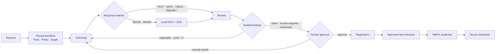
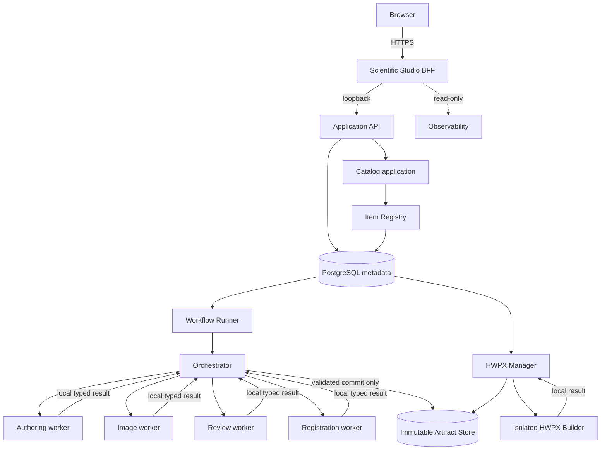

# EOM Scientific Studio

> 기출·교과서 근거를 검색하고, 역할별 검증과 사람 승인을 거쳐 문항을 등록한 뒤 HWPX로
> 전달하는 protocol-first 평가 문항 제작 플랫폼

EOM은 하나의 프롬프트가 문항 파일을 바로 만드는 도구가 아닙니다. 요청 시점의 Workflow,
Content Pack, 실행 정책과 RAG 근거를 불변 Revision으로 고정하고, 격리된 worker의 구조화 결과를
JSON Schema 2020-12와 Pydantic으로 검증합니다. 승인된 결과만 Item Revision으로 등록되며 PNG와
HWPX는 그 정본을 참조하는 별도 Artifact Revision입니다.

```text
logical Item
  -> immutable Item Revision
    -> typed component pointers
      -> immutable Artifact Revisions
        -> SHA-256 content hashes
```

## 지금 할 수 있는 일

- Scientific Studio에서 통합과학 단일 문항을 요청하고 진행 상태 확인
- Authoring → Image(조건부) → Review → 최대 3회 bounded 개선 → Human Approval → Registration 실행
- 검증된 기출 PDF Graph를 검색해 Evidence Bundle을 만들고, 인용한 evidence·anchor·문항 적용
  위치를 authoring/review 영수증으로 다시 검증
- 표, 수식, `<자료>`, `<조건>`, 탐구, `ㄱ/ㄴ/ㄷ`, 5지선다와 해설을 구조화된 Item으로 등록
- 로컬 GPU 이미지와 결정론적 SVG를 합성하되 외부 LLM·이미지 API는 사용하지 않음
- 승인 Item Revision을 단일 문항 또는 시험지 HWPX로 만들고 보안 다운로드
- 승인 문항, HWPX build, RAG 학습 현황과 Codex slot 사용 상태 조회
- 25문항 모의고사 생산 계획·실행·검토·퇴역을 불변 checkpoint와 영수증으로 관리

## 현재 저장소 릴리스 선

아래 값은 기존 실행의 의미를 바꾸지 않고 추가된 최신 계약입니다. 저장소에 존재한다는 사실과
운영 환경에서 현재 활성화되었다는 사실은 구분합니다. 정확한 활성 상태는 Studio와 서비스
readiness가 정본입니다.

| 경계 | 최신 additive 계약 |
| --- | --- |
| 단일 문항 Workflow | `generic-item-development@1.13.0` |
| 역할 protocol / 결과 | `workflow-role/1.24.0` / `authoring·image·review·registration-result@12.0` |
| Content Pack | `generated-knowledge-item@1.19.0` |
| 표준 / RAG 실행 정책 | `standard-control-bootstrap/17.0` / `knowledge-item-control-bootstrap/14.0` |
| Canonical Item | `assessment-item-content/3.0`, Catalog protocol `catalog/1.13` |
| HWPX | `hwpx-content-team/3.0` |
| 로컬 GPU prompt policy | `local-gpu-image-prompt-policy/1.4` |
| 기출 풀이보고서 Workflow | `knowledge-analysis@10.0.0`, result `@10.0` |
| 자료 형식 | `content-team-material-requirement/1.0`, Item Brief `4.0` |
| 25문항 생산 | `mock-exam-production-plan/5.0`, execution `5.0` |
| 제품 내 고객지원 | `customer-support@1.0.0`, role `workflow-role/1.22.0` |
| 교육 문서 검토 | `pdf-document-review@1.2.0`, role `workflow-role/1.27.0`, result `@3.0`, plan `15.0` |
| PDF 검토 주석 | request `document-review-pdf-annotation/3.0`, Catalog protocol `catalog/1.22` |

단일 문항의 최신 Graph 검증 successor는 정답·①~⑤·선택적 ㄱ/ㄴ/ㄷ·해설·교육과정·독창성·시각자료를
각각 독립 판정합니다. Review worker는 verdict 전에 검증 대상과 필요한 source class를 계획하고,
시각자료가 있으면 이미지·표와 본문·선택지·해설의 일치를 먼저 확인합니다. 의심 사항은
`CONFIRMED`, `DEMOTED`, `UNCERTAIN`으로 구분하며, 실제 차단 finding은 `CONFIRMED`에서만 만들 수
있습니다. 구조가 복잡하거나 불확실성이 남은 문항은 Orchestrator가 정확한 source review Artifact와
검증 대상을 고정한 directive를 발급해 더 강한 독립 검토를 최대 한 번만 실행합니다. 첫 검토는
덮어쓰지 않고 `SUPERSEDED` lineage로 보존되며, worker끼리 직접 통신하지 않습니다.

Graph 모드에서는 Evidence Bundle에 연결된 승인 풀이보고서를 과학 검증에 실제로 사용해야 합니다.
Orchestrator는 검토 결과의 evidence·anchor·문항 JSON Pointer뿐 아니라 검토가 요구한 source class가
정확한 pinned manifest에 실제로 존재하는지도 대조하고, `evidence-usage-validation-receipt/3.0`을 같은
commit transaction에 남깁니다. Catalog는 등록 전에 source review와 선택된 최종 review의 pointer,
attempt, directive, receipt self-hash를 다시 확인합니다. 일반지식 모드도 근거를 가장할 수 없고 같은
draft 결속 검증을 받습니다. 교정 가능한 확정 finding은 정확한 이전 authoring/review Artifact pointer와
typed directive로 최대 세 번 다시 작성·검토하며, 불확실성·근거 변경·정책 판단과 소진된 개선 횟수는
사람 게이트로 보냅니다. 사람 최종 승인은 그대로 유지됩니다.

문서 검토는 Item result schema와 분리된 additive protocol입니다. PDF·HWP·HWPX 원본을 불변
Artifact Revision으로 보존하고, HWP/HWPX는 격리된 LibreOffice/H2Orestart adapter가 만든 PDF
projection을 기존 페이지/영역 anchor 검토 Workflow에 전달합니다. PDF와 HWP는 검토 전용입니다.
HWPX에서 worker가 확정한 정확한 `REPLACE` 지적만 사용자가 선택하면 원본을 덮어쓰지 않고 새
HWPX 교정본을 만들며, 바뀐 글자만 빨간색으로 표시합니다. 교정 출력은 HWPX만 제공하고 PDF/HWP
수정본을 만들지 않습니다. 문제지와 해설지를 함께 올리면 두 문서를 별도 Revision으로 고정하고,
각 문항의 문제 위치와 대응 정답·해설 위치를 역할별 anchor로 교차 검증합니다. 최신 V3 계약은
과학적 정확성·정답 유일성·해설 일치·교육과정·독창성·시각 자료·편집 명료성·타이포그래피·문서
구조·평가 균형의 정확히 10개 target을 각각 요구합니다. 문항마다 독립 풀이 요약과 순서화된 풀이
단계, 검산 답, 조건 충분성, 단위 검사, 모든 선지 판정, 해설 단계 검증과 문제지·해설지 anchor를
구조적으로 남깁니다.
결과는 검증 target → 후보 재확인 → 확정 finding 순서로 남고, 확정 finding만 화면과 파생 산출물에
표시됩니다.

V3 문서 검토는 업로드된 두 PDF의 검증된 텍스트에서 bounded term set을 만들고, 현재 Graph의
indexed node-term 관계로 정확한 topic scope를 결정합니다. Catalog가 만든 Evidence Bundle V5의
evidence·anchor를 문항별 풀이·답·결론의 scalar JSON Pointer에 인용하고, Orchestrator가 plan,
Graph revision, manifest/context hash, solution evidence와 인용 위치를 NAS commit 전에 다시
검증합니다. self-hashed `document-review-evidence-validation-receipt/1.0`은 결과 Artifact와 같은
`ARTIFACT_COMMITTED` event에 남습니다. `ORIGINALITY=INSUFFICIENT`를 포함해 어느 target이나 문항별
검사가 확정되지 않으면 전체 상태는 `NEEDS_HUMAN_DECISION`이며 `COMPLETE`가 될 수 없습니다.

다운로드용 주석 PDF는 원본을 바꾸지 않는 별도 Artifact입니다. 빨간 번호 상자를 유지하면서 표준
PDF `/Square` 주석에 제목·분류·심각도·설명·수정 권고를 넣으므로 Acrobat·한컴 등 호환 viewer의
주석 패널에서도 내용을 볼 수 있습니다. Graph-grounded V3 결과도 result V3 pointer를 사용하는
annotation request V3를 통해 같은 native panel 출력 경계로 전달됩니다. 과거 read-only 실물 감사의
result `@2.0`은 14쪽 문제지와 7쪽 해설지 전체에 anchor를 남겼지만 전 축·문항별 검증을 강제하지
않았으며 그 역사적 bytes와 의미는 그대로 보존됩니다. 최신 보강 설계는
[Document Review Detail Audit](docs/status/DOCUMENT_REVIEW_DETAIL_AUDIT_2026-09-24.md), 불변식과
격리 경계는 [ADR 0104](docs/adr/0104-office-document-review-and-redline-hwpx.md),
[ADR 0105](docs/adr/0105-paired-document-review-and-annotated-pdf.md),
[ADR 0110](docs/adr/0110-native-pdf-review-comment-panel.md),
[ADR 0111](docs/adr/0111-graph-grounded-exhaustive-document-review.md)에 기록돼 있습니다.

`mock-exam-production-plan/5.0`은 Workflow 1.10, role 1.20, Pack 1.16.1, Item Brief 4.0과
자료 형식 1.0을 함께 고정합니다. V5는 선택된 자료 형식을 authoring의 단일 권위로 사용합니다.
각 문항이 요구하는 `TEXT`, `DATA`, `TABLE`, `IMAGE`, `MIXED`, `INQUIRY`에서 이미지 step과 RAG
검색 요소를 파생하며, V1–V4 계획과 checkpoint는 기존 실행 재현을 위해 그대로 읽을 수 있고
의미를 바꾸지 않습니다.

제품 내 고객지원은 현재 운영에 활성화된 additive 기능입니다. 인증된 사용자가 Scientific
Studio에서 bounded 문의를 등록하면 기존 Workflow command·lease·격리 worker·Artifact commit
경계를 그대로 사용해 slot 06의 `gpt-5.6-terra`가 한국어 답변을 생성합니다. 상주 모델 process를
두거나 Web에서 Codex를 직접 호출하지 않으며, support worker는 읽기 전용·network disabled이고
배포·승인·재시도·DB/NAS 변경을 할 수 없습니다. 운영 활성화 여부는 source 존재와 별개이며,
[고객지원 rollout runbook](docs/operations/CUSTOMER_SUPPORT_ROLLOUT.md)의 배포·canary gate로만
판정합니다. 새 disposable PostgreSQL에서 migration 왕복, runtime-role reconciliation, 정상적인
`DRAFT`→`RELEASED` immutable preset replay, V3/V4 capacity 공존과 owner-history index 사용까지
검증했고, 호환 API/Web/worker 배포 뒤 실제 문의 1건이 `ANSWERED`에 도달했습니다. 동일
idempotency key의 exact replay는 같은 Workflow를 반환하고 두 번째 worker를 실행하지 않았습니다.
상세한 content-free 증거는
[고객지원 live acceptance](docs/status/CUSTOMER_SUPPORT_ACCEPTANCE_2026-09-17.md)에 기록합니다.

## RAG 학습의 의미와 현재 기준선

EOM에서 “기출 학습”은 모델 weight training이 아니라 PDF를 검증 가능한 문항·페이지·anchor와
Graph evidence로 구조화하는 RAG ingestion입니다. 현재 typed corpus 기준선은 기출 PDF 50개와
occurrence-backed 승인 기출 문항 분석 520개입니다. 별도로 승인된 trusted-RAG 카나리 문항은
신규 문항의 독립 lineage이며 이 520개 풀이보고서 target에 합산하지 않습니다. 생성 worker는 원
PDF 전체를 복사받지 않고, 권한·Revision·Schema·Hash를 확인한 Evidence Bundle의 bounded
context만 받습니다.

근거를 실제로 사용했는지는 `graph_grounded=true` 같은 boolean 하나로 판정하지 않습니다.
Authoring과 Review가 동일한 evidence와 anchor, 문항 JSON Pointer를 선언하고 Orchestrator가
Graph snapshot 및 Artifact bytes에 대해 이를 재검증한 영수증을 남깁니다. 기출 풀이 논리와
개념→출제요소 연결은 기존 분석을 바꾸지 않는 additive 풀이보고서 Artifact로 축적합니다.

사용자 화면은 시험지 수, 승인 문항 수, 풀이보고서 완료 수처럼 corpus 전체 기준으로 보여 줍니다.
내부 batch는 실행·복구 구현 세부사항이므로 노출하지 않습니다. ID와 hash 기반 조회 기능은 운영과
관리자 감사를 위해 유지하되 기본 화면에서는 숨기고 필요한 상세 화면에서만 제공합니다.

Scientific Studio의 완성 문항 미리보기는 Item Preview 3.0으로 V1/V2/V3 정본을 하나의 bounded
표현 계약에 투영합니다. 표만 있는 자료는 native 표로, 그림은 승인된 Item Revision의 같은-origin
visual URL로 표시합니다. 조회 실패나 빠른 문항 전환이 발생하면 이전 편집·HWPX 대상은 즉시
해제되고 늦게 도착한 이전 응답은 무시됩니다. 브라우저 route, BFF route, Application OpenAPI,
상태 어휘, DOM/module, wheel 파일 목록은 자동 정합성 검사로 함께 변경되어야 합니다. 자세한
경계는 [Item Preview V3](docs/architecture/ITEM_PREVIEW_V3.md)에 정리했습니다.

## 한 문항이 만들어지는 과정



1. 작은 typed request를 검증하고 현재 Workflow·Pack·실행 정책 Revision을 고정합니다.
2. Catalog가 pinned Graph에서 bounded Evidence Bundle을 만들고 Orchestrator가 local workspace에
   materialize합니다.
3. Worker는 서로 통신하지 않고 staged input을 읽어 typed local result만 제출합니다.
4. Orchestrator는 schema, pointer, hash, RAG citation과 state transition을 검증한 뒤에만 NAS에
   canonical Artifact를 커밋합니다.
5. 사람 승인 후 Catalog가 Item Revision을 등록합니다.
6. HWPX Manager는 Item Revision과 HwpQuestionEditor handoff를 고정해 전달 Artifact를 만듭니다.

## 이미지와 HWPX 배치 계약

콘텐츠팀장 원문 두 개와 KICE 삽화 가이드는 원본 bytes와 SHA-256을 그대로 보존합니다. Image
worker는 세 파일을 순서대로 모두 읽고 authoring 결과의 실제 `visuals` 배열에서 IMAGE slot만
투영합니다.

| 학생에게 보이는 자료 구조 | PNG | HWPX 배치 |
| --- | --- | --- |
| TEXT / DATA / INQUIRY | 생성하지 않음 | 각 native 본문·자료·탐구 구조만 배치 |
| TABLE 1개 | 생성하지 않음 | 편집 가능한 native 표 1개, panel label·빈 이미지 칸 없음 |
| TABLE 2개 | 생성하지 않음 | 서로 다른 표 칸에 native 표 2개, `(가)/(나)`는 편집 가능한 텍스트 |
| IMAGE 1개 | PNG 1개 | `(가)/(나)` 없이 단일 영역 |
| IMAGE 2개 | 서로 다른 PNG 2개 | 서로 다른 표 칸에 배치하고 `(가)/(나)`는 편집 가능한 텍스트 행 |
| IMAGE + TABLE | IMAGE slot에만 PNG 1개 | 실제 요소 순서를 유지하고 두 요소 모두 panel label 없음 |

즉 `<자료>`가 그림 없이 표 하나인 문항은 정상적인 독립 형식입니다. `TABLE_ONLY`는 정확히
`PNG 0개 + native 표 1개 + panel label 0개 + 이미지 placeholder 0개`이며 Image worker를
실행하지 않습니다. 표를 이미지로 바꾸거나 빈 1행 2열 이미지 틀을 만드는 것은 계약 위반입니다.

`A`, `B`, `P`, `Q`, 축, 수치 같은 과학적 표시는 panel label과 다릅니다. 이 값은 GPU 픽셀이
아니라 sanitizer를 통과한 결정론적 SVG overlay가 담당합니다. 로컬 GPU에는 worker가 작성한 짧은
의미 설명과 흑백·흰 배경·장식 금지 정책만 전달하고, 전체 팀장 원문과 정확한 기하·label은
Artifact provenance와 검증 단계에 남깁니다. HWPX staging은 symlink를 따르지 않는 file descriptor,
bounded read, SHA-256, identity 재확인과 fresh-target copy를 사용합니다.

서로 다른 자료 형식을 한 시험지로 합칠 때 per-Item HWPX header가 완전히 같은 bytes가 아닐 수
있습니다. Whole-exam renderer는 기존 정의가 정확한 prefix인 append-only header superset만
선택하고, 같은 ID의 의미가 바뀌거나 두 header가 비교 불가능하면 실패합니다. 일반적인 XML 합성이나
style ID 재번호 매기기는 하지 않습니다.

자세한 경계와 실패 규칙은
[Content-team prompt to HWPX preflight](docs/adr/0076-content-team-prompt-to-hwpx-preflight.md)에
정리되어 있습니다.

## 시스템 구조



Browser가 접근하는 공개 경계는 Scientific Studio뿐입니다. Worker와 HWPX Builder는 DB·NAS·다른
worker에 직접 접근하지 않습니다. PostgreSQL에는 binary나 전체 문항 복사본 대신 identity,
Revision, 관계, 상태, pointer와 hash만 저장합니다.

## 설계 원칙

- **Protocol first:** JSON Schema 2020-12를 먼저 추가하고 Pydantic과 동작을 뒤따르게 합니다.
- **Pinned provenance:** logical ID, revision ID, Artifact ID, Artifact Revision ID와 content hash를
  서로 다른 불변 개념으로 유지합니다.
- **Fail closed:** missing, stale, lifecycle, schema/media, permission, hash 불일치를 최신값으로
  대체하지 않습니다.
- **One canonical artifact:** workspace는 임시 materialization이며 정본은 등록된 Revision입니다.
- **Orchestrated isolation:** worker 간 직접 통신과 NAS 쓰기를 금지합니다.
- **Explicit state machines:** Workflow, job, approval, build와 lease는 전이표와 append-only event로
  관리합니다.
- **Idempotent boundaries:** HTTP command, Workflow step, registration과 build는 입력 identity로
  exact replay와 conflict를 구분합니다.
- **Human authority:** 자동 검토는 증거이고 최종 승인은 사람의 결정입니다.

## 현재 검증 상태

2026-09-15 로드맵 상태는 다음과 같습니다. Preview V3와 인증 HWPX 다운로드는 사용자가 실제
브라우저에서 확인했고, Hancom 내부 레이아웃·편집성은 최종 수동 확인 목록에 남아 있습니다.
기존 25문항은 개별 HWPX 25개가 아니라 하나의 승인 Assembly와 whole-exam HWPX로 제공되는 것이
현재 제품 계약입니다.

- S01–S04 자동화 경계: PASS; Gate A browser/download: PASS;
- M02: 기존 25문항의 사람 품질평가 worksheet 준비 완료, 평가는 진행 전;
- M03 자동 UX 기반과 M04 관리자 관측성: PASS;
- L01 제한 교과서 evidence 기술 파일럿: PASS, 교육적 개선 효과는 미평가;
- L02 반복 생산 기술 경계: PASS, M02 결과 전 새 25문항 생성은 시작하지 않음;
- L03 두 support slot 측정: 33.5분 동안 17개 승인, 백업 manifest source hardening PASS;
- M01 풀이보고서: 520/520 완료. typed projection은 active/pending/failed 0, accepted successor
  중복 0이며, 완료 집합의 canonical SHA-256은
  `sha256:d3ec932f2b85cf44b8289b5bf77459f5e40c86071139ffb982473472ab522520`입니다.

M01 처리 중 실패한 17개 terminal attempt는 감사 이력으로 보존되며 현재 실패로 재해석하지
않습니다. 최종화 시 자동 수집 모드는 `DISABLED`로 되돌렸고 슬롯 05/06용 accelerator는 공식
manager를 통해 제거했습니다. canonical Workflow runner 하나만 유지됩니다. 상세 증거는
[M01 기록](docs/status/M01_SOLUTION_REPORT_BACKFILL_2026-09-15.md)과
[L03 기준선](docs/status/L03_SOLUTION_REPORT_CAPACITY_BASELINE_2026-09-15.md)에 있습니다.

2026-09-13 저장소 후보는 runtime별 명시적 환경에서 non-live 테스트 2,916개를 통과했고, 158개
live·DB·privileged opt-in 테스트는 조건 미설정으로 skip했습니다.

- API·domain·Catalog·Orchestrator·GUI: 2,755 passed / 35 skipped
- HWPX 전체 + local image adapter: 160 passed / 1 skipped
- PostgreSQL integration collection: 1 passed / 122 skipped
- Ruff format/check 전체 1,301개 파일, strict mypy 414개 source 파일
- V4 schema 재생성, JSON Schema 2020-12, canonical/package byte parity, shell syntax와 Git whitespace

세 release wheel을 실제로 만들고 V4 plan/execution schema와 HWPX renderer가 저장소 원본과
byte-for-byte 같은지도 확인했습니다.

이후 2026-09-14에는 현재 release 선에서 API suite 511개가 통과하고 14개 opt-in이 skip됐으며,
HWPX 전체 및 관련 Application 경계 225개가 통과하고 privileged 1개가 skip됐습니다. HWPX
persistence 6개는 운영 DB가 아닌 명시적 disposable PostgreSQL에서 실행됐고, migration·runtime
role·release wheel 검증까지 통과한 뒤 그 DB를 제거했습니다.

Item Preview 3.0과 프론트엔드–백엔드 정합성 게이트를 포함한 최신 저장소 후보는 표준 non-live
진입점에서 API/domain/Catalog/Orchestrator/Studio 2,924개, HWPX/local-image 197개, integration
collection 순수 테스트 1개를 통과했습니다. live·DB·privileged opt-in 162개는 운영 환경으로
우회하지 않고 명시적으로 skip했습니다. Ruff는 1,331개 파일, strict mypy는 417개 source를
통과했습니다.

2026-09-18 Graph-RAG 독립 검토 V11 저장소 후보는 API/domain/Catalog/Orchestrator/Studio
3,020개와 HWPX/local-image 197개를 통과했습니다. 환경이 필요한 테스트는 API 36개, HWPX 1개,
PostgreSQL integration 127개를 운영 환경으로 우회하지 않고 skip했으며 integration collection의
순수 테스트 1개는 통과했습니다. Ruff format/check는 1,383개 파일, strict mypy는 420개 source,
successor schema generator idempotence와 release wheel의 새 schema 8개 및 RECORD hash도 통과했습니다.
이 결과는 저장소 후보 검증이며 운영 활성화나 live 문항 품질 판정을 의미하지 않습니다.

2026-09-21 Graph 검증 계획·시각자료 우선 검토·의심 사항 삼분류·1회 독립 강화 검토를 결합한
successor 저장소 후보는 focused 335개(guarded skip 33개), 나머지 전체 unit 2,231개,
API/Studio 739개(guarded skip 14개)를 통과했습니다. PostgreSQL/live opt-in은 운영 환경으로
우회하지 않았습니다. Ruff
format/check는 1,418개 파일, strict mypy는 422개 source를 통과했고 새 schema/control/Pack generator의
재실행도 byte-stable했습니다. 이미지 provider 전용 두 component test는 해당 명시적 image runtime에
pytest가 없어 실행하지 않았으며, 변경되지 않은 provider 구현의 PASS로 과장하지 않습니다. 이 후보는
Workflow 1.13, role 1.24, result @12, receipt 3.0, Pack 1.19, standard 17, knowledge 14를 한 release set으로
요구하며 아직 운영 활성화나 실제 문항의 교육 품질 PASS를 의미하지 않습니다.

Pack 1.16.1과 production plan/execution 5.0은 운영에서 실제 25문항 생성·검토·승인·등록까지
완료했습니다. 같은 immutable Item set을 공식 HWPX API로 빌드해 25개 section, native 수식 81개,
native 표 7개, visual 13개와 PNG 6개를 검증했고, 출력의 SHA-256·ZIP entry·CRC·경로 안전성도
재확인했습니다. 로그인한 Studio 사용자는
[검증된 25문항 HWPX를 다운로드](https://eomai.duckdns.org/studio/api/v1/mock-exam-hwpx/builds/hwpxbuild_f3686d5ca87042e390537464a49f1878/download)할 수 있습니다.

기출 풀이보고서 보강의 모집단은 occurrence-backed 원 기출 분석 520개이며 별도 trusted-RAG
canary는 의도적으로 제외합니다. 2026-09-16 최종 typed projection은 520/520 완료,
active/pending/current-failed 0, 중복 accepted successor 0입니다. 처리 중 검증 실패 이력은 보존했고,
DB row를 수정하거나 실패를 성공으로 재해석하지 않았습니다. 완료 집합 SHA-256, 자동화 종료와
임시 runner 제거 증거는 M01 상태 문서에 고정했습니다.

더 자세한 구현/운영 구분과 남은 경계는
[Current System Status](docs/status/CURRENT_SYSTEM_STATUS.md)를 참고하십시오.

## 저장소 구조

| 경로 | 책임 |
| --- | --- |
| `schemas/` | canonical JSON Schema 2020-12 |
| `packages/` | domain contracts, typed pointer, identifier, API DTO |
| `services/` | Orchestrator, Workflow Runner, Catalog, HWPX Manager/Builder |
| `apps/` | Application API, Scientific Studio, observability, `eomctl` |
| `config/workflows/` | 불변 Workflow 정의 |
| `config/control-plane/` | 버전 고정 실행·지식 정책 |
| `content/packs/` | Content Pack, role profile과 prompt template |
| `migrations/` | PostgreSQL schema revision |
| `infra/` | 명시적 Conda, systemd와 운영 경계 |
| `scripts/` | schema 생성, 검증, release와 격리 test 도구 |
| `docs/adr/` | 변경 이유와 불변성 결정 |
| `docs/operations/` | 설치·검증·복구 runbook |

## 개발과 검증

```bash
git clone git@github.com:teddyok1206/eomai.git
cd eomai

/srv/eom/conda/envs/eom-api/bin/ruff format --check .
/srv/eom/conda/envs/eom-api/bin/ruff check .
/srv/eom/conda/envs/eom-api/bin/python -m mypy --cache-dir=/tmp/eom-mypy-cache
scripts/infra/test_repository_non_live.sh
scripts/infra/check_repository_boundaries.sh
git diff --check
```

각 runtime은 `infra/conda/`의 명시적 환경을 사용합니다. HWPX test는 `eom-hwpx`, API·Catalog·
Orchestrator test는 `eom-api`, 실제 GPU runtime은 `eom-image` 환경에서 실행합니다. 위 스크립트는
서로 다른 Pydantic runtime을 한 Python process에 섞지 않고 non-live suite를 분리하며, live·DB·
privileged opt-in 변수가 설정돼 있으면 실행을 거부합니다. PostgreSQL integration은 배포 DB가 아니라
[API Integration Test Database](docs/operations/API_INTEGRATION_TEST_DATABASE.md)의 disposable DB를
사용해야 합니다.

## 핵심 문서

- [Current System Status](docs/status/CURRENT_SYSTEM_STATUS.md)
- [Document Review Detail Audit](docs/status/DOCUMENT_REVIEW_DETAIL_AUDIT_2026-09-24.md)
- [M01 Solution-report Backfill Recovery](docs/status/M01_SOLUTION_REPORT_BACKFILL_2026-09-15.md)
- [M02 25-Item Educational Review Baseline](docs/status/M02_25_ITEM_EDUCATIONAL_REVIEW_BASELINE_2026-09-15.md)
- [Repository agent rules](AGENTS.md)
- [Knowledge-backed Item Execution V3](docs/architecture/KNOWLEDGE_BACKED_ITEM_EXECUTION_V3.md)
- [Trusted Evidence Registration Gate](docs/architecture/TRUSTED_EVIDENCE_REGISTRATION_GATE.md)
- [Mock-exam Trusted RAG Production V3](docs/architecture/MOCK_EXAM_TRUSTED_RAG_PRODUCTION_V3.md)
- [Material-first Item and independent HWPX acceptance](docs/adr/0077-material-first-item-and-independent-hwpx-acceptance.md)
- [HWPX whole-exam append-only header merge](docs/adr/0078-hwpx-exam-header-superset-merge.md)
- [HWPX explicit equation and output acceptance](docs/adr/0090-content-team-explicit-equation-and-output-acceptance.md)
- [Education Knowledge and Assessment Item GraphRAG](docs/architecture/EDUCATION_KNOWLEDGE_ITEM_GRAPHRAG.md)
- [Additive Past-exam Solution Reports](docs/adr/0073-additive-past-exam-solution-reports.md)
- [Batch-independent Solution Scheduling](docs/adr/0074-batch-independent-additive-solution-scheduling.md)
- [Local GPU Image Orchestration](docs/architecture/LOCAL_GPU_IMAGE_ORCHESTRATION_V1.md)
- [Local GPU Image Prompt Policy](docs/architecture/LOCAL_GPU_IMAGE_PROMPT_POLICY_V1.md)
- [HWPX Application API](docs/architecture/HWPX_APPLICATION_API_V0.md)
- [Scientific Studio Design System](docs/product/EOM_SCIENTIFIC_WORKBENCH_DESIGN_SYSTEM.md)
- [Application API Troubleshooting](docs/operations/API_TROUBLESHOOTING.md)

## 보안

Secret, token, credential, `.env`, Codex auth, SSH key와 DB URL을 Git에 넣지 않습니다. 외부 파일은
모두 untrusted input으로 취급합니다. HWPX, PNG, AI, PDF, 장기 log와 backup은 Git이나 PostgreSQL이
아니라 manifest가 있는 Artifact storage에 보관합니다. 새 EOM service는 port 8000을 사용하지
않으며 Application API의 예약 bind는 `127.0.0.1:8765`입니다.
