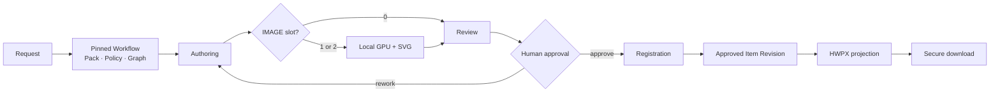
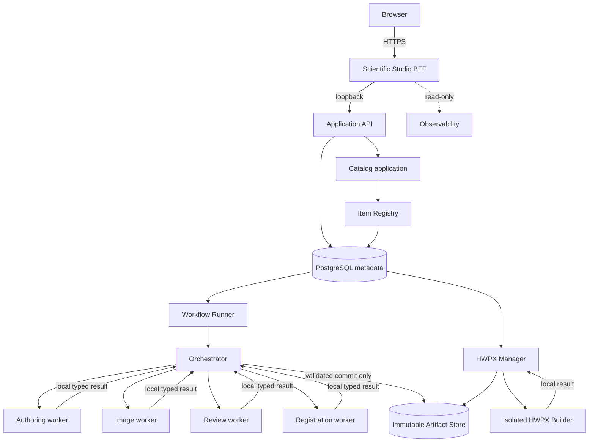

# EOM Scientific Studio

> 기출·교과서 근거를 검색하고, 역할별 검증과 사람 승인을 거쳐 문항을 등록한 뒤 HWPX로
> 전달하는 protocol-first 평가 문항 제작 플랫폼

EOM은 하나의 프롬프트가 문항 파일을 바로 만드는 도구가 아닙니다. 요청 시점의 Workflow,
Content Pack, 실행 정책과 RAG 근거를 불변 Revision으로 고정하고, 격리된 worker의 구조화 결과를
JSON Schema 2020-12와 Pydantic으로 검증합니다. 승인된 결과만 Item Revision으로 등록되며 PNG와
HWPX는 그 정본을 참조하는 별도 Artifact Revision입니다.

```text
logical Item
  -> immutable Item Revision
    -> typed component pointers
      -> immutable Artifact Revisions
        -> SHA-256 content hashes
```

## 지금 할 수 있는 일

- Scientific Studio에서 통합과학 단일 문항을 요청하고 진행 상태 확인
- Authoring → Image(조건부) → Review → Human Approval → Registration 실행
- 검증된 기출 PDF Graph를 검색해 Evidence Bundle을 만들고, 인용한 evidence·anchor·문항 적용
  위치를 authoring/review 영수증으로 다시 검증
- 표, 수식, `<자료>`, `<조건>`, 탐구, `ㄱ/ㄴ/ㄷ`, 5지선다와 해설을 구조화된 Item으로 등록
- 로컬 GPU 이미지와 결정론적 SVG를 합성하되 외부 LLM·이미지 API는 사용하지 않음
- 승인 Item Revision을 단일 문항 또는 시험지 HWPX로 만들고 보안 다운로드
- 승인 문항, HWPX build, RAG 학습 현황과 Codex slot 사용 상태 조회
- 25문항 모의고사 생산 계획·실행·검토·퇴역을 불변 checkpoint와 영수증으로 관리

## 현재 저장소 릴리스 선

아래 값은 기존 실행의 의미를 바꾸지 않고 추가된 최신 계약입니다. 저장소에 존재한다는 사실과
운영 환경에서 현재 활성화되었다는 사실은 구분합니다. 정확한 활성 상태는 Studio와 서비스
readiness가 정본입니다.

| 경계 | 최신 additive 계약 |
| --- | --- |
| 단일 문항 Workflow | `generic-item-development@1.10.0` |
| 역할 protocol / 결과 | `workflow-role/1.20.0` / `authoring·image·review·registration-result@10.0` |
| Content Pack | `generated-knowledge-item@1.15.9` |
| 표준 / RAG 실행 정책 | `standard-control-bootstrap/13.0` / `knowledge-item-control-bootstrap/10.0` |
| Canonical Item | `assessment-item-content/3.0`, Catalog protocol `catalog/1.13` |
| HWPX | `hwpx-content-team/3.0` |
| 로컬 GPU prompt policy | `local-gpu-image-prompt-policy/1.4` |
| 기출 풀이보고서 Workflow | `knowledge-analysis@10.0.0`, result `@10.0` |
| 25문항 생산 | `mock-exam-production-plan/3.0` |

`mock-exam-production-plan/3.0`은 재현성을 위해 Workflow 1.10, role 1.20, Pack 1.15.1을
고정합니다. 따라서 Pack 1.15.9의 최신 이미지/HWPX handoff를 25문항 생산에도 적용하려면 기존
V3를 수정하지 않고 새 생산 계약을 추가해야 합니다.

## RAG 학습의 의미와 현재 기준선

EOM에서 “기출 학습”은 모델 weight training이 아니라 PDF를 검증 가능한 문항·페이지·anchor와
Graph evidence로 구조화하는 RAG ingestion입니다. 검증된 기준선은 기출 PDF 50개와 승인된 기출
문항 분석 520개입니다. 생성 worker는 원 PDF 전체를 복사받지 않고, 권한·Revision·Schema·Hash를
확인한 Evidence Bundle의 bounded context만 받습니다.

근거를 실제로 사용했는지는 `graph_grounded=true` 같은 boolean 하나로 판정하지 않습니다.
Authoring과 Review가 동일한 evidence와 anchor, 문항 JSON Pointer를 선언하고 Orchestrator가
Graph snapshot 및 Artifact bytes에 대해 이를 재검증한 영수증을 남깁니다. 기출 풀이 논리와
개념→출제요소 연결은 기존 분석을 바꾸지 않는 additive 풀이보고서 Artifact로 축적합니다.

사용자 화면은 시험지 수, 승인 문항 수, 풀이보고서 완료 수처럼 corpus 전체 기준으로 보여 줍니다.
내부 batch는 실행·복구 구현 세부사항이므로 노출하지 않습니다. ID와 hash 기반 조회 기능은 운영과
관리자 감사를 위해 유지하되 기본 화면에서는 숨기고 필요한 상세 화면에서만 제공합니다.

## 한 문항이 만들어지는 과정



1. 작은 typed request를 검증하고 현재 Workflow·Pack·실행 정책 Revision을 고정합니다.
2. Catalog가 pinned Graph에서 bounded Evidence Bundle을 만들고 Orchestrator가 local workspace에
   materialize합니다.
3. Worker는 서로 통신하지 않고 staged input을 읽어 typed local result만 제출합니다.
4. Orchestrator는 schema, pointer, hash, RAG citation과 state transition을 검증한 뒤에만 NAS에
   canonical Artifact를 커밋합니다.
5. 사람 승인 후 Catalog가 Item Revision을 등록합니다.
6. HWPX Manager는 Item Revision과 HwpQuestionEditor handoff를 고정해 전달 Artifact를 만듭니다.

## 이미지와 HWPX 배치 계약

콘텐츠팀장 원문 두 개와 KICE 삽화 가이드는 원본 bytes와 SHA-256을 그대로 보존합니다. Image
worker는 세 파일을 순서대로 모두 읽고 authoring 결과의 실제 `visuals` 배열에서 IMAGE slot만
투영합니다.

| 문항 구조 | PNG | HWPX 배치 |
| --- | --- | --- |
| IMAGE 0개 | 생성하지 않음 | 이미지 영역 없음 |
| IMAGE 1개 | PNG 1개 | `(가)/(나)` 없이 단일 영역 |
| IMAGE 2개 | 서로 다른 PNG 2개 | 서로 다른 표 칸에 배치하고 `(가)/(나)`는 편집 가능한 텍스트 행 |
| IMAGE + TABLE | IMAGE의 실제 배열 ordinal만 사용 | 두 요소 모두 panel label 없음 |

`A`, `B`, `P`, `Q`, 축, 수치 같은 과학적 표시는 panel label과 다릅니다. 이 값은 GPU 픽셀이
아니라 sanitizer를 통과한 결정론적 SVG overlay가 담당합니다. 로컬 GPU에는 worker가 작성한 짧은
의미 설명과 흑백·흰 배경·장식 금지 정책만 전달하고, 전체 팀장 원문과 정확한 기하·label은
Artifact provenance와 검증 단계에 남깁니다. HWPX staging은 symlink를 따르지 않는 file descriptor,
bounded read, SHA-256, identity 재확인과 fresh-target copy를 사용합니다.

자세한 경계와 실패 규칙은
[Content-team prompt to HWPX preflight](docs/adr/0076-content-team-prompt-to-hwpx-preflight.md)에
정리되어 있습니다.

## 시스템 구조



Browser가 접근하는 공개 경계는 Scientific Studio뿐입니다. Worker와 HWPX Builder는 DB·NAS·다른
worker에 직접 접근하지 않습니다. PostgreSQL에는 binary나 전체 문항 복사본 대신 identity,
Revision, 관계, 상태, pointer와 hash만 저장합니다.

## 설계 원칙

- **Protocol first:** JSON Schema 2020-12를 먼저 추가하고 Pydantic과 동작을 뒤따르게 합니다.
- **Pinned provenance:** logical ID, revision ID, Artifact ID, Artifact Revision ID와 content hash를
  서로 다른 불변 개념으로 유지합니다.
- **Fail closed:** missing, stale, lifecycle, schema/media, permission, hash 불일치를 최신값으로
  대체하지 않습니다.
- **One canonical artifact:** workspace는 임시 materialization이며 정본은 등록된 Revision입니다.
- **Orchestrated isolation:** worker 간 직접 통신과 NAS 쓰기를 금지합니다.
- **Explicit state machines:** Workflow, job, approval, build와 lease는 전이표와 append-only event로
  관리합니다.
- **Idempotent boundaries:** HTTP command, Workflow step, registration과 build는 입력 identity로
  exact replay와 conflict를 구분합니다.
- **Human authority:** 자동 검토는 증거이고 최종 승인은 사람의 결정입니다.

## 현재 검증 상태

2026-09-12 저장소 후보에서 다음을 통과했습니다.

- 전체 source 단위 테스트 2,016개
- HWPX renderer 26개, HWPX manager/application 54개
- 이미지 0개·1개·2개 HWPX canary
- API 배포 인벤토리 39개
- Ruff format/check 전체 1,286개 파일
- mypy 전체 412개 source 파일
- 두 control schema의 canonical/package byte parity와 `deploy_release.sh` syntax

실제 PostgreSQL을 사용하는 HWPX persistence 6개는 운영 DB 보호 원칙에 따라 이번 검증에서
실행하지 않았습니다. 새 Pack 1.15.9와 control bootstrap 13/10은 검증된 저장소 후보이며, 운영
활성화는 별도의 bootstrap → release → activation → single-item canary를 거쳐야 합니다.

더 자세한 구현/운영 구분과 남은 경계는
[Current System Status](docs/status/CURRENT_SYSTEM_STATUS.md)를 참고하십시오.

## 저장소 구조

| 경로 | 책임 |
| --- | --- |
| `schemas/` | canonical JSON Schema 2020-12 |
| `packages/` | domain contracts, typed pointer, identifier, API DTO |
| `services/` | Orchestrator, Workflow Runner, Catalog, HWPX Manager/Builder |
| `apps/` | Application API, Scientific Studio, observability, `eomctl` |
| `config/workflows/` | 불변 Workflow 정의 |
| `config/control-plane/` | 버전 고정 실행·지식 정책 |
| `content/packs/` | Content Pack, role profile과 prompt template |
| `migrations/` | PostgreSQL schema revision |
| `infra/` | 명시적 Conda, systemd와 운영 경계 |
| `scripts/` | schema 생성, 검증, release와 격리 test 도구 |
| `docs/adr/` | 변경 이유와 불변성 결정 |
| `docs/operations/` | 설치·검증·복구 runbook |

## 개발과 검증

```bash
git clone git@github.com:teddyok1206/eomai.git
cd eomai

/srv/eom/conda/envs/eom-api/bin/ruff format --check .
/srv/eom/conda/envs/eom-api/bin/ruff check .
/srv/eom/conda/envs/eom-api/bin/python -m mypy --cache-dir=/tmp/eom-mypy-cache
scripts/infra/check_repository_boundaries.sh
git diff --check
```

각 runtime은 `infra/conda/`의 명시적 환경을 사용합니다. HWPX test는 `eom-hwpx`, API·Catalog·
Orchestrator test는 `eom-api`, 실제 GPU runtime은 `eom-image` 환경에서 실행합니다. PostgreSQL
integration은 배포 DB가 아니라
[API Integration Test Database](docs/operations/API_INTEGRATION_TEST_DATABASE.md)의 disposable DB를
사용해야 합니다.

## 핵심 문서

- [Current System Status](docs/status/CURRENT_SYSTEM_STATUS.md)
- [Repository agent rules](AGENTS.md)
- [Knowledge-backed Item Execution V3](docs/architecture/KNOWLEDGE_BACKED_ITEM_EXECUTION_V3.md)
- [Trusted Evidence Registration Gate](docs/architecture/TRUSTED_EVIDENCE_REGISTRATION_GATE.md)
- [Mock-exam Trusted RAG Production V3](docs/architecture/MOCK_EXAM_TRUSTED_RAG_PRODUCTION_V3.md)
- [Education Knowledge and Assessment Item GraphRAG](docs/architecture/EDUCATION_KNOWLEDGE_ITEM_GRAPHRAG.md)
- [Additive Past-exam Solution Reports](docs/adr/0073-additive-past-exam-solution-reports.md)
- [Batch-independent Solution Scheduling](docs/adr/0074-batch-independent-additive-solution-scheduling.md)
- [Local GPU Image Orchestration](docs/architecture/LOCAL_GPU_IMAGE_ORCHESTRATION_V1.md)
- [Local GPU Image Prompt Policy](docs/architecture/LOCAL_GPU_IMAGE_PROMPT_POLICY_V1.md)
- [HWPX Application API](docs/architecture/HWPX_APPLICATION_API_V0.md)
- [Scientific Studio Design System](docs/product/EOM_SCIENTIFIC_WORKBENCH_DESIGN_SYSTEM.md)
- [Application API Troubleshooting](docs/operations/API_TROUBLESHOOTING.md)

## 보안

Secret, token, credential, `.env`, Codex auth, SSH key와 DB URL을 Git에 넣지 않습니다. 외부 파일은
모두 untrusted input으로 취급합니다. HWPX, PNG, AI, PDF, 장기 log와 backup은 Git이나 PostgreSQL이
아니라 manifest가 있는 Artifact storage에 보관합니다. 새 EOM service는 port 8000을 사용하지
않으며 Application API의 예약 bind는 `127.0.0.1:8765`입니다.
