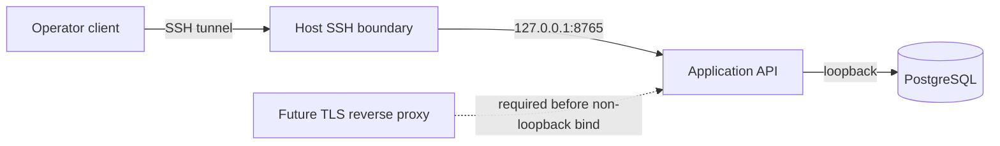

# ADR 0025: Loopback-Only Application API V0

Status: Accepted

Application API V0 binds only `127.0.0.1:8765`. Operators connect through SSH forwarding. CORS is
disabled and wildcard trusted hosts are rejected. Passwords and bearer tokens must not be sent over
LAN or public HTTP.

Installing an automatic TLS proxy or changing firewall/router configuration would expand the
operational boundary. Those changes require a later ADR and are not part of V0.
