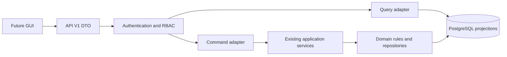

# API Command and Query Boundary

The HTTP package is an adapter. Routers validate a stable DTO, authenticate the current opaque
access token, resolve current permissions, and call either `QueryAdapter` or `CommandAdapter`.
Routers do not import ORM records, execute SQL, read files, invoke workers, or locate artifacts.

Queries return typed, sanitized projections. Artifact values include logical identity, pinned
revision, expected hash, schema reference, media type, and logical URI. They never dereference or
return a NAS path. Lists use signed keyset cursors and a stable `(created_at, opaque_id)` order.

Commands return after durable command registration or a completed synchronous application use
case. Workflow commands do not execute Codex or worker processes in the API process. The workflow
runner remains responsible for queued execution. Domain events are the authoritative business
history. API audit rows contain only HTTP and security context.

Content Intake final decisions currently require creation of an immutable decision artifact. The
API runtime is deliberately denied NAS access and File Gateway V0 is deferred. Consequently
`content_intake_decide` is advertised with `content_intake_decision=false` and returns the stable
`API_DEPENDENCY_UNAVAILABLE` error rather than bypassing the canonical artifact invariant.
