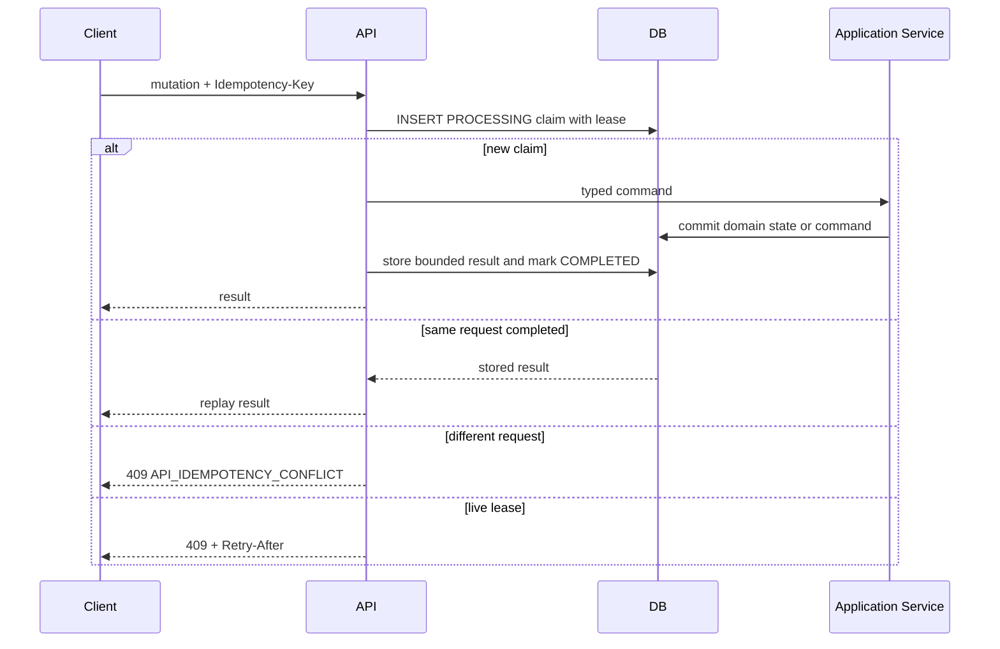

# Application API Idempotency

Every non-authentication mutation requires `Idempotency-Key`. The raw key is validated at the HTTP
boundary and never logged or persisted. The database key is an HMAC-SHA-256 of the supplied key.
The request digest is canonical JSON over method, operation ID, validated path parameters, the
validated body, and Operator ID. Sensitive input is represented by a keyed digest before request
canonicalization.

The compound unique index `(operator_id, endpoint_key, idempotency_key_hash)` is the concurrent
claim invariant. Lookup is O(log n); the response is capped at 64 KiB and retained for one day.
Token and password-changing endpoints never use this cache. Workflow execution duration does not
extend the API lease: the record is completed when the durable workflow command is registered.

Workflow start keeps this transport identity separate from business equivalence. A keyed digest of
the operator, `workflow_start`, and raw Idempotency-Key identifies one workflow submission without
persisting the raw key. The workflow's deterministic `request_hash` identifies equivalent business
input for active-work detection and audit; it is not a permanent exactly-once key. Consequently a
new API key after a terminal FAILED or CANCELLED occurrence can create a new `workflow_id`, while
same-key replay still returns the original occurrence and an equivalent active occurrence prevents
parallel work. See ADR 0031.
