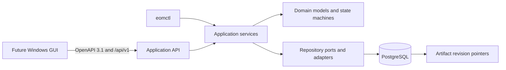

# EOM Application API V0

## Responsibility and boundary

The Application API is a versioned HTTP adapter for future desktop clients. It authenticates an
Operator, resolves current permissions, validates stable request DTOs, and invokes an application
command or query. It does not own catalog or workflow business rules and never reads NAS, worker
HOME directories, Codex state, or binary artifacts.

PostgreSQL domain rows, immutable artifact revisions, and domain audit events remain canonical.
API sessions, API audit rows, and idempotency records are security and transport state, not domain
source of truth. HTTP DTOs expose logical IDs, pinned revision IDs, hashes, media type, schema
reference, and logical URI. They never expose filesystem paths or ORM records.

## Identity and revision model

An Operator has a stable opaque `operator_id`; username is a normalized, unique login attribute.
Credentials, role assignments, sessions, and tokens have their own identities and lifecycles.
Role assignment history is append-only through revocation. Mutable resources expose a strong ETag
derived from their integer `lock_version`; mutation requests use `If-Match` consistently.

Artifact DTOs preserve each of logical artifact ID, immutable artifact revision ID, SHA-256,
schema/version, media type, and logical URI. Resolution validates target existence, pinned revision,
hash, media type, schema, permission, lifecycle, and immutability. Missing, stale, and mismatched
pointers are explicit errors; an implicit latest revision is never substituted.

## Access patterns and data structures

V0 expects tens to low thousands of Operators, thousands of sessions, and catalog scale already
documented by each domain. PostgreSQL indexes own persistent lookup and concurrency. Small immutable
permission sets are resolved in one joined query per request and represented as `frozenset`; no
long-lived authorization cache can make a role change stale.

| Access pattern | Structure or index | Complexity and ordering | Concurrency boundary |
| --- | --- | --- | --- |
| Token selector lookup | Unique B-tree on `api_tokens.selector` | O(log n), no scan | token row lock for consume/rotate |
| Username lookup | Unique B-tree on `operators.normalized_username` | O(log n) | unique constraint and bootstrap lock |
| Effective permission membership | `dict[role, frozenset[permission]]`, joined DB lookup | O(r + p), O(1) membership | current transaction snapshot |
| Active role lookup | partial unique `(operator_id, role_id)` | O(log n) | row/advisory lock for last ADMIN |
| Active session lookup | B-tree `(operator_id, revoked_at)` and token family | O(log n) | session row lock on refresh/revoke |
| Idempotency lookup | unique compound B-tree `(operator_id, endpoint_key, key_hash)` | O(log n) | insert claim plus expiring lease |
| List pagination | B-tree keyset `(created_at, opaque_id)` | O(log n + page), stable tie-break | read transaction |
| Audit/event history | append-only sequence and `(created_at, id)` B-tree | O(log n + page) | DB sequence or aggregate lock |
| Rate limiting | bounded expiry-aware `OrderedDict` | amortized O(1), LRU eviction | process-local lock |

Indexes explicitly include operator status, token expiration, `(session_id, token_type)`, session
family, idempotency expiration, audit time, audit operator/time, and operator event sequence. B-tree
is sufficient for exact lookup and keyset range queries; no GIN query is required by V0. A process
local rate limiter is intentionally advisory and complements, rather than replaces, the persistent
credential lock.

## Transactions, retries, and idempotency

One SQLAlchemy Session owns one request transaction and is never shared between concurrent tasks.
Authentication reads current Operator, credential/session/token, roles, and permissions. Refresh
locks the refresh token and session, consumes exactly one generation, and creates the replacement
pair in the same transaction. Reuse of a consumed refresh token revokes the token family.

The fixed transaction advisory lock for bootstrap and last-ADMIN changes serializes checks that
span multiple rows. Unique and partial unique constraints remain the final invariant. Concurrent
losers receive stable conflict errors and do not retry an unsafe state change automatically.

Mutation idempotency hashes the validated method, operation ID, path parameters, body, and Operator.
A short database lease covers only command registration. Completed bounded responses are replayed;
same key/different request is a conflict; a live lease returns in-progress with `Retry-After`.
Password and token responses are never cached. Safe database disconnects may be retried by the
client with the same idempotency key.

## Dependency direction

`eom_api_contracts` contains only frozen stable HTTP values and schemas. `eom_api` contains HTTP,
authentication, authorization, request context, rate limiting, and adapters. Existing application
services own domain orchestration and persistence. Domain and contract packages do not import
FastAPI, filesystem, subprocess, or infrastructure modules. CLI and HTTP construct typed commands
and call the same application service.

The API runtime role receives only table `SELECT`/`INSERT`/`UPDATE`, required sequence `USAGE`, and
explicit function `EXECUTE`. It cannot create schema objects, migrate, truncate, manage roles, or
inherit the migration owner. The service binds only `127.0.0.1:8765`; direct LAN/public HTTP is not
supported. TLS is required before any non-loopback exposure.

## Failure and simpler alternatives

All adapter errors use RFC 9457 Problem Details with stable error codes and no internal exception,
path, SQL, token, password, or request body. Dependency outage and migration mismatch make readiness
fail without exposing details. Domain errors retain their existing codes and are mapped at the HTTP
boundary.

A direct GUI-to-PostgreSQL design was rejected because it leaks persistence and operational
boundaries. JWT was rejected because immediate role/disable/revocation and refresh-family reuse
detection are required. A shared Redis rate limiter was rejected because V0 is a single loopback
process. A generic repository or event framework was rejected because existing application
services and event stores already own those rules.

`OBSERVABILITY_APPLICATION_API_NODE_DEFERRED`: the existing read-only console is unchanged in this
release.
