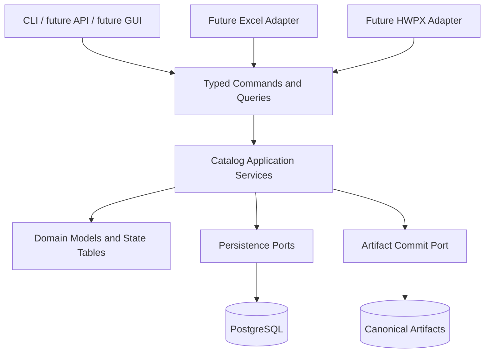

# Catalog Application Boundary

Interfaces may submit typed commands and render query DTOs. They do not implement lifecycle,
pointer, hash, idempotency, or transaction rules. Domain packages contain identifiers, values,
and transition tables and do not import infrastructure. Catalog services validate contracts,
resolve pinned revisions, and own transaction boundaries. PostgreSQL, NAS, filesystem, Codex,
and HWPX remain replaceable adapters.

Cross-component code must use public package APIs. Production packages must not import CLI
modules or another service's private modules. HTTP is intentionally absent in V0 and port 8765
remains reserved.
