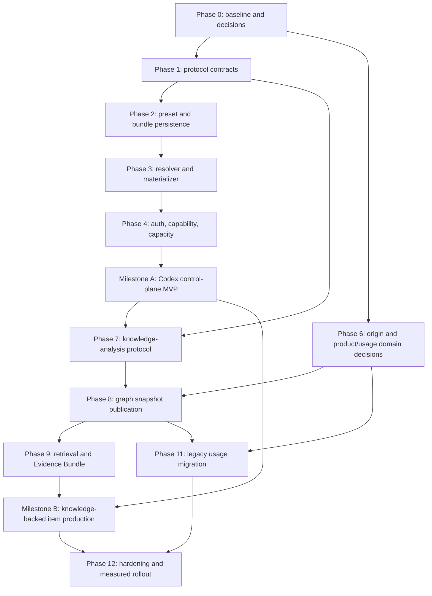

# Codex and Education Knowledge Control Plane Implementation Plan

Status: Active implementation roadmap. Each phase retains its own migration, deployment, live-run,
and production-data authorization boundary.

Plan baseline: `32e96263353f42e6bc857f6577604d83f8557680`

Last reviewed: 2026-08-31 UTC

## Implementation status

| Phase | State | Evidence |
| --- | --- | --- |
| 0 — baseline and decisions | `COMPLETED` | [`CODEX_KNOWLEDGE_PHASE0_BASELINE.md`](CODEX_KNOWLEDGE_PHASE0_BASELINE.md), ADRs 0038/0039, V0 acceptance queries |
| 1 — protocol-first contracts | `COMPLETED` | [`CODEX_KNOWLEDGE_PROTOCOL_COMPATIBILITY.md`](CODEX_KNOWLEDGE_PROTOCOL_COMPATIBILITY.md), 13 public contracts, two support schemas, frozen models, resource/package/negative tests |
| 2 — preset and bundle persistence | `DEPLOYED` | [`CODEX_CONTROL_PLANE_PERSISTENCE_DESIGN.md`](CODEX_CONTROL_PLANE_PERSISTENCE_DESIGN.md), additive migration 0009, immutable revision/pointer/plan records, deterministic lease transactions, disposable PostgreSQL migration/concurrency proof |
| 3 — execution resolution and materialization | `DEPLOYED` | [`CODEX_EXECUTION_RESOLUTION_AND_MATERIALIZATION.md`](CODEX_EXECUTION_RESOLUTION_AND_MATERIALIZATION.md), deterministic released-preset resolver, authorized hash-checked Markdown materializer, job-local `AGENTS.md`, exact Codex model/effort invocation |
| 4 — auth, capability, and capacity | `DEPLOYED` | [`CODEX_AUTH_CAPABILITY_CAPACITY_CONTROLLER.md`](CODEX_AUTH_CAPABILITY_CAPACITY_CONTROLLER.md), six fixed identities, credential-free GUI device enrollment, exact capability snapshots, bounded leases, and two-slot analysis capacity |
| 5 — control-plane MVP and GUI | `DEPLOYED` | [`CODEX_CONTROL_PLANE_MVP.md`](../operations/CODEX_CONTROL_PLANE_MVP.md), released presets, installed runner/API/GUI, account administration, device reauthentication, and public HTTPS Studio |
| 6 — origin and product/usage decisions | `DESIGN_COMPLETE` | [`ITEM_ORIGIN_OCCURRENCE_V1_DESIGN.md`](ITEM_ORIGIN_OCCURRENCE_V1_DESIGN.md), [`PRODUCT_FORM_ASSEMBLY_USAGE_V1_DESIGN.md`](PRODUCT_FORM_ASSEMBLY_USAGE_V1_DESIGN.md), ADRs 0038/0039, eight required scenarios |
| 7 — knowledge-analysis protocol | `DEPLOYED_AND_CORPUS_ACCEPTED` | [`KNOWLEDGE_ANALYSIS_INTAKE_WORKFLOW_V1.md`](KNOWLEDGE_ANALYSIS_INTAKE_WORKFLOW_V1.md), all 495 textbook ranges and 1,702 pages accepted under immutable run pointers; bounded-parallel refill evidence in [`KNOWLEDGE_ANALYSIS_BOUNDED_PARALLEL_CAPACITY_V1.md`](KNOWLEDGE_ANALYSIS_BOUNDED_PARALLEL_CAPACITY_V1.md) |
| 8 — graph snapshot publication | `DEPLOYED_AND_PUBLISHED` | [`EDUCATION_GRAPH_SNAPSHOT_PERSISTENCE_V1.md`](EDUCATION_GRAPH_SNAPSHOT_PERSISTENCE_V1.md), published full-corpus snapshot with 8,749 nodes, 16,917 edges, 3,370 anchors, and exact 495-run coverage |
| 9 — retrieval and Evidence Bundle | `DEPLOYED_AND_ACCEPTED` | [`EDUCATION_RETRIEVAL_EVIDENCE_BUNDLE_V2.md`](EDUCATION_RETRIEVAL_EVIDENCE_BUNDLE_V2.md), one live bounded bundle resolved by exact snapshot/revision/hash pointers and re-read successfully |
| 10 — knowledge-backed item production | `DEPLOYED_AND_READY` | [`KNOWLEDGE_BACKED_ITEM_EXECUTION_V3.md`](KNOWLEDGE_BACKED_ITEM_EXECUTION_V3.md), active Content Pack 1.2, verified curriculum capability, hierarchy-guided request UI, and pointer-only Evidence Bundle provenance |
| 11 — legacy Product and Usage intake | `SOURCE_COMPLETE` | [`LEGACY_PRODUCT_USAGE_INTAKE_V1.md`](LEGACY_PRODUCT_USAGE_INTAKE_V1.md), additive migration 0015, guarded XLSX proposal/review/commit service, Product/Form/Assembly/Publication/Usage projection, disposable PostgreSQL proof |
| 12 — hardening and measured rollout | `GRAPH_ROLLOUT_COMPLETE` | [`CODEX_KNOWLEDGE_PHASE12_ROLLOUT.md`](../operations/CODEX_KNOWLEDGE_PHASE12_ROLLOUT.md), full textbook analysis, graph publication, bounded retrieval, dynamic GUI capability, public Studio, release provenance, and isolation gates passed; real legacy workbook import remains an independent reviewed-data gate |

The table is the current operational status. The following phase notes preserve what each earlier
source-complete exit gate was authorized to change; their “no deployment” statements are historical
boundary records, not descriptions of the current runtime.

Phase 1 added no migration, live worker execution, runtime deployment, or production-data write.
Phase 2 source work adds an unapplied additive migration and source behavior only; it performed no
production migration, runtime deployment, live worker execution, or production-data write. It is
marked complete only after the later controlled deployment and post-deployment evidence gates.
Phase 3 source work remains dual-path and unactivated. It performed no live Codex execution,
production workspace materialization, runtime executable installation, or service restart.
Phase 4 source work adds fixed authentication-probe units and deployable application code only. It
performed no credential read, live Codex execution, production migration, unit installation,
service restart, or production-data write. The three-worker host/service resource benchmark and
actual-identity health smoke remain controlled Phase 5 deployment gates.
Phase 5 source and deployment gates passed. The separately fresh-authenticated, non-generating
five-account observation and any live one-shot remain distinct evidence boundaries. Phase 6 fixes
domain ownership and exact field/lifecycle decisions only; it adds no schema resource, migration,
production data, graph publication, or worker invocation. Phase 7 source work preserves all V1
bytes, adds immutable V2/schema and workflow-role/1.4 resources plus additive migration 0011, uses
slot05/support, and separates ephemeral worker proposals from accepted pointer-only results. Its
source, static, security, package-boundary, and disposable PostgreSQL migration/integration gates
passed. No production migration, runtime deployment, live Codex invocation, or graph publication
was performed; those remain separately reviewed gates before Phase 8.
Phase 8 and Phase 9 source, schema, migration, security, package, and disposable PostgreSQL gates
passed in their focused commits. They did not publish a production graph or run Codex. Phase 10
source work preserves source-free V1 execution, introduces a separate `knowledge-grounded-item` V2
preset boundary, and keeps graph publication, preset activation, live worker execution, and
production mutation behind Phase 12 rollout authorization.
Phase 11 source work preserves workbook bytes as immutable Content Intake artifacts, adds additive
migration 0015 and versioned mapping/import/proposal/projection contracts, and commits canonical
Product/Form/Assembly/Publication/Usage rows only after exact-pointer review. Its source, static,
security, release, migration-cycle, concurrency, immutability, and disposable PostgreSQL gates
passed. No production workbook was imported and no graph snapshot was published.
Phase 12 now includes a measured full-textbook rollout. Ten approved textbook revisions resolve to
495 non-overlapping ordered ranges and 1,702 physical pages. All ranges are accepted and each final
graph source pins its exact Analysis Run and accepted Artifact Revision rather than resolving a
mutable latest result. Published snapshot `graphrev_8f062e995ca3ddbba867f9699126db0b`
contains 8,749 nodes, 16,917 edges, and 3,370 anchors with manifest SHA
`sha256:b845f76adb74e85e8fcfd1b577fced6172570e7bb00eab441b8f53ac04dc56c1`.
Evidence Bundle revision `evidencerev_930a3e9d823e2e4c9f309b5f857541ff` proves bounded retrieval
against that snapshot without copying textbook bytes into PostgreSQL. The public GUI enables Graph
grounding only when the API revalidates the current published snapshot, Artifact pointers, all 43
editorial curriculum units, and all 119 closure rows. Real legacy workbook import is still not
claimed; it remains a separate reviewed-data authorization boundary.

## 1. Outcome

This plan turns two architecture documents into one staged implementation program:

- [`CODEX_SESSION_PRESETS_AND_CAPACITY.md`](CODEX_SESSION_PRESETS_AND_CAPACITY.md) defines fresh
  Codex execution, account health, immutable presets, job-local instructions/references, and bounded
  capacity.
- [`EDUCATION_KNOWLEDGE_ITEM_GRAPHRAG.md`](EDUCATION_KNOWLEDGE_ITEM_GRAPHRAG.md) defines canonical
  educational sources, typed graph snapshots, item origin, product usage, retrieval, and Evidence
  Bundles.

The intended production flow is:

```text
educational request
  -> immutable Execution Preset Revision
  -> pinned workflow/Content Pack/instruction policy
  -> typed Education Retrieval Request
  -> pinned Graph Snapshot + Reference Revisions
  -> bounded Evidence Bundle
  -> resolved per-role Execution Plan
  -> capacity/auth/capability admission
  -> fresh one-shot Codex execution
  -> schema-valid result Artifact Revision
  -> existing review/approval/Item Registry/HWPX boundaries
```

The first usable milestone deliberately stops before GraphRAG. It makes current Codex execution
explicit, reproducible, capacity-bounded, and able to consume approved Reference Bundles. GraphRAG
later supplies a better Evidence Bundle through the same interface.

## 2. Fixed Decisions

The following are implementation invariants, not open product choices:

1. Every production Codex job is fresh and one-shot. No `resume`, TUI session memory, or previous
   conversation is part of workflow state.
2. Worker authentication may persist only in the private credential store of its fixed worker
   identity. Credentials never enter PostgreSQL, Git, Slack, NAS, GUI responses, or job manifests.
3. Users select educational requirements and a reviewed product-level preset. They do not enter
   model IDs, reasoning effort, Linux users, paths, credentials, or fallback models.
4. The Orchestrator resolves and pins the exact preset, model policy, effort, instruction,
   references, Content Pack, workflow protocol, and hashes before a worker claim.
5. The current host retains six configured worker identities, at most three active Codex
   processes, one active process per slot, and at most two knowledge-analysis processes on the
   dedicated support pool.
6. Workers read only staged local inputs, communicate only through the Orchestrator, and never
   write NAS or canonical database state.
7. Large source and reference bytes remain Artifact Revisions. PostgreSQL stores identities,
   revisions, relationships, lifecycle, manifests, and hashes.
8. Graph snapshots, Markdown projections, embeddings, summaries, and indexes are derived products.
   Approved Document, Item, Deliverable, Usage, and Artifact Revisions remain canonical.
9. `item_type_key` remains the content/interaction type. Origin, creation method, institution,
   examination occurrence, derivation, and rights are separate typed dimensions.
10. Usage Plans and immutable Usage Records remain the canonical use ledger. Graph edges are a
    rebuildable exploration projection, not a second ledger.
11. The first graph backend is PostgreSQL adjacency/closure plus artifact-backed projections unless
    measurements justify a replaceable dedicated graph adapter.
12. General model knowledge is allowed only when the request/preset explicitly permits it and the
    execution provenance records that mode.

## 3. Explicitly Open Decisions

Phase 0 resolved the logical boundaries through ADRs 0038 and 0039. The following schema and policy
details still require evidence before their corresponding implementation:

- exact Organization/Assessment Occurrence fields, aliases, lifecycle, and import policy within the
  revision boundaries selected by ADR 0038;
- the exact `ItemOriginProfile` controlled vocabulary and rights requirements under ADR 0038;
- physical schema and compatibility migration for the Product/Form/Assembly/Publication ownership
  selected by ADR 0039;
- aggregate Distribution Event fields and the separate protected per-student learning-record design;
- the reviewed mapping for legacy usage spreadsheets;
- initial approved model/effort combinations, based on installed-CLI capability and eval evidence;
- representative scale and retrieval quality thresholds for the three accepted V0 queries.

These details do not block the Codex control-plane MVP. They block only their own schema/runtime
work where proceeding would invent unsupported values or privacy policy.

## 4. Dependency Map and Delivery Milestones



Milestones are independently useful:

| Milestone | User-visible outcome | Graph required |
| --- | --- | --- |
| A: Codex control-plane MVP | stable accounts, reviewed preset, exact model/effort, fresh sessions, bounded slots, approved Markdown references | no |
| B: knowledge-backed item production | a request pins a graph snapshot and receives a bounded, attributable Evidence Bundle | yes |
| C: product and usage intelligence | item origin and “which product/form/question used this revision?” queries | origin/product decisions required |
| D: operational rollout | measured quality, capacity, rollback, admin GUI, legacy intake | all accepted prior gates |

### Expected repository ownership

The exact modules are confirmed in each phase, but the dependency direction should remain:

| Responsibility | Expected existing owner |
| --- | --- |
| protocol schemas and compatibility | `schemas/`, `packages/workflow`, existing contract packages |
| preset resolution, capacity leases, worker claim | `services/orchestrator` and `services/workflow_runner` |
| Item origin, Deliverable, Usage Ledger | `packages/catalog_contracts`, `packages/item_registry`, `services/catalog_service` |
| source intake and legacy workbook proposals | `packages/content_intake` and its application boundary |
| public/admin DTOs | `packages/api_contracts` |
| HTTP use cases and read projections | `apps/application_api` |
| operator commands | `apps/eomctl` |
| administrator/editor interface | `apps/web_gui` |
| fixed identity and sandbox deployment | existing `config/systemd`, `infra`, and reviewed scripts |
| migrations | existing migration chain; disposable DB first |

A new knowledge contract package is justified only if analysis, publication, and retrieval create a
real shared domain boundary. Otherwise the first contracts extend the smallest existing owner.

## 5. Phase 0 — Baseline, Measurements, and Decision Inputs

### Work

1. Inventory the current five slots, role bindings, fixed units, Codex CLI versions, account login
   status, worker limits, current queue behavior, and all invocation arguments without reading
   credential contents.
2. Capture non-live current tests for one-shot `--ephemeral --ignore-user-config`, worker isolation,
   fixed identity, schema output, and Orchestrator-only artifact commit.
3. Define three representative knowledge queries:
   - all table materials under a pinned curriculum middle unit;
   - approved items containing both a table and ㄱ/ㄴ/ㄷ statements, with exact evidence;
   - exact usage history of an Item Revision across product/form/question placements.
4. Select redacted representative curriculum/textbook/item/usage-spreadsheet samples as immutable
   test fixtures. Never copy production credentials or unrestricted copyrighted corpora into Git.
5. Measure current single and three-worker CPU, memory, task, queue, and service latency with
   non-sensitive representative fixtures. Usage-consuming Codex evals remain separately authorized.
6. Write the open Product/Form/Assembly/Distribution and Organization/Occurrence design notes.

### Outputs

- sanitized baseline inventory and capacity evidence;
- representative query acceptance criteria;
- fixture manifests pointing to approved immutable artifacts;
- ADRs resolving only the entity boundaries needed by Phases 6 and 11;
- a risk register with owner, severity, evidence, and removal/rollback condition.

### Exit gate

No implementation starts until the baseline confirms the existing five-slot/three-active boundary
and each new persistent entity has one canonical owner. Unknown product or institution identity is
recorded as an open decision, not guessed.

## 6. Phase 1 — Protocol-First Contracts

### Work

Define canonical JSON Schema 2020-12 resources before service behavior. Initial contract families:

```text
execution-preset-revision/1.0
instruction-bundle-manifest/1.0
reference-bundle-manifest/1.0
resolved-execution-plan/1.0
codex-auth-health-view/1.0
codex-capability-snapshot/1.0
worker-capacity-policy/1.0
worker-lease-view/1.0
knowledge-analysis-request/1.0
knowledge-analysis-result/1.0
knowledge-graph-snapshot-manifest/1.0
education-retrieval-request/1.0
evidence-bundle-manifest/1.0
```

Origin, Product/Form, Assembly, Distribution, and legacy-mapping schemas are added only after their
Phase 0 decisions. Existing protocol resources remain byte-identical. Any breaking change gets a
new schema/protocol/workflow/Content Pack version rather than editing a persisted identity.

Future frozen Pydantic models mirror the schemas and add cross-field invariants that JSON Schema
cannot express clearly. One endpoint compatibility table defines which workflow, Content Pack,
preset, graph, and evidence versions can be combined.

### Primary validation

- canonical and packaged schema bytes match;
- Draft 2020-12 meta-schema validation passes;
- unknown fields and unknown enum values fail closed;
- model/effort policies are bounded ordered values, not free-form dictionaries;
- all pointers carry logical ID, immutable revision ID, schema/version, Artifact Revision, and
  expected SHA where resolution requires them;
- secrets, absolute paths, NAS paths, conversation/session IDs, and raw prompts are forbidden;
- old schema bundle hashes and historical replay remain pinned.

### Exit gate

Schema tests, typed-model tests, protocol immutability tests, dependency-boundary tests, formatter,
Ruff, and strict mypy pass before persistence code begins.

## 7. Phase 2 — Preset, Bundle, Plan, and Lease Persistence

### Responsibility

Extend existing workflow/orchestrator ownership; do not create a parallel worker registry or a
second prompt system. The exact table design requires a migration note and disposable-DB proof.

### Canonical records

- logical Execution Preset and immutable Preset Revisions;
- immutable Instruction and Reference Bundle Revisions with Artifact component pointers;
- one immutable resolved Execution Plan per workflow;
- sanitized Codex account and worker-auth binding operational state;
- capability observations with TTL, not entitlement promises;
- capacity pools and short-lived worker leases;
- append-only account-health and lease events.

Credential bytes and large Markdown are absent from all rows.

### Access patterns and structures

| Operation | Structure/index | Target complexity |
| --- | --- | --- |
| preset/reference lookup | unique logical/revision keys | O(log n) |
| capability membership | unique binding/model/effort relation | O(log n) or bounded set |
| eligible slot query | indexes on enabled, health, role, capability | O(log n + k) |
| one active job per slot | partial unique active-lease index | constraint-enforced |
| global admission | short lock on one capacity-pool row | bounded transaction |
| event history | append-only `(owner_id, sequence)` | O(log n) |
| reproducible plan | immutable manifest pointer and hash | constant pointer lookup |

With five slots, a bounded deterministic scan of eligible slots is preferable to a new priority
queue. Existing indexed workflow/job queues remain authoritative.

### Transaction boundaries

- workflow creation resolves current preset/bundle pointers and inserts the Execution Plan in one
  application transaction;
- lease acquisition locks one pool row, checks limits, selects one eligible slot, and inserts the
  lease in one short transaction;
- Codex execution never occurs inside a database transaction;
- lease release follows exact systemd terminal-state reconciliation;
- snapshot and current-pointer publication use an atomic final transaction.

### Tests and exit gate

Use only the disposable API test database. Test migration upgrade/rollback, unique constraints,
concurrent claims, idempotent resolution, immutable revisions, stale pointers, no large payloads,
and coexistence of historical protocol versions. No production migration is part of this phase's
source work.

## 8. Phase 3 — Execution Resolver and Job-Local Materializer

### Work

1. Implement a deterministic preset resolver that returns one typed immutable Execution Plan.
2. Add fail-closed resolution of instruction/reference pointers: existence, revision, approval,
   schema, media type, permission, path containment, non-symlink, and SHA.
3. Generate job-local `AGENTS.md` from pinned platform and role instruction revisions.
4. Materialize approved reference members beneath validated relative paths such as
   `references/evidence/`; filesystem paths never become identity.
5. Pass explicit model and reasoning effort to the fixed Codex executable while retaining
   `--ephemeral --ignore-user-config` and the current sandbox/tool/network policy.
6. Record requested parameters, manifest hashes, selected binding, CLI version, and stable outcome
   codes without chain-of-thought, credentials, or full event logs.

### Failure rules

- missing or stale input fails before claim and does not consume an attempt;
- post-claim authentication/model/process failure creates one terminal attempt;
- no implicit latest revision, model substitution, cross-account retry, or session resume;
- a preset-declared fallback is resolved and recorded before execution or becomes a new authorized
  attempt according to existing workflow semantics;
- workspace cleanup removes only disposable materialization after evidence is committed.

### Tests and exit gate

Tests cover deterministic manifests, exact arguments, fresh sessions, forbidden resume paths,
traversal/symlink/hash failures, cross-worker isolation, no NAS writes, output schema validation,
and byte-identical replay inputs. A fake Codex adapter is used by default; live usage tests remain
explicit opt-in.

## 9. Phase 4 — Authentication, Capability, and Capacity Controller

### Work

- implement sanitized non-generating `codex login status` observation as the exact worker identity;
- publish `READY`, `STALE`, `AUTH_REQUIRED`, `DEGRADED`, `DRAINING`, and `DISABLED` projections;
- inventory installed CLI/model/effort compatibility through reviewed observations;
- implement deterministic capacity admission in the Orchestrator application layer;
- enforce `max_configured_slots=5`, `max_active_codex=3`, `max_active_per_slot=1`,
  `max_active_gpu=1`, and later `max_active_knowledge_analysis=1`;
- reconcile expired leases against exact unit/process state before reuse;
- expose queue, lease, duration, and sanitized failure metrics.

The capacity controller is normal deterministic code, not another Codex agent. It has no credential
access and never chooses educational content.

### Admin operations

An administrator may drain/enable a binding and initiate a protected operator-side login flow.
Scientific Studio never accepts a password, token, device code, `auth.json`, or credential path.
Re-authentication drains the slot, waits for its active lease to terminate, runs under the exact
worker identity, performs a sanitized check, and returns to READY only on success.

### Tests and exit gate

Concurrent tests prove all pool ceilings, duplicate-lease rejection, draining behavior, crash
reconciliation, authentication failures before and after claim, stable reason codes, and absence of
secret data in API/DB/log/Slack projections. A three-worker resource benchmark must not materially
degrade PostgreSQL, API, GUI, Observability, or runners.

## 10. Phase 5 — Codex Control-Plane MVP and GUI

### User surfaces

1. **System / Codex Accounts (ADMIN):** sanitized binding health, drain/enable, re-auth required,
   CLI version, capability observation, last successful job.
2. **Execution Presets (ADMIN):** draft, validate, release, deprecate, compare immutable revisions,
   and inspect eval evidence.
3. **New Item Request (EDITOR):** educational requirements and a reviewed quality/preset choice;
   no model, effort, host path, account, or credential fields.

Start with one measured `standard-item` preset. A fast or high-difficulty preset is not published
until it is a real second use case with eval evidence.

### Deployment order

1. schema/contracts and dual-read application code;
2. reviewed migration through the canonical migration procedure;
3. preset/reference bootstrap data with immutable manifests;
4. worker executable/config change with existing five identities;
5. API/Orchestrator rollout;
6. GUI rollout;
7. non-generating health and fake-adapter smoke;
8. separately authorized one-shot live acceptance.

Rollback returns the current one-shot invocation path while preserving newly written immutable
history. It never copies credentials or rewinds protocol rows.

### Milestone A completion

- one new item can run with a pinned standard preset and approved Markdown Reference Bundle;
- exact model/effort/CLI/preset/instruction/reference evidence is observable;
- all steps are fresh one-shot executions;
- account health and capacity are fail-closed and bounded;
- old workflows remain replayable;
- GraphRAG is not yet required.

## 11. Phase 6 — Origin, Organization, Product, Form, and Usage Decisions

This phase completes the focused designs required by Graph Model V0 before adding database tables.

Design evidence:

- [`ITEM_ORIGIN_OCCURRENCE_V1_DESIGN.md`](ITEM_ORIGIN_OCCURRENCE_V1_DESIGN.md) fixes reviewed
  Organization/Occurrence revision fields, alias resolution, `ItemOriginProfile`, rights and
  derivation pointers, intake states, indexes, transactions, and failure rules.
- [`PRODUCT_FORM_ASSEMBLY_USAGE_V1_DESIGN.md`](PRODUCT_FORM_ASSEMBLY_USAGE_V1_DESIGN.md) keeps
  Deliverable as Product, adds separate Form/Assembly/Publication identities, assigns ordered
  placement authority to Assembly, actual-use authority to Usage Record, and limits Distribution
  Event to aggregate evidence.

### Required domain decisions

- versioned Organization identities and aliases;
- versioned Assessment Occurrences for 평가원, 교육청, school, and other real examinations;
- orthogonal Item Origin dimensions and derivation/rights pointers;
- whether a Product contains Form entities or groups existing Deliverables;
- ordered Assembly placement and deterministic manifest ownership;
- Publication versus Deliverable Revision responsibilities;
- fulfillment into existing immutable Usage Records;
- aggregate Distribution Event versus protected per-student learning records.

### Required sample scenarios

1. a human-authored new item with no exam occurrence;
2. an institutional past item pinned to organization and exact occurrence evidence;
3. an EOM human, AI-assisted, or AI-generated item with workflow provenance;
4. an EOM adaptation retaining its source Item/Document Revision lineage;
5. “00모의고사” forms 1–12 with Item A at form 1 question 12 and Item B at form 5 question 7;
6. the same logical Item with different revisions used in different editions;
7. a corrected/withdrawn item whose historical placement remains immutable;
8. an ambiguous legacy spreadsheet row that must remain unresolved.

### Exit gate

One authoritative domain rule and ownership boundary exists for every canonical placement. Graph
edges, Assembly manifests, and Usage Records cannot all claim independent authority for the same
fact. Per-student data remains outside the general graph.

Result: `DESIGN_COMPLETE`. Additive JSON Schema, frozen-model, migration, and runtime work remains
subject to the later protocol/persistence gates and is not implied by this status.

## 12. Phase 7 — Knowledge Analysis Protocol and Intake Workflow

Implementation design: [`KNOWLEDGE_ANALYSIS_INTAKE_WORKFLOW_V1.md`](KNOWLEDGE_ANALYSIS_INTAKE_WORKFLOW_V1.md).

### Work

1. Extend Content Intake so approved Document/Artifact Revisions can request knowledge analysis.
2. Add a versioned knowledge-analysis workflow using a compatible existing support pool; do not add
   slot 06.
3. Resolve a knowledge-analysis preset through the Milestone A control plane.
4. Stage one immutable source revision and bounded instructions into a fresh worker workspace.
5. Require schema-valid proposed Markdown, nodes, edges, claims, source anchors, component
   observations, confidence, and unresolved ambiguity.
6. Validate deterministic structure and route policy-selected risks to human review.
7. Commit only accepted results as immutable corpus delta artifacts.

The analyst worker never mutates graph tables or NAS. General model knowledge cannot be represented
as a source citation. Source text that resembles instructions remains untrusted data.

### Initial scope

Begin with one curriculum framework revision, a small textbook/source set, and existing approved
Item Revisions. Support paragraph, table, figure/image, equation, curriculum-unit, concept, claim,
and source-anchor extraction. Defer unmeasured ontology expansion.

### Tests and exit gate

Test malformed/oversized files, archive traversal, symlinks, forged hashes, prompt injection,
duplicate IDs, illegal edge names/endpoints, missing anchors, contradictory claims, rejected review,
retry idempotency, and no worker persistence access. One accepted delta is reproducible from pinned
inputs; a failed analysis publishes nothing.

## 13. Phase 8 — Immutable Graph Snapshot Publication

### Work

- implement logical corpus and immutable graph snapshot revisions;
- validate proposed nodes/edges against a closed compatibility table;
- store sparse adjacency and source-pointer relations in PostgreSQL;
- build a revision-scoped curriculum closure table;
- publish Markdown and machine-readable projections as Artifact Revisions;
- add Item Element refs into immutable approved Item content;
- add origin and product/usage projections only after Phase 6 contracts exist;
- atomically publish a new current snapshot while retaining every prior snapshot.

### Data structures

- B-tree identities and lifecycle/source-class filters;
- unique snapshot-scoped node/edge identities;
- adjacency indexes by `(snapshot, from, type)` and `(snapshot, to, type)`;
- closure rows by `(framework_revision, ancestor, descendant, depth)`;
- unique Item Element refs by `(item_revision, kind, stable_element_id)`;
- origin indexes by source domain, creation method, organization, and occurrence;
- usage reverse lookup by exact Item Revision and product/form/deliverable revision.

The expected initial access cost is O(log n + k) for indexed neighborhood/subtree lookup. No graph
database or vector dependency is added without benchmark and query-plan evidence.

### Publication gate

Reject dangling, stale, unapproved, unauthorized, schema/media/hash-mismatched pointers; curriculum
cycles; duplicate positions/elements; illegal edge endpoints; unsupported rights; and incomplete
provenance. Snapshot manifests and Markdown projections must serialize deterministically.

## 14. Phase 9 — Retrieval and Evidence Bundle Service

### Work

1. Implement the three Phase 0 typed queries without accepting arbitrary browser graph query text.
2. Resolve one exact graph snapshot, curriculum revision, retrieval-policy revision, and caller
   permission set at request start.
3. Retrieve by indexed lexical/hierarchy/adjacency filters first; add semantic candidates only as a
   measured derived adapter.
4. Deduplicate by immutable source/item/component pointers, not filenames or copied text.
5. Rank within explicit node/document/item/claim/token budgets.
6. Emit an immutable Evidence Bundle manifest and bounded Markdown members.
7. Materialize the bundle under the Phase 3 job-local reference path.

### Quality gate

Evaluate provenance precision, retrieval recall, curriculum coverage, duplicate avoidance, latency,
and context tokens against a simple lexical/vector baseline. GraphRAG global/community retrieval is
enabled only for query classes where it demonstrates value.

### Failure behavior

Unknown/stale snapshots and insufficient evidence return typed failures. The service never silently
broadens to an unauthorized corpus, substitutes current revisions, exposes answer-bearing edges to
student-safe consumers, or claims uncited model knowledge as evidence.

## 15. Phase 10 — Knowledge-Backed Item Production Integration

### Work

- extend the new-item request with approved educational retrieval requirements, not raw graph/path
  controls;
- let the Execution Preset select and pin a retrieval policy compatible with the Content Pack;
- resolve the Evidence Bundle before the authoring lease;
- record Graph Snapshot, query, policy, Evidence Bundle, references, preset, model, and effort in the
  Execution Plan;
- stage evidence for each fresh role according to least-needed context;
- keep review, human approval, Item Registry, HWPX, and secure download unchanged;
- expose concise provenance and evidence coverage to reviewers without revealing hidden reasoning.

### Required acceptance cases

- reference-only item generation with no graph dependency still works;
- explicit general-model-knowledge sample still works and is labeled as such;
- curriculum/table/statement-set GraphRAG request grounds the item in exact evidence;
- origin filters distinguish EOM, individual human, and institutional past items;
- a graph miss creates no Codex invocation;
- stale graph or source pointers fail before claim;
- changing the current graph/preset does not affect an in-flight or historical workflow;
- successful approval still produces one canonical Item Revision usable by HWPX.

### Milestone B completion

The same fresh-session worker pipeline operates with either an approved Reference Bundle or a
bounded Graph-derived Evidence Bundle. No worker has graph, database, NAS, or credential authority.

## 16. Phase 11 — Legacy Product and Usage Intake

### Work

1. Register each Excel workbook as an immutable Content Intake source artifact.
2. Parse it with a versioned mapping contract into proposed Product/Form/Placement rows.
3. Resolve exact Item logical/revision identities, product/form revisions, section, position,
   points, and usage role.
4. Quarantine unknown, duplicate, conflicting, or fuzzy matches for operator review.
5. Create or fulfill canonical Assembly/Usage records idempotently only after validation.
6. Project graph edges from committed records and publish a new snapshot.
7. Reconcile source row counts, accepted/rejected/unresolved counts, placement hashes, and reverse
   item-usage queries.

No Excel cell directly becomes a graph fact. No ambiguous row resolves to the latest Item Revision.
Original workbooks remain preserved; imported placement history is append-only.

### Milestone C completion

An administrator can answer “where was this exact Item Revision used?” and “which items are in this
product/form and position?” with canonical record pointers. Graph traversal adds curriculum,
structure, origin, and similarity context without replacing the Usage Ledger.

## 17. Phase 12 — Hardening, Rollout, and Capacity Review

### Source gates

- focused contracts/domain/application tests;
- full workflow, Catalog, Item Registry, Usage, API, GUI, and non-live worker suites;
- disposable PostgreSQL integration/migration tests;
- Ruff, formatter, strict mypy, shell syntax, schema/resource parity;
- repository boundary/secret scan and release artifact/provenance checks;
- deterministic manifests and historical schema/hash pins;
- default tests prove no live Codex use and no large binary/text DB values.

### Security gates

- credentials absent from Git, DB, manifests, API, GUI, logs, Slack, and artifacts;
- arbitrary path, symlink, traversal, cross-worker home, NAS write, direct worker communication, and
  prompt-injection attempts fail;
- answer-bearing and rights-restricted graph projections obey caller policy;
- student identity/answers/scores/attempts are absent from the general graph;
- runtime imports come from reviewed installed packages, not checkout paths;
- worker users receive no sudo, Docker, `eom` group, DB, or NAS authority.

### Measured rollout

1. deploy dual-read code and contracts;
2. migrate only after disposable-DB proof and backup/rollback review;
3. publish one standard preset and one small approved Reference Bundle;
4. run a separately authorized single-item acceptance;
5. publish one small graph snapshot and compare retrieval with the baseline;
6. enable knowledge-backed requests for administrators/editors behind an explicit capability;
7. import one reviewed legacy workbook batch;
8. expand corpora and query modes only from measured results.

`max_active_codex > 3`, configured slots above five, or a dedicated graph backend require a new
capacity/infrastructure review. Until then, excess work queues rather than increasing attack surface.

## 18. Git, Review, Deployment, and Reporting Discipline

Each phase uses focused commits with tests in the same commit. Suggested boundaries are:

1. ADR/design decisions;
2. schema resources and compatibility tests;
3. typed domain models and invariants;
4. migration and persistence tests;
5. application services and fake adapters;
6. fixed worker/materializer integration;
7. API/CLI projections;
8. GUI surfaces;
9. deployment/runbook changes;
10. opt-in acceptance evidence references.

Do not combine protocol bumps, migrations, worker deployment, graph publication, and GUI changes in
one commit or one irreversible deployment step. Preserve a clean tree at release boundaries, pin
source commit and package hashes, and use the repository-owned build/install/verification scripts.
Never merge or push without the requested review boundary.

The Slack development reporter sends only milestone `BLOCKED` or `COMPLETED` summaries. It never
contains prompts, item content, full diffs/logs, paths to secrets, credentials, or worker results,
and reporting failure never blocks development.

## 19. Program-Level Stop Conditions

Stop rather than automatically repair or broaden scope when:

- a historical protocol/schema/resource hash would change;
- a migration requires production data reinterpretation not covered by the design;
- an account/model capability is not supported by observed installed-CLI evidence;
- credentials or arbitrary host/NAS paths would cross into an API, DB, manifest, or worker input;
- a graph pointer cannot prove source lifecycle, schema, media, permission, and hash;
- Product/Form/Assembly/Usage ownership is ambiguous;
- a default test attempts live Codex usage or production mutation;
- three-worker resource evidence shows unacceptable platform degradation;
- a real source, integration, security, or deployment gate fails.

Resume only from the exact failed boundary with a reviewed remediation. Never suppress a failing
contract, silently select the latest revision, loosen worker isolation, or add capacity to make a
test pass.

## 20. Final Definition of Done

The integrated program is complete only when:

- every production Codex run is fresh, pinned, schema-valid, auditable, and capacity-bounded;
- administrators can maintain non-secret account health and immutable presets without exposing
  credentials;
- users specify educational intent rather than execution internals;
- job-local `AGENTS.md`, references, and Evidence Bundles resolve from immutable revisions and
  hashes;
- the graph connects curriculum, science evidence, item elements, origin, examination occurrence,
  product/form placement, and immutable usage records without duplicating canonical payloads;
- exact historical workflow and product queries replay against pinned snapshots and revisions;
- item generation works both without GraphRAG and with a bounded graph-derived Evidence Bundle;
- legacy usage history is traceable to immutable source workbooks and reviewed mappings;
- all security, source, migration, release, rollback, capacity, and retrieval-quality gates pass;
- the current Item Registry, human approval, HWPX, secure download, and public Scientific Studio
  boundaries remain intact.

Until all phases are separately authorized and completed, this plan is the execution order and
acceptance contract—not evidence that the future control plane or GraphRAG runtime already exists.

## 21. First Implementation Tranche When Authorized

The first authorization should cover only Phase 0 and the schema/design portion of Phase 1. I will:

1. create a read-only current Codex slot/invocation/capacity inventory;
2. locate and pin the existing worker, workflow, artifact, and Usage Ledger contracts;
3. write the Organization/Occurrence and Product/Form/Assembly/Distribution decision notes using
   representative non-sensitive scenarios;
4. define the first three query acceptance fixtures and a redacted legacy workbook mapping fixture;
5. draft canonical JSON Schema 2020-12 resources for preset, instruction/reference bundle,
   Execution Plan, auth health, capability, capacity, analysis, graph snapshot, retrieval, and
   Evidence Bundle;
6. add schema parity, immutability, forbidden-secret/path, and typed-model tests;
7. run all focused/static/security gates and create focused commits; and
8. stop before migration, worker invocation change, live Codex usage, or deployment for review.

This tranche produces a reviewable protocol foundation without consuming model usage or changing
production state. Persistence and runtime implementation begin only after its contracts and ADRs
are accepted.
