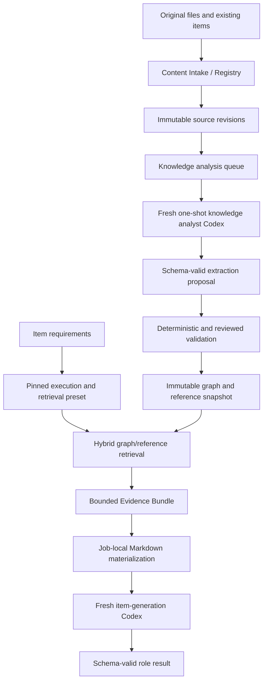

# Education Knowledge and Assessment Item GraphRAG Design

Status: Proposed design; documentation only. No database, worker, index, or runtime implementation is
authorized by this document.

Last reviewed: 2026-08-23 UTC

## 1. Purpose and Decision

EOM needs to use heterogeneous educational data without copying entire corpora into every Codex
prompt. The source set may include existing questions, curriculum documents, textbooks, HWPX,
PDF, office documents, images, tables, diagrams, equations, and partially curated Markdown.

The proposed boundary is a versioned Education Knowledge Graph with five connected typed views:

1. a **Curriculum and Science Knowledge Graph**;
2. an **Assessment Item and Item-Element Graph**;
3. an **Item Origin and Provenance Graph**;
4. a **Product, Form, Placement, and Usage Graph**; and
5. a **Provenance and Evidence Graph** connecting all views to immutable source revisions.

These are views over one versioned knowledge model, not five independently mutable sources of
truth. The graph is a derived retrieval product. Canonical sources remain approved immutable
Document, Item, and Artifact Revisions.

A data-analysis role continuously processes an ingestion queue through fresh one-shot Codex jobs.
It proposes normalized Markdown, typed nodes, edges, claims, and source anchors. Workers never
write NAS or mutate the graph directly. The Orchestrator validates results and publishes a new
immutable graph snapshot.

Item-generation presets pin graph/reference revisions and declare a stable job-local Markdown root.
They do not expose a NAS path or an arbitrary host path. A retrieval adapter selects a bounded
evidence subgraph and stages human-readable Markdown beneath that root before a fresh item worker
starts.

## 2. System Boundary



Responsibilities:

- Content Intake/Registry owns source identities, revisions, component pointers, and lifecycle.
- The knowledge-analysis workflow owns proposed extraction and enrichment jobs.
- A knowledge publishing service owns validation and immutable snapshot publication.
- The retrieval service owns graph traversal, ranking, budgets, and Evidence Bundle creation.
- The Orchestrator owns local materialization and worker invocation.
- Codex workers read staged inputs and return structured results only.

The graph does not become a shortcut around Item Registry, Content Packs, workflow approval, or
artifact validation. It also does not replace the canonical Usage Ledger or ordered assessment
assembly manifests.

## 3. Canonical and Derived Data

### 3.1 Canonical sources

Canonical source examples are:

- an immutable curriculum document revision;
- an immutable textbook edition/document revision;
- an immutable external examination document revision;
- an immutable approved `ItemRevision` and its `ITEM_CONTENT` component;
- independently pinned figure, image, table, and other media artifact revisions.

The original file is preserved. Normalization never overwrites or re-identifies it.

### 3.2 Derived products

Derived products include:

- normalized Markdown;
- page/section anchors;
- OCR and layout observations;
- extracted table/equation/figure components;
- concepts, claims, relationships, and community summaries;
- embeddings, lexical indexes, graph adjacency indexes, and retrieval caches;
- Evidence Bundles for individual workflow steps.

Every derived product pins its exact source revisions, extraction contract, analyzer version,
instruction/preset revision, content hashes, and UTC creation time. A changed source or extraction
contract produces a new revision.

Embeddings and retrieval indexes are rebuildable projections. They are not canonical facts. A
Graph Snapshot Revision pins the exact index revision used by a historical workflow.

### 3.3 Markdown is a projection, not the only representation

Markdown is optimized for human review and Codex reading, but it cannot safely preserve every
source structure by itself. A normalized document revision may therefore point to:

```text
NormalizedDocumentRevision
  -> normalized Markdown artifact member
  -> page/section anchor manifest
  -> table component pointers
  -> equation component pointers
  -> figure/image component pointers
  -> OCR/layout observation manifest
  -> source Document/Artifact Revision
```

A textbook table is retained as a typed rectangular structure and may also receive a Markdown
projection. A figure remains a pinned binary artifact plus textual description and source anchor.
An equation keeps its declared notation. Flattening all of these into prose is prohibited.

## 4. Graph Model V0: Five Connected Views

This is an extensible **Graph Model V0**, not a claim that the education ontology is 100% complete.
V0 deliberately closes a small vocabulary needed by known queries. New node or edge types require
an additive schema/version change, compatibility review, and snapshot rebuild; a worker may not
invent them at runtime. Section 22 records the main decisions that remain open.

### 4.1 Curriculum hierarchy

Curriculum is a revisioned ordered hierarchy:

```text
CurriculumFrameworkRevision
  -> MajorUnit
      -> MiddleUnit
          -> MinorUnit
              -> AchievementStandard
```

Nodes include stable logical IDs and immutable revision context. The main edges are:

- `CONTAINS_CURRICULUM_UNIT`;
- `PRECEDES_CURRICULUM_UNIT` for sibling order where required;
- `DEFINES_ACHIEVEMENT_STANDARD`;
- `ALIGNS_WITH_CURRICULUM` from knowledge, source, or item nodes.

The graph must distinguish the logical curriculum unit from the particular curriculum framework
revision. A query never silently resolves “the latest curriculum.”

### 4.2 Science knowledge and source graph

Initial node types should remain small and concrete:

- `Concept`;
- `Claim`;
- `Process`;
- `ObservableProperty`;
- `Formula`;
- `DataRepresentation`;
- `DocumentRevision`;
- `DocumentSectionRef`;
- `FigureRef`;
- `TableRef`;
- `EquationRef`.

Initial relationship types include:

- `DEFINES`, `EXPLAINS`, `IS_A`, `PART_OF`;
- `CAUSES`, `AFFECTS`, `DEPENDS_ON`, `CONTRASTS_WITH`;
- `REQUIRES_PREREQUISITE`;
- `SUPPORTS_CLAIM`, `CONTRADICTS_CLAIM`;
- `ILLUSTRATES`, `TABULATES`, `EXPRESSES_AS_EQUATION`;
- `DERIVED_FROM` and `CITES_SOURCE`;
- `ALIGNS_WITH_CURRICULUM`.

Relationship direction and allowed endpoint types are defined by JSON Schema and future typed
models. Arbitrary worker-invented relationship names fail validation rather than expanding the
ontology implicitly.

### 4.3 Assessment item graph

The Item Registry remains canonical. The graph references approved immutable Item Revisions and
their existing stable element IDs; it does not copy complete item JSON into graph rows.

```text
ItemRevisionRef
  -> body block refs
      -> ParagraphBlockRef
      -> TableBlockRef
      -> ImageBlockRef
      -> EquationBlockRef
  -> StatementSetBlockRef
          -> StatementRef ㄱ
          -> StatementRef ㄴ
          -> StatementRef ㄷ
  -> ChoiceRef
```

An element reference is conceptually:

```text
ItemElementRef
  item_id
  item_revision_id
  item_content_artifact_revision_id
  item_content_sha256
  element_kind
  stable element_id (block_id, statement_id, or choice_id)
  schema_id/version
```

It is a pointer into an immutable item-content snapshot, not an independent mutable copy.

Assessment edges include:

- `HAS_ITEM_ELEMENT`;
- `ASSESSES_CONCEPT`;
- `REQUIRES_CONCEPT`;
- `USES_SOURCE_EVIDENCE`;
- `REPRESENTS_CONCEPT` from a table, figure, equation, or paragraph;
- `SUPPORTS_STATEMENT` and `CONTRADICTS_STATEMENT`;
- `PART_OF_INTERACTION`;
- `OBSERVED_IN_EXAM`;
- `USES_ASSESSMENT_PATTERN`;
- `SIMILAR_TO_ITEM` as a scored, derived observation rather than a fact.

The correct answer and solution remain in the Item Revision. Retrieval projections must obey role
and permission rules so a future student-facing consumer cannot retrieve answer-bearing edges.

### 4.4 Item kind, origin, and examination provenance

“문항의 종류” must not become one overloaded enum. The following questions are independent and
can have different answers for one Item Revision:

| Dimension | Question answered | Illustrative controlled values/pointer |
| --- | --- | --- |
| content/interaction type | 어떻게 응답하는 문항인가? | existing `item_type_key`, such as EOM template multiple choice |
| ownership/source domain | 어느 조직 영역의 문항인가? | `INTERNAL_EOM`, `EXTERNAL_INSTITUTION`, `EXTERNAL_INDIVIDUAL`, `LEGACY_UNKNOWN` |
| creation method | 어떻게 만들어졌는가? | `HUMAN_AUTHORED`, `AI_ASSISTED`, `AI_GENERATED`, `IMPORTED`, `ADAPTED` |
| examination occurrence | 실제 어떤 시험에 출제되었는가? | immutable `AssessmentOccurrenceRevision` pointer or none |
| source organization | 누가 출제·발행했는가? | versioned organization pointer: 평가원, 교육청, 학교, 출판사, EOM 등 |
| derivation | 어떤 원본을 바탕으로 변형했는가? | exact source/Item Revision `DERIVED_FROM` pointers |
| rights policy | 어느 범위에서 검색·재사용 가능한가? | pinned rights/license/access-policy revision |

This prevents misleading classifications. An EOM item can be human-authored or AI-assisted. A
past examination item is identified by a real assessment occurrence, not merely a `past_exam=true`
label. An institution-authored item may have an unknown creation method. An EOM adaptation of an
institutional item retains both the new ownership domain and the pinned derivation lineage.

Representative combinations are:

| Human meaning | Source domain | Creation method | Exam occurrence |
| --- | --- | --- | --- |
| 사람이 낸 신규 문제 | `EXTERNAL_INDIVIDUAL` or reviewed internal author domain | `HUMAN_AUTHORED` | none |
| 교육청·평가원 기출 | `EXTERNAL_INSTITUTION` | known method or explicit unknown | exact occurrence revision required |
| EOM이 만든 문제 | `INTERNAL_EOM` | `HUMAN_AUTHORED`, `AI_ASSISTED`, or `AI_GENERATED` | none unless later published in a real occurrence |
| EOM 변형 문항 | `INTERNAL_EOM` | `ADAPTED` | new item has none; derivation points to the historical source occurrence/item |

The future immutable value contract may be named `ItemOriginProfile`, but its exact schema is not
authorized here. It should reference the existing `ItemProvenanceRecord` and workflow/source
evidence rather than replace them. Existing `item_type_key` continues to mean item/template or
interaction type; it must not silently change to mean author, institution, or past-exam status.

Conceptual nodes and edges are:

```text
ItemRevisionRef --HAS_ORIGIN_PROFILE--> ItemOriginProfileRef
ItemRevisionRef --AUTHORED_OR_ISSUED_BY--> OrganizationRevisionRef
ItemRevisionRef --OBSERVED_IN_EXAM--> AssessmentOccurrenceRevisionRef
ItemRevisionRef --DERIVED_FROM--> ItemRevisionRef | SourceRevisionRef
ItemOriginProfileRef --GOVERNED_BY--> RightsPolicyRevisionRef
```

An `AssessmentOccurrenceRevision` should identify at least the issuing organization revision,
exam family, year/date, administration/session, subject, form where relevant, and immutable source
evidence. Corrections create a new revision. Institution names are not free-text graph keys.

### 4.5 Product, form, placement, and actual-usage graph

Items are distinct from the products in which they are arranged and distributed. For example,
“00모의고사” may contain forms 1 through 12, while Item A appears in form 1 question 12 and Item B
appears in form 5 question 7. The same approved Item Revision can validly have many placements.

The canonical hierarchy is conceptually:

```text
AssessmentProductRevision                  # 00모의고사의 특정 판/버전
  -> ordered AssessmentFormRevision refs   # 1회 ... 12회
      -> AssessmentAssemblyRevision
          -> ordered ItemPlacement values
              -> exact ItemRevisionPointer
      -> Publication/DeliverableRevision
          -> immutable UsageRecord entries
      -> DistributionEvent refs (separate restricted domain)
```

The names above express responsibilities, not approved new table names. Before implementation EOM
must decide whether `AssessmentProduct` and `AssessmentForm` become distinct logical entities or
whether a product is a grouping over existing `Deliverable` entities. In both alternatives the
following invariants are fixed:

- product, form, assembly, publication, and item identities are separate;
- every historical placement pins an exact Item Revision, never `Item.current_revision_id`;
- a placement is an ordered immutable value containing at least section, question number/ordinal,
  points, usage role, and the Item Revision pointer;
- `(assembly_revision_id, section, position)` is unique and deterministically ordered;
- the assembly manifest has a canonical serialization and SHA-256;
- reordering, replacing, or rescoring an item creates a new Assembly Revision;
- publishing creates or pins a Publication/Deliverable Revision; it does not mutate the Item;
- the item payload and binary artifacts are referenced, not copied into product or graph rows.

EOM already has an accepted separation between mutable `UsagePlan` intent and immutable
`UsageRecord` evidence. A `UsageRecord` pins an Item Revision and a Deliverable Revision plus its
section/sequence placement. That ledger remains the source of truth for actual published use. A
future assembly layer should extend and fulfill that contract, not create a parallel “graph usage
history” ledger.

The graph publishes derived, pointer-backed edges such as:

```text
ProductRevisionRef --HAS_FORM--> FormRevisionRef
FormRevisionRef --HAS_ASSEMBLY--> AssessmentAssemblyRevisionRef
AssessmentAssemblyRevisionRef --PLACES_ITEM--> ItemRevisionRef
UsageRecordRef --EVIDENCES_PLACEMENT--> ItemRevisionRef
UsageRecordRef --IN_DELIVERABLE_REVISION--> DeliverableRevisionRef
PublicationRevisionRef --PUBLISHES_FORM--> FormRevisionRef
```

`PLACES_ITEM` may project `section`, `position`, `points`, and `usage_role` for indexed graph
queries, but the canonical values remain in the pinned assembly/Usage Record. A graph edge is
rebuilt or rejected if it disagrees with those pointers.

Four histories must remain distinct:

1. **planned inclusion:** mutable `UsagePlan` or blueprint intent;
2. **assembled placement:** immutable ordered Assembly Revision;
3. **published use:** immutable Publication/Deliverable Revision plus fulfilled `UsageRecord`;
4. **distribution or learning activity:** a separate event saying a release reached a cohort,
   channel, or learner and, if needed, a separate protected learning-record domain.

The general education graph must not contain student names, account identifiers, answers, scores,
or attempts. It may reference an authorized aggregate Distribution Event or a protected record ID
when a real query requires it. Per-student records require a separate privacy, retention, access,
and deletion design.

Legacy Excel usage sheets enter through Content Intake. The original workbook is retained as an
immutable artifact. A reviewed mapping contract resolves product/form identities, question
positions, exact Item Revisions where possible, and uncertainty. Only validated rows create
canonical placement or Usage Records; graph edges are then projected from those records. Unknown
or ambiguous legacy matches remain explicit review tasks and never silently resolve to the latest
Item Revision.

### 4.6 Cross-graph connections

The main value comes from connecting item structure to curriculum and science evidence:

```text
Curriculum Middle Unit
  -> contains Minor Units
  -> aligned Concepts
  -> supported by Textbook Sections
  -> illustrated by Figures/Tables
  -> assessed by approved Item Revisions
  -> represented in specific Item Blocks and ㄱ/ㄴ/ㄷ statements
```

Examples:

```text
ItemRevision --ASSESSES_CONCEPT--> Concept
TableBlockRef --REPRESENTS_CONCEPT--> Concept
TableBlockRef --DERIVED_FROM--> Source TableRef
StatementRef --SUPPORTED_BY--> Claim
Claim --CITES_SOURCE--> DocumentSectionRef
Concept --ALIGNS_WITH_CURRICULUM--> MinorUnit
ItemRevision --USES_ASSESSMENT_PATTERN--> AssessmentPattern
ItemRevision --OBSERVED_IN_EXAM--> AssessmentOccurrenceRevision
ProductRevision --HAS_FORM--> FormRevision
FormRevision --PLACES_ITEM--> ItemRevision
UsageRecord --EVIDENCES_PLACEMENT--> ItemRevision
```

These connections enable retrieval that is simultaneously educational, structural, and grounded.

## 5. Required Query Shapes

Queries are typed use cases, not arbitrary graph query text from a browser.

### 5.1 Curriculum subtree plus component type

Example request:

> 특정 중단원 아래 모든 소단원과 연결된 표 형태 자료를 찾는다.

Conceptual plan:

```text
pin CurriculumFrameworkRevision
  -> find MiddleUnit by stable ID
  -> traverse all descendant MinorUnits
  -> follow ALIGNS_WITH_CURRICULUM from approved sources/items
  -> select TableRef and TableBlockRef
  -> filter lifecycle, permission, schema, and source policy
  -> deduplicate by immutable artifact/element pointer
  -> rank and apply evidence budget
```

### 5.2 Curriculum subtree plus complete item structure

Example request:

> 이 중단원에서 표와 ㄱ/ㄴ/ㄷ 보기를 모두 사용하는 승인 문항을 찾는다.

The query uses indexed element membership rather than repeatedly scanning every Item JSON:

```text
curriculum subtree
  -> ItemRevisionRefs
  -> require element-kind set contains TABLE and STATEMENT_SET
  -> resolve exact approved Item Revisions only after ranking
```

### 5.3 Frequently used examination patterns

“주로 기출된 유형” requires evidence, not a model adjective. The query groups approved external
exam item observations by pinned curriculum unit, concept, assessment pattern, source authority,
exam family, and date range. It reports counts and coverage together with source pointers.

Frequency is never inferred from the number of duplicate files. Deduplication uses source identity,
document revision, item identity where available, and content/similarity evidence.

### 5.4 High-difficulty item preparation

“엄청 어려운 문제” is represented by an Item Requirement/Blueprint, not a single graph label.
Possible typed dimensions are:

- cognitive demand;
- required concept count and reasoning hops;
- prerequisite depth;
- calculation burden;
- representation changes between prose/table/figure/equation;
- distractor strategy;
- source integration count;
- prior-item similarity ceiling;
- curriculum scope.

The graph finds appropriate concepts, evidence, representations, and prior patterns. It does not
declare difficulty solely because a path is long or a node is central. Difficulty labels and
observations retain their assessment method and provenance.

### 5.5 Novelty and duplication control

For a new item, the retrieval layer may return both positive evidence and a bounded negative set:

- concepts and sources that should ground the item;
- nearby prior Item Revisions whose wording/structure should not be copied;
- commonly used distractor patterns;
- similarity observations above a reviewed threshold.

Final duplication checking is a separate validation gate. It does not rely on a Codex session
remembering prior questions.

### 5.6 Product composition and item usage history

Example requests include:

> Item A가 실제 어느 제품, 어느 회차, 몇 번 문항으로 발행되었는가?

> 00모의고사 1~12회의 교육과정 소단원·난이도·자료 유형 분포는 어떠한가?

> 동일 문항 또는 동일 파생 계보의 문항이 여러 제품에 중복 배치되었는가?

The query starts from immutable Usage/Assembly records, then traverses the graph:

```text
Item logical ID or pinned Item Revision
  -> immutable UsageRecord / ItemPlacement refs
  -> exact Deliverable/Form/Assembly Revisions
  -> Product Revision
  -> curriculum, origin, element, and source-evidence neighborhoods
```

Results distinguish logical-item reuse from exact-revision reuse and derived/similar items. They
also distinguish a plan from a published record. Graph results must return the canonical record
pointers that support every claimed placement.

## 6. Typed Retrieval Request

The future contract should express the query intent independently of storage or query language.

```json
{
  "schema_version": "education-retrieval-request/1.0",
  "graph_snapshot_revision_id": "graphrev_<id>",
  "curriculum_scope": {
    "framework_revision_id": "curriculumrev_<id>",
    "root_unit_id": "currunit_<id>",
    "include_descendants": true
  },
  "required_item_elements": ["table", "statement_set"],
  "source_classes": ["curriculum", "textbook", "approved_item", "past_exam"],
  "item_origin_filters": {
    "source_domains": ["EXTERNAL_INSTITUTION", "INTERNAL_EOM"],
    "creation_methods": ["HUMAN_AUTHORED", "AI_ASSISTED"],
    "assessment_occurrence_revision_ids": []
  },
  "usage_scope": {
    "product_revision_ids": [],
    "form_revision_ids": [],
    "published_only": true
  },
  "retrieval_mode": "hybrid_local_multihop",
  "evidence_budget": {
    "max_documents": 8,
    "max_item_revisions": 12,
    "max_graph_nodes": 48,
    "max_claims": 24,
    "max_context_tokens": 18000
  }
}
```

IDs, enum values, and budgets above are illustrative contract shapes, not authorized production
defaults. Empty arrays mean the dimension was not requested; they do not mean “search every
unauthorized source.” The request must reject unknown graph, curriculum, origin, occurrence,
product/form revisions, element kinds, retrieval modes, and unbounded limits.

## 7. Preset and Job-Local Markdown Path

An execution/retrieval preset pins identities and declares a reviewed relative mount contract:

```json
{
  "knowledge_profile_revision_id": "knowprofrev_<id>",
  "graph_snapshot_revision_id": "graphrev_<id>",
  "retrieval_policy_revision_id": "retrievalrev_<id>",
  "reference_bundle_revision_ids": ["refrev_<id>"],
  "workspace_mount_name": "earth-science",
  "reference_root": "references/earth-science",
  "primary_evidence_root": "references/evidence"
}
```

`reference_root` and `primary_evidence_root` are validated safe POSIX-relative paths from a closed
workspace convention. They contain no `..`, symlink, absolute path, storage URI, or caller-defined
host location.

The job-local projection may look like:

```text
<job-workspace>/
  AGENTS.md
  worker-input.json
  context/
    retrieval-request.json
    evidence-manifest.json
  references/
    evidence/
      curriculum-evidence.md
      concept-evidence.md
      source-tables.md
      prior-item-patterns.md
      item-origin-evidence.md
      product-usage-history.md
    earth-science/
      corpus-manifest.json
      curriculum/
        <framework-revision>/
          major-units/
          middle-units/
          minor-units/
      concepts/
      sources/
      items/
      graph/
        graph-manifest.json
        communities/
        entities/
        relationships/
```

The worker is instructed to read `references/evidence/` first. It may traverse the broader staged
`reference_root` only when the pinned policy permits it and the primary evidence is insufficient.
Reference Markdown is untrusted data: instructions embedded in a textbook, imported question, or
Markdown body never override `AGENTS.md`, the worker protocol, or tool policy.

## 8. Markdown Graph Projection

Markdown nodes provide a model- and human-readable view while a typed machine index remains
authoritative for traversal.

```markdown
---
schema_version: education-graph-markdown/1.0
node_id: concept_earthquake_focus
node_type: concept
graph_snapshot_revision_id: graphrev_<id>
source_revision_ids:
  - docrev_<id>
curriculum_unit_ids:
  - currunit_<id>
---

# 진원

## 정의

지진이 최초로 발생한 지구 내부의 지점.

## 관계

- `IS_BELOW` → [진앙](../concepts/epicenter.md)
- `GENERATES` → [지진파](../concepts/seismic-waves.md)
- `ASSESSED_BY` → [진원 거리 문항 유형](../patterns/hypocentral-distance.md)

## 근거

- [교과서 근거](../sources/<document-revision>/page-142.md)
```

Front matter and links are generated from validated graph records; Markdown edits do not mutate the
graph. A changed approved projection creates a new revision and snapshot.

Machine traversal should use typed adjacency and hierarchy indexes rather than ask Codex to scan
thousands of Markdown files. Direct Markdown exploration is a bounded fallback and review aid.

## 9. Knowledge Analysis Workflow

The “data analyst” is a workflow role, not a long-lived TUI or persistent conversation.

```text
one source revision
  -> one fresh knowledge-analysis attempt
  -> normalized document proposal
  -> proposed graph nodes/edges/claims
  -> deterministic validation
  -> optional human review based on risk
  -> accepted corpus delta
  -> new immutable graph snapshot
```

The protocol-first result should include at least:

- exact source logical/revision/artifact IDs, schema/media types, and SHA-256 values;
- normalized Markdown member proposals with source anchors;
- typed table, figure, equation, and layout observations;
- proposed node and edge IDs from a closed vocabulary;
- claim text/value objects with supporting source anchors;
- confidence/quality observations and extraction warnings;
- unresolved ambiguities rather than invented relationships;
- analyzer instruction bundle, execution preset, Codex version, and model/effort provenance.

The worker writes only its local result. The Orchestrator validates and commits accepted artifacts.
Another worker never consumes the analyst's unvalidated local output.

## 10. Capacity and Priority

No sixth slot is introduced by default. A future protocol may allow the current support slot 05 to
serve the `knowledge_analysis` role or an explicitly compatible pool. This is a reviewed role and
systemd/configuration change, not a GUI rename.

Initial capacity intent remains:

```text
max_configured_slots = 5
max_active_codex = 3
max_active_knowledge_analysis = 1
max_active_per_slot = 1
```

Interactive item-production work has higher admission priority than background analysis. Background
work is queued; it is not killed or preempted after starting. A Knowledge Analysis job acquires the
same canonical capacity lease as every other Codex job, so it cannot exceed the global ceiling.

Batching uses source revisions and extraction-contract hashes for idempotency. An already accepted
source/extractor pair is not reprocessed merely because the queue is scanned again.

## 11. Persistence and Index Design

The first implementation should not require a dedicated graph database. PostgreSQL already owns
identity, lifecycle, revisions, constraints, and transactional publication. Artifact storage owns
large snapshot/index files. A graph adapter boundary allows a measured future backend change.

Logical persistent structures:

```text
knowledge_corpora
knowledge_corpus_revisions
knowledge_graph_snapshots
knowledge_nodes
knowledge_edges
knowledge_node_source_pointers
knowledge_edge_source_pointers
curriculum_units
curriculum_unit_closure
item_element_refs
retrieval_policy_revisions
evidence_bundle_revisions
```

Canonical product and usage structures are deliberately outside the graph projection list:

```text
assessment_products / product_revisions        # exact names still open
assessment_forms / form_revisions               # exact names still open
assessment_assembly_revisions + placement manifest
deliverables / deliverable_revisions            # already present
usage_plans / usage_records                      # already present and authoritative
distribution_events                             # future restricted boundary
```

The graph stores typed references to these records and snapshot-scoped adjacency, not another copy
of the placement ledger. `ItemOriginProfile` likewise composes existing provenance, workflow,
organization, occurrence, and rights pointers instead of embedding source files or full item JSON.

Key structures and indexes:

- primary/unique indexes for logical and revision identity;
- unique `(graph_snapshot_revision_id, node_id)` and edge identities;
- B-tree indexes by snapshot, node type, lifecycle, curriculum unit, and source class;
- adjacency indexes on `(snapshot, from_node_id, edge_type)` and
  `(snapshot, to_node_id, edge_type)`;
- a revision-scoped curriculum closure table with
  `(framework_revision_id, ancestor_unit_id, descendant_unit_id, depth)`;
- unique item-element pointers by `(item_revision_id, element_kind, element_id)`;
- indexes for origin filtering by snapshot, source domain, creation method, organization revision,
  and assessment occurrence revision;
- assembly uniqueness on `(assembly_revision_id, section, position)` and an index by pinned
  `item_revision_id` for reverse usage lookup;
- Usage Ledger indexes by item revision, Deliverable Revision, section/sequence, and recorded time;
- graph adjacency indexes from product/form revisions to exact placement/Usage Record refs;
- partial/current-pointer indexes only for future selection, never historical replay;
- vector or lexical indexes as revisioned derived projections with an explicit rebuild policy.

The curriculum closure table makes all descendants of a middle unit an indexed O(log n + k)
lookup. Repeated recursive parsing of Markdown headings or O(n-squared) graph walks is rejected.
Parent adjacency remains authoritative for validating the tree; closure rows are derived in the
same snapshot build and checked for self-depth, cycles, and transitive completeness.

Expected initial scale is tens of curriculum frameworks, thousands of curriculum/concept/source
nodes, and tens to hundreds of thousands of item/source element references. At this scale,
PostgreSQL adjacency lists plus bounded Evidence Bundle materialization are simpler than operating a
second graph datastore. A dedicated graph engine requires measured traversal/query-plan evidence
and must remain an adapter, not a new source of truth.

## 12. Snapshot Publication and Concurrency

Accepted deltas do not mutate a published graph in place.

1. pin the prior corpus/graph revision if doing incremental construction;
2. validate all new source and derived pointers;
3. build node/edge/closure tables and Markdown/machine projections in staging;
4. reject dangling nodes, illegal edge endpoints, cycles in the curriculum hierarchy, duplicate
   item-element refs, and missing provenance;
5. compute deterministic manifests and hashes;
6. commit the immutable artifacts;
7. create the new graph snapshot and atomically move only the logical current pointer;
8. preserve the previous snapshot and its indexes for workflows that pinned it.

Retrieval pins one snapshot at request start. A newly published snapshot cannot change an in-flight
or historical workflow.

## 13. Retrieval Modes

GraphRAG should be a hybrid capability, not the answer to every query.

| Mode | Use case | Primary structures |
| --- | --- | --- |
| lexical/local | exact term, standard code, formula, named unit | B-tree/full-text + source anchors |
| semantic local | related explanation or example | vector candidates + provenance filter |
| graph local | concept neighborhood and supporting representations | typed adjacency |
| hierarchical | major/middle/minor unit scope and long documents | closure table + hierarchical summaries |
| multi-hop | high-difficulty cross-concept evidence | bounded typed traversal |
| global/community | corpus themes and common assessment patterns | published community summaries |
| hybrid | production item preparation | filtered union + deterministic reranking |

The original GraphRAG work reports particular benefits for global sensemaking over large corpora,
not universal superiority for every local lookup. Microsoft GraphRAG's default pipeline extracts
entities, relationships, optional claims, communities, reports, and embeddings. EOM can adopt these
ideas without adopting an external-API configuration or treating one library's storage format as
its domain model.

RAPTOR-style hierarchical summaries are a possible adapter for long textbooks where both chapter
context and local sections matter. They remain derived, revisioned evidence and do not replace
source anchors.

Primary references:

- [From Local to Global: A Graph RAG Approach to Query-Focused Summarization](https://www.microsoft.com/en-us/research/publication/from-local-to-global-a-graph-rag-approach-to-query-focused-summarization/)
- [Microsoft GraphRAG indexing architecture](https://microsoft.github.io/graphrag/index/architecture/)
- [Microsoft GraphRAG indexing dataflow](https://microsoft.github.io/graphrag/index/default_dataflow/)
- [RAPTOR: Recursive Abstractive Processing for Tree-Organized Retrieval](https://openreview.net/pdf?id=GN921JHCRw)

## 14. Evidence Bundle Contract

Codex receives a bounded immutable Evidence Bundle, not an unbounded graph dump. Its manifest
records:

- retrieval request and policy revision;
- graph snapshot and reference bundle revisions;
- selected node/edge/item-element pointers;
- exact source revision/page/section/member anchors;
- rank features and retrieval mode without hidden arbitrary explanations;
- deduplication decisions;
- lifecycle, permission, schema, media type, and SHA validation results;
- bounded Markdown members and total bytes/token estimate;
- UTC creation time and retrieval implementation version.

The Evidence Bundle may contain:

```text
evidence-manifest.json
curriculum-evidence.md
concept-evidence.md
source-tables.md
source-figures.md
prior-item-patterns.md
negative-similarity-examples.md
item-origin-evidence.md
product-usage-history.md
```

The bundle is temporary workflow input materialization backed by an immutable manifest/artifact
revision when durable replay evidence is required. It never becomes the canonical source document
or Item Revision.

## 15. Quality, Security, and Trust

Every imported document and Markdown file is untrusted input. Required controls include:

- reject symlinks, traversal, unsafe archive members, oversized files, and hash mismatches;
- treat embedded prompts and instructions as content, never worker authority;
- retain copyright/license/access metadata and filter retrieval by permission;
- never infer a source citation that is not backed by an exact pointer and anchor;
- represent contradictory claims rather than merging them silently;
- distinguish model-proposed, machine-validated, human-reviewed, and published lifecycle states;
- require source coverage for every published claim/edge class that promises factual grounding;
- separate answer-bearing item projections from student-safe retrieval projections;
- exclude learner identity, answers, scores, and attempts from the general knowledge graph;
- enforce rights and source-organization policy independently from item interaction type;
- avoid persisting prompts, chain-of-thought, raw credentials, or unbounded Codex logs;
- keep worker network/tool/sandbox policy fixed by the execution preset and platform boundary.

Graph poisoning and prompt injection tests must include malicious textbook text, fake front matter,
links escaping the reference root, duplicate IDs, forged source hashes, cycles, and relationships to
unauthorized items.

## 16. Token, Latency, and Cost Expectations

This design shifts repeated reading from item-generation time to versioned analysis/index time. It
can reduce item-generation context when retrieval is selective, but it does not guarantee lower
total usage. Standard GraphRAG-style entity/relationship/community summarization is itself model
intensive.

Required controls:

- incremental analysis keyed by source revision plus extraction contract hash;
- no reanalysis of identical immutable inputs;
- background concurrency one;
- per-request Evidence Bundle budgets;
- query/result caching keyed by graph snapshot, policy, and normalized typed request;
- retrieval evals measuring recall, provenance precision, item quality, latency, and tokens;
- a simple lexical/vector baseline for comparison;
- global/community retrieval only for query classes that benefit from it.

No performance claim is accepted without measurements on representative curriculum, textbook, and
item corpora.

## 17. Failure, Retry, and Idempotency

- A failed analyst result creates no graph delta or snapshot.
- A source/extractor idempotency collision succeeds only when all pinned identities and hashes
  match.
- Dangling graph pointers, wrong snapshot revisions, stale curriculum revisions, hash mismatches,
  and illegal edge types fail explicitly.
- A retrieval miss returns a typed insufficient-evidence result; it does not silently broaden to an
  unapproved corpus.
- General model knowledge is used only when explicitly allowed by the request/preset and recorded in
  provenance.
- Analyst retry is a new attempt with fresh conversation context and the same immutable input
  pointers unless an authorized change creates a new request.
- Publishing and current-pointer movement are atomic; prior snapshots remain addressable.

## 18. Dependency Direction

```text
Scientific Studio / future capsule
  -> typed item and retrieval requirements
  -> retrieval application service
  -> graph/curriculum/item reference contracts

Knowledge analysis workflow
  -> Orchestrator
  -> fresh Codex worker
  -> schema-valid proposal

Infrastructure adapters
  -> PostgreSQL graph projection
  -> artifact/NAS storage
  -> lexical/vector/graph index
  -> job-local Markdown materializer
```

Graph and retrieval domain contracts import no SQLAlchemy, NAS, filesystem, Codex, or GUI code. A
future graph database, embedding engine, or GraphRAG library is an adapter and remains replaceable.

## 19. Simpler Alternatives and Trade-offs

| Alternative | Why it is insufficient |
| --- | --- |
| put every Markdown file in every prompt | token-heavy, unranked, and difficult to audit |
| let Codex recursively search the whole folder every time | variable latency and nondeterministic coverage at scale |
| store only embeddings | weak explicit hierarchy, provenance, and multi-hop structural queries |
| store only a graph | loses original wording, layout, table cells, and local evidence |
| make Markdown the canonical source | cannot faithfully preserve heterogeneous originals and media |
| add a dedicated graph DB immediately | adds an operational source-of-truth risk before scale/query evidence exists |
| let the analyst mutate a live graph | bypasses validation, history, and atomic snapshot publication |
| use a persistent analyst conversation as memory | hidden mutable state and cross-document contamination |
| use one `item_kind` enum for EOM/기관/기출/AI/객관식 | conflates independent provenance, occurrence, creation, and interaction dimensions |
| make graph edges the product placement ledger | loses ordered canonical history and weakens transactional uniqueness/audit |
| import legacy Excel directly into graph | silently turns ambiguous rows into facts and bypasses revision/pointer validation |

The chosen hybrid—canonical revisions, typed relational/graph projection, Markdown view, bounded
retrieval, and fresh Codex runs—is more work than a folder-only prototype but is the smallest design
that supports curriculum hierarchy, item elements, provenance, replay, and future corpus scale.

## 20. Required Design and Test Gates for Implementation

Before implementation:

1. define JSON Schema 2020-12 for analysis input/result, graph snapshot manifest, node/edge types,
   item-element pointers, retrieval request, and Evidence Bundle;
2. define future frozen Pydantic models and one authoritative endpoint compatibility table;
3. document corpus scale, licensing classes, and first three production retrieval queries;
4. benchmark a lexical/vector baseline before selecting graph infrastructure;
5. design a disposable-DB migration and rollback; and
6. write a focused Product/Form/Assembly/Distribution design note that resolves the open entity
   boundaries without replacing the existing Usage Ledger; and
7. preserve existing Item Registry and workflow protocol versions additively.

Required tests include:

- major/middle/minor curriculum order, descendants, cycles, and revision pinning;
- exact subtree retrieval of all table elements;
- combined table plus statement-set membership without repeated Item JSON scans;
- orthogonal item-origin dimensions, including EOM human/AI combinations and institutional past
  examination occurrences without changing `item_type_key` semantics;
- required organization/occurrence/source evidence, derivation lineage, and rights-policy pointers;
- missing/stale/unapproved/hash-mismatched source and item pointers;
- duplicate node/edge/element references and illegal endpoint types;
- source anchor and claim coverage;
- graph snapshot coexistence and immutable historical replay;
- exact Item Revision placement, deterministic ordering, duplicate position rejection, and one Item
  Revision appearing in multiple Form/Deliverable Revisions;
- distinction between planned, assembled, published, and distributed use;
- immutable historical product/form/assembly revisions after reorder or item replacement;
- legacy Excel import provenance, unresolved-row quarantine, and idempotent replay;
- no student PII, answers, scores, or attempts in the general graph projection;
- incremental build idempotency and concurrent publication;
- bounded context and deterministic Evidence Bundle manifests;
- prompt injection, path traversal, symlink, unauthorized-source, and answer-leak prevention;
- fresh analyst/item sessions and absence of resume state;
- no NAS writes by workers and no large binary/text corpus values in PostgreSQL;
- knowledge-analysis capacity one and global Codex capacity three;
- retrieval quality and token/latency comparison against the simple baseline.

## 21. Relationship to Existing EOM Boundaries

`ITEM_REGISTRY_V0` rejected a generalized content graph as unnecessary for the Registry's canonical
V0 model. This proposal does not reverse that decision. Item Registry remains a revision/pointer
system; the assessment graph is a derived retrieval projection over approved Item Revisions.

`ASSESSMENT_ITEM_CONTENT_V1` already provides stable block, statement, and choice IDs. The graph
references these IDs and does not duplicate content payloads.

`USAGE_LEDGER_V0` and ADR 0019 already separate mutable Usage Plans from immutable Usage Records.
The product/usage graph projects those records and exact placements; it does not become a second
ledger. `SINGLE_ITEM_PRODUCTION_CAPABILITY` already proposes Blueprint, Slot, Assembly Revision,
and Publication Revision concepts for textbooks and mock examinations. This document connects
those revision pointers to curriculum, provenance, item-element, and retrieval views without
changing their ownership boundary.

`CODEX_SESSION_PRESETS_AND_CAPACITY` defines fresh sessions, instruction/reference bundles,
execution presets, auth health, and bounded worker leases. This document supplies the knowledge
corpus, graph snapshot, job-local Markdown, and Evidence Bundle boundary used by those presets.

## 22. Phase 6 Decisions and Remaining Measured Policies

Phase 6 resolves the previously open canonical ownership and field decisions:

- [`ITEM_ORIGIN_OCCURRENCE_V1_DESIGN.md`](ITEM_ORIGIN_OCCURRENCE_V1_DESIGN.md) defines Organization
  and Assessment Occurrence revisions, fail-closed alias intake, `ItemOriginProfile` controlled
  dimensions, derivation/provenance/rights pointers, and correction behavior.
- [`PRODUCT_FORM_ASSEMBLY_USAGE_V1_DESIGN.md`](PRODUCT_FORM_ASSEMBLY_USAGE_V1_DESIGN.md) keeps
  Deliverable as Product; defines Form, Assembly, Publication, Usage V1, aggregate Distribution,
  legacy mapping, compatibility, transaction, and idempotency boundaries.
- [`EDUCATION_GRAPH_V0_ACCEPTANCE_QUERIES.md`](EDUCATION_GRAPH_V0_ACCEPTANCE_QUERIES.md) fixes the
  first three representative queries and synthetic scenario families.

The decisions deliberately do not claim that JSON Schema, tables, imports, graph publication, or
query execution already exist. Those are additive implementation work in later phases.

The remaining choices require runtime policy or measurements rather than more entity invention:

1. graph projection fields visible to authoring, reviewer, administrator, and future student-safe
   callers;
2. small-cohort suppression and retention policy for aggregate Distribution Events;
3. representative corpus/ledger scale and Q1–Q3 latency/query-plan thresholds;
4. human-reviewed retrieval gold sets and acceptable provenance precision/recall;
5. evidence required before adding vector indexes or a dedicated graph adapter.

Until those measurements and later protocol/persistence gates pass, this document is an integration
map and invariant set, not authorization for production schema or runtime changes.
