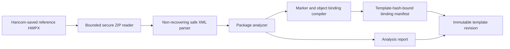
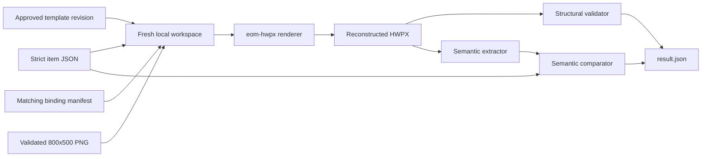
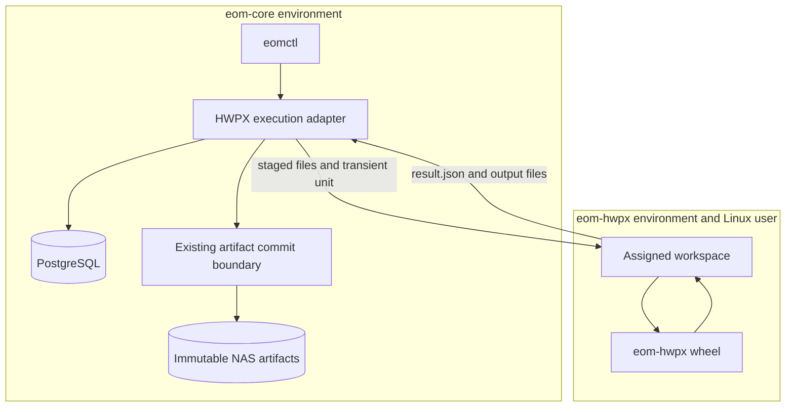
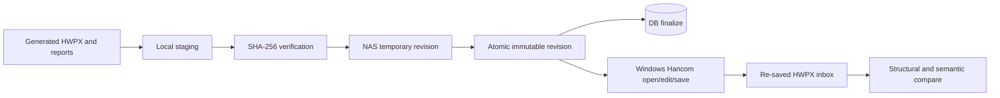
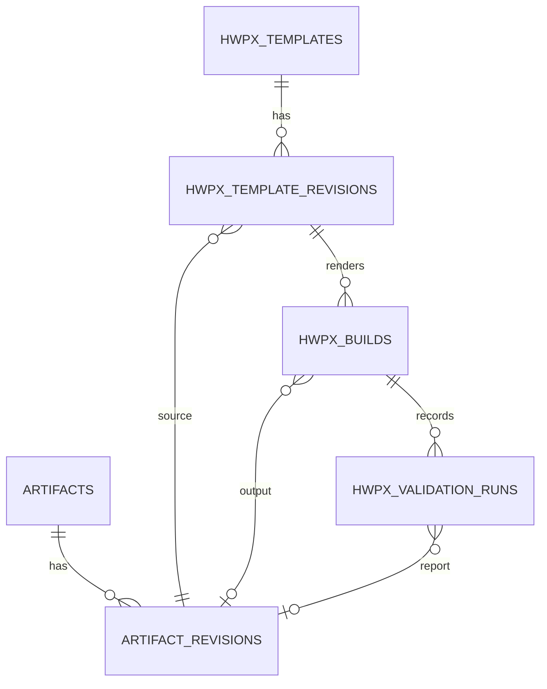

# HWPX POC V0

## Scope

This POC builds one combined placeholder item and solution document from one approved Hancom-saved
reference template. It does not synthesize an OWPML document from scratch and does not claim Hancom
compatibility until a human completes the Windows open, edit, save, reopen, and semantic comparison
gate. Repository synthetic packages exercise parsers and transforms only.

The builder is a file-only process. It has no PostgreSQL, NAS, Codex, Docker, Git, or network
access. The eom-core adapter owns database records, local staging, result validation, artifact
commit, and finalization.

## Reference Import



The importer preserves the reference `version.xml`, namespace profile, package entries, entry
order, compression methods, declarations, attributes, and unknown passive parts. Scripts, macros,
OLE, encryption, signatures, external links, executable content, and embedded packages are rejected.

## Render And Validation



Text and table values replace only exact bound marker occurrences. The image replaces the one
binary identified by the reference PNG hash while retaining its package path and object
relationships. An equation is changed only at a location observed during import, using either the
stored marker or a unique anchor-bound equation source. The renderer never guesses an XPath.

## Core And Builder Boundary



```mermaid
flowchart LR
  A[eom-hwpx process] --> W[Assigned workspace]
  A -. blocked .-> N[/mnt/nas]
  A -. blocked .-> D[Docker socket]
  A -. blocked .-> C[Codex auth and worker homes]
  A -. blocked .-> G[Git checkout]
  A -. blocked .-> NET[Network]
```

## Artifact And Manual Gate



Linux structural and semantic success reaches `LINUX_POC_VALIDATED`. Only the recorded manual
Hancom gates can reach `HWPX_POC_V0_COMPLETE`.

## Persistence



Logical IDs, revision IDs, package byte hashes, and semantic hashes remain distinct. An approved
template revision and every committed output revision are immutable. Build idempotency is enforced
by a unique normalized key.

## Preview And Determinism

Preview parts are not authoritative. A retained preview produces a stale-preview warning when it
cannot be safely regenerated on Linux. The renderer preserves entry order and compression method
but fixes ZIP timestamps to the DOS epoch. For the same template revision, canonical input, and
renderer version, output bytes and semantic hash are deterministic. Actual Hancom re-save behavior
will be recorded after the manual gate.

## Deferred Observability

The installed Observability Console is not rebuilt by this POC. A dedicated HWPX node requires a
future versioned observer contract and release: `OBSERVABILITY_HWPX_NODE_DEFERRED`.
