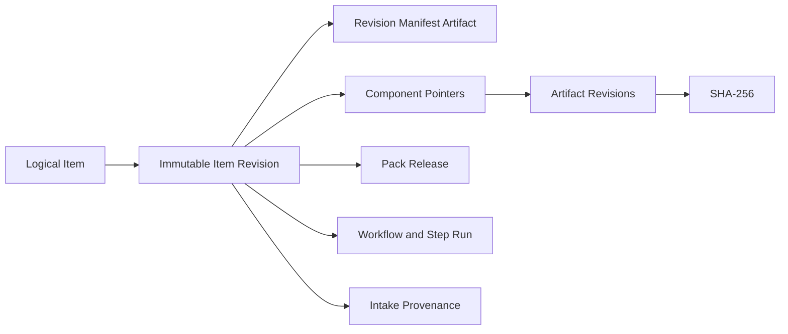

# Item Registry V0

## Boundary and canonical source

The registry owns logical Items and immutable Item Revisions. The canonical source is an
approved revision manifest plus validated component pointers, not a HWPX file, folder,
worker result, or exported spreadsheet.

Registration resolves and verifies every pack, workflow, Intake, schema, artifact revision,
media type, approval state, and hash before one transaction creates the DB projection. The
manifest is staged and committed through the existing artifact service. A workspace copy is
temporary and is never canonical.

## Data structures and access patterns

Expected V0 scale is thousands of Items and tens of revisions per Item. Key lookup uses
primary/foreign keys. Component lookup uses the unique `(revision, type, ordinal)` key.
Current-item search uses B-tree indexes and keyset ordering `(created_at DESC, item_id DESC)`.
Event history is append-only with an aggregate-local unique sequence. These give O(log n)
indexed lookup and O(page size) page materialization; component assembly is O(c).

Registration uses a unique registration key derived from workflow, step attempt, intent, and
pack hash. Create/revise locks the logical Item and base revision. A stale base is an explicit
`ITEM_REVISION_CONFLICT`; the service never substitutes the latest revision.

Approved revisions and their components, metadata, and provenance are protected by application
rules and PostgreSQL triggers. Revision replacement adds a new revision and changes only the
logical Item's current pointer; historical revisions remain addressable.

## Dependency direction

CLI and future APIs call catalog application services. Domain contracts do not import
SQLAlchemy, filesystem, or artifact infrastructure. The application service coordinates
validation and transactions; existing artifact adapters implement storage. Direct table writes
from workers or future GUI code are forbidden.

The simpler alternative was to store the complete Item JSON in one row. It was rejected because
it duplicates binary data, obscures revision identity, and cannot independently verify component
hashes. A generalized content graph was also rejected as unnecessary for V0.
