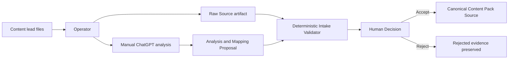
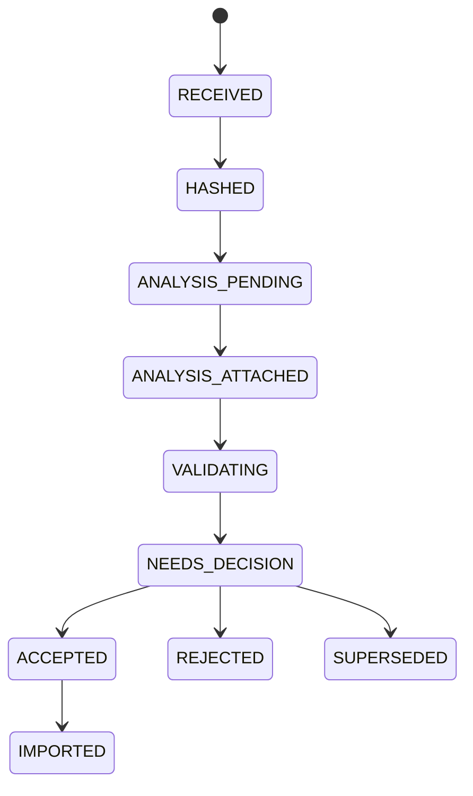

# Manual Content Intake V0

## Boundary

Manual Intake separates raw files, analysis proposals, and canonical pack source. Raw files and
analysis are never worker prompts. The EOM server has no ChatGPT API dependency.

## Lifecycle

Each transition and actor is recorded with a workflow-local monotonic sequence. Source rows,
analysis rows, and decision rows are immutable in PostgreSQL. Terminal batches are protected by a
database trigger.

## File Security

V0 inspects only path, type, size, and SHA-256 metadata. It rejects links, special files, traversal,
control characters, Unicode normalization collisions, case-fold collisions, duplicate bytes,
oversized batches, and suspected secrets. It does not execute macros, scripts, embedded programs,
or source document parsers.

The core-owned artifact adapter stages validated evidence locally and commits through the existing
NAS temporary-write, checksum, and atomic-rename boundary. DB rows retain artifact, revision, and
hash pointers rather than source bytes.

## Implementation Design Record

1. **Responsibility and boundary:** `eom_content_intake` owns IDs and lifecycle rules;
   `eom_catalog_service` owns the use case, database transaction, filesystem inspection, artifact
   adapter, evidence resolution, and pointer materialization. Workers and content authors do not
   access PostgreSQL or NAS.
2. **Canonical source:** immutable artifact revisions plus their intake database aggregate are
   canonical. Inbox files, staging files, analysis working copies, and pointer manifests are not.
3. **Entity and revision:** an intake batch is the logical aggregate. Each source, analysis, and
   decision points to an immutable artifact revision; replacement creates a new batch.
4. **Pointers:** logical artifact ID, artifact revision ID, SHA-256, manifest version, artifact type,
   and DB foreign keys are stored. Resolution never substitutes a latest revision.
5. **Access patterns:** batches are looked up by ID or source fingerprint; evidence by revision ID;
   events by `(batch_id, sequence)`; list views by `(created_at, batch_id)`.
6. **Data structures:** sets reject normalized, case-folded, and content-hash duplicates in expected
   O(1) membership time; maps join discovered files to manifest entries in O(1) lookup; tuples expose
   ordered immutable discovery results; the event log is append-only.
7. **Complexity:** discovery sorts `n` paths in O(n log n), while hashing is O(total input bytes).
   Metadata is O(n) space. Database point lookups use unique or B-tree indexes.
8. **Transaction and concurrency:** artifact I/O runs outside database transactions. Aggregate rows
   are locked for transitions, unique constraints enforce idempotency, and evidence plus state plus
   event append finalize together.
9. **Dependency direction:** CLI calls the application service; the application service depends on
   domain rules and explicit infrastructure adapters; domain rules do not import SQLAlchemy,
   filesystem, subprocess, or NAS code.
10. **Failure, retry, and idempotency:** source fingerprint and evidence hash form idempotency keys.
    Missing, stale, unapproved, wrong-schema, or hash-mismatched revisions fail explicitly. Replays
    return the same batch or immutable decision and never create duplicate artifacts.
11. **Simpler alternative rejected:** storing raw files or analysis JSON in PostgreSQL would reduce
    adapter code but duplicate large payloads and break the platform artifact boundary. A generic
    document parser is intentionally deferred because V0 only needs bounded metadata inspection.
