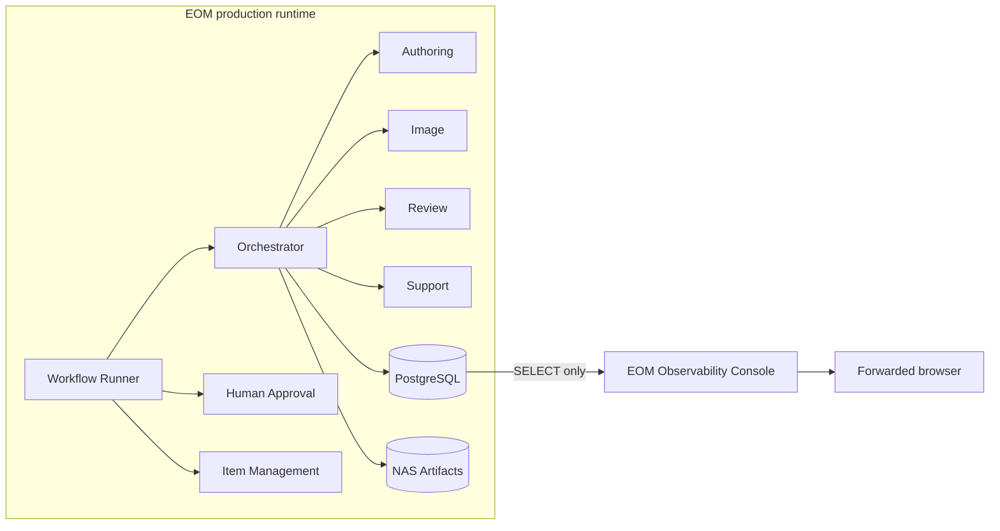
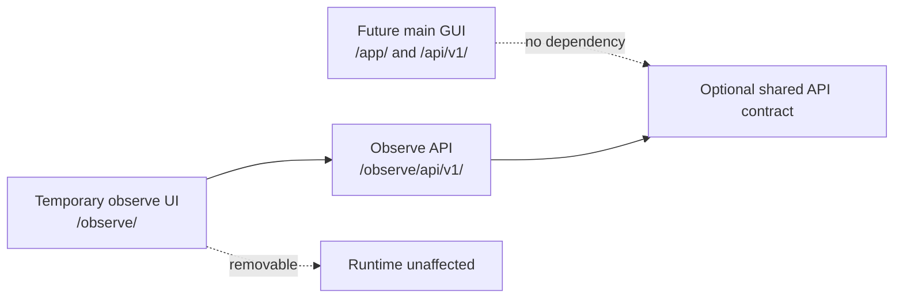
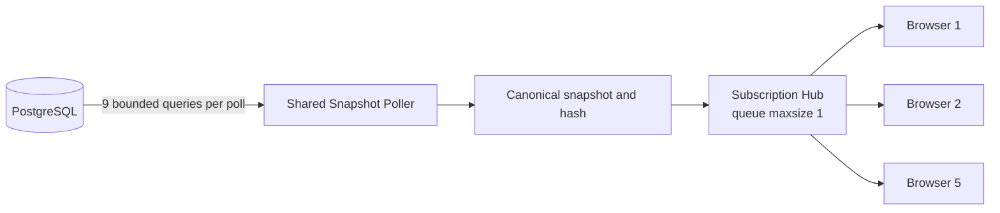
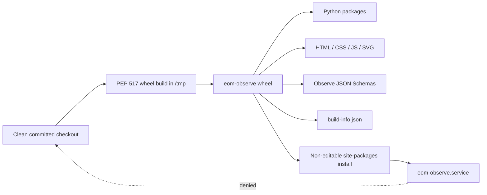
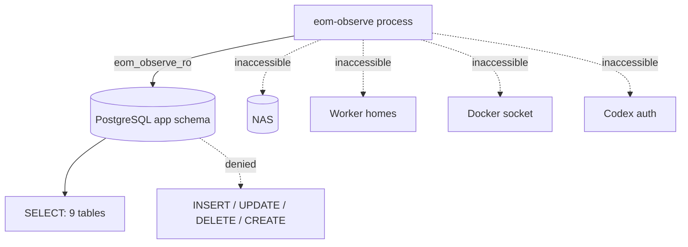
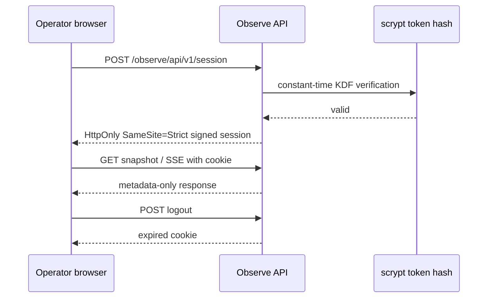
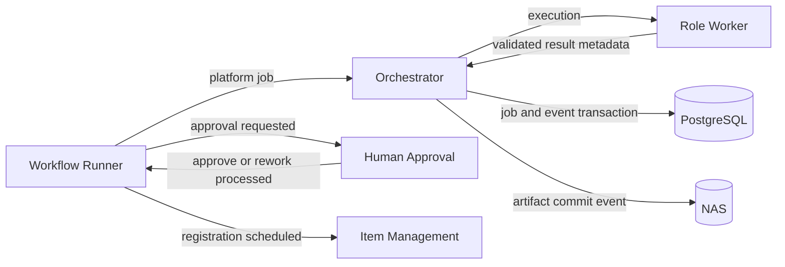
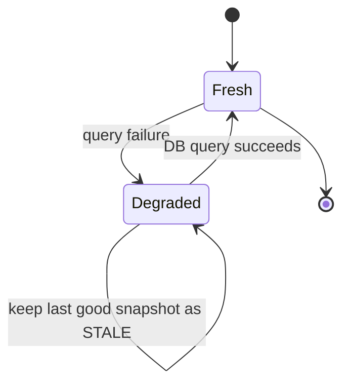

# EOM Observability Console V0

## Scope And Separation

Observability Console V0 is a read-only development and operations view. It is not a workflow control
plane, terminal, database admin, main GUI, or Slack feature. Production runtime packages never import
`eom_observe` or `eom_observe_contracts`.

The running service is a non-editable `eom-observe` wheel installed in the dedicated observer prefix.
It neither imports from nor reads `/home/eom/EOM`; the systemd mount namespace explicitly makes the
checkout inaccessible. Branch changes and future work such as HWPX therefore cannot alter the active
release. Deployment is an explicit build-and-install operation.

## Snapshot And Streaming

One polling task performs nine fixed SELECT queries in a short read-only transaction: workers,
workflows, step runs, jobs, job events, workflow events, approvals, revisions, and aggregate counts.
The pool has three connections, no overflow, 1500 ms statement timeout, and 3000 ms idle transaction
timeout. There is no N+1 query path.

Identical canonical content produces the same hash and is suppressed. Every reconnect receives a full
snapshot. Changes produce `delta`; inactivity produces `heartbeat`. A slow client loses intermediate
snapshots and receives the latest value.

## Release Resources

`importlib.resources` is the sole runtime resource boundary for static assets, schemas, and the
embedded worker-slot projection. `build-info.json` supplies source commit, package version, and UTC
build timestamp without consulting Git. The API exposes those immutable values in each snapshot.

## Read-Only Boundary

The role is `NOSUPERUSER NOCREATEDB NOCREATEROLE NOREPLICATION`, defaults transactions to read-only,
and has an `app, pg_catalog` search path. It has SELECT only on `worker_slots`, `jobs`, `job_events`,
`artifacts`, `artifact_revisions`, `workflow_instances`, `workflow_step_runs`, `workflow_events`, and
`approval_requests`.

## Authentication

The token has at least 32 random bytes. Only its scrypt hash is stored. Sessions are stateless HMAC
claims with issuance and expiry. Five failures within five minutes trigger the in-memory limiter.

## State Derivation

- Worker `RUNNING`: active step or job is claimed/running/validating/committing.
- Worker `QUEUED`: active job is created/validated/queued.
- Human gate `WAITING`: a pending approval exists.
- Runner `RUNNING`: a nonterminal workflow exists; orchestrator `RUNNING`: an active job exists.
- A worker completed within 30 seconds is `SUCCEEDED_RECENTLY` or `FAILED_RECENTLY`; it then returns
  to `IDLE`.
- Disabled slots are `DISABLED`. DB failure is `UNAVAILABLE`. Probe failure affects freshness only.

Input and output summaries contain IDs, schema/protocol versions, allowed enums, byte sizes, safe
idempotency-key digests, exit codes, and abbreviated hashes. Free text is represented as
`[CONTENT HIDDEN, length=N]`. Filesystem paths are hidden or mapped to
`nas://artifacts/<artifact_id>/<revision_id>` without reading NAS.

## Event And Worker Mapping

Events merge with the stable key `timestamp`, source priority, source-local sequence, and primary ID.
No original event payload is sent to the browser.

## Degraded Database Flow

The service remains alive and emits `degraded`; recovery emits `recovered`. EOM workflow and job state
is never changed by this path.

## Dependencies

FastAPI and Uvicorn provide the HTTP/SSE boundary; SQLAlchemy and psycopg provide bounded PostgreSQL
reads; Pydantic and jsonschema validate the contract; PyYAML validates config; httpx is test and local
acceptance tooling; Typer provides the operator CLI; pytest, Ruff, mypy and type stubs provide quality
checks. Versions are pinned in `infra/conda/eom-observe.requirements.lock` and installed only in the
dedicated observer prefix.
