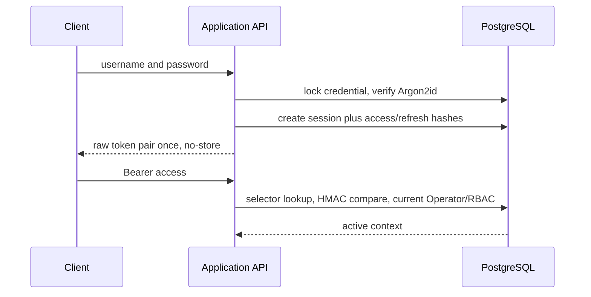
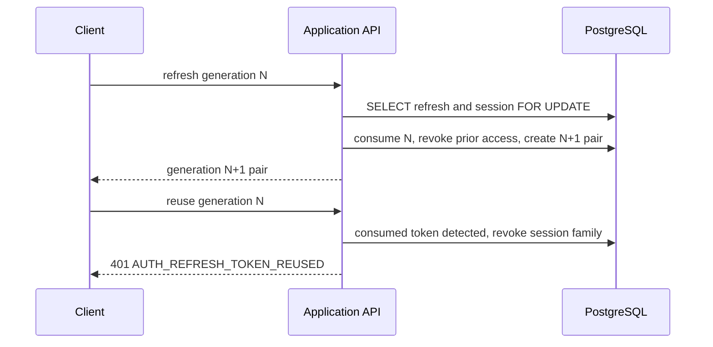

# Opaque Token Sessions

Access and refresh tokens contain a random non-secret selector and a minimum 32-byte random
verifier. PostgreSQL stores the selector and `HMAC-SHA256(server_key, verifier)` only. Tokens carry
no identity, role, permission, or other JWT-like payload.

The default access TTL is 30 minutes. Refresh and absolute session lifetime are 30 days; idle
lifetime is 7 days. Refresh does not change `authenticated_at`, so it cannot make a session fresh.
Every refresh rotates both tokens. The refresh row and session row are locked in one transaction,
therefore only one concurrent request succeeds and reuse revokes the new pair too.

Logout revokes the current session; logout-all and admin revoke affect all current sessions.
Password change revokes other sessions and rotates the current pair. Disable is checked from the
Operator row on every access and revokes all sessions in the same management transaction.

Token/session rows are not physically deleted in V0. A later maintenance release may purge revoked
or expired rows only after their audit retention window, with session family and replacement links
preserved in a manifest. No purge daemon is part of V0.
