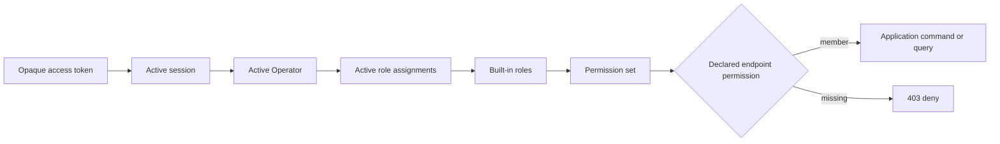

# Operator Identity and RBAC

`operator_id` is canonical identity. A lowercase username is only a case-insensitive unique login
attribute and `display_name` is a separate Unicode value. Operators are disabled, never physically
deleted. Credential state is separate so password versions and login lock state do not change the
logical identity.

Built-in role keys and permission keys are immutable. Active assignments are append-only rows with
`revoked_at`; a partial unique index prevents duplicate active assignment. Each request joins the
current active assignment and role-permission tables into a `frozenset`, so disable and role changes
affect an existing access token immediately without a permission cache.

The API denies any protected route without explicit permission metadata. ADMIN is represented by
the complete permission set, not scattered role-name branches. Restricted first-login sessions may
only call `auth:me`, `auth:change_password`, and `auth:logout` at the HTTP dependency boundary.

Bootstrap and ADMIN removal share fixed transaction advisory lock `0x454F4D4150495630`. Under that
lock the service counts active Operators with a current ADMIN assignment. Disabling or revoking the
ADMIN role from the last one fails with `OPERATOR_LAST_ADMIN`; the partial unique constraint and row
locks protect the remaining assignment mutations.

Password hashing uses `pwdlib==0.3.1` with its recommended Argon2id hasher. `pwdlib[argon2]` is the
only new core dependency because both emergency CLI and HTTP login must use one credential rule.
EOM adds bounded Unicode character and UTF-8 byte length, NUL, identity, and explicit common-value
checks. Unknown usernames execute dummy Argon2 verification. Client login failures remain the same
401 message regardless of unknown, mismatch, disabled, or locked internal reason.

Token HMAC and fingerprint keys enter the service only through systemd's protected
`EnvironmentFile`. They are validated as non-placeholder values and never returned by doctor,
logs, audit events, or HTTP. Operator and role behavior does not require the runtime identity to
traverse the shared secret directory.
