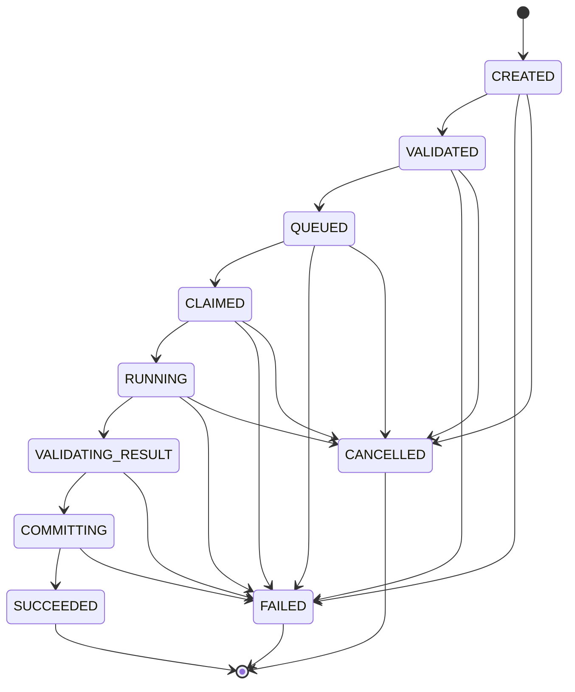

# Platform Skeleton V0

## Scope

This version proves one authoring smoke-test job end to end. It deliberately excludes integrated
science authoring logic, HWPX, images, Slack, GUI, direct worker coordination, and external LLM
APIs. Codex CLI is the only model subprocess.

## Data Flow

```mermaid
flowchart LR
  CLI[eomctl] -->|JobRequest| ORCH[Orchestrator]
  ORCH -->|job and events| DB[(PostgreSQL)]
  ORCH -->|WorkerInput files| WS[Job workspace]
  ORCH -->|transient unit| W[eom-cdx-01 codex exec]
  W -->|result.json only| WS
  ORCH -->|Schema 2020-12 and Pydantic| V[Result validation]
  V -->|canonical bytes and SHA-256| ST[/srv/eom/staging/JOB_ID]
  ST -->|temporary copy, verify, rename| NAS[/mnt/nas/eom/artifacts/ARTIFACT_ID/REVISION_ID]
  NAS -->|final path and hashes| ORCH
  ORCH -->|artifact, revision, final event| DB
  DB -->|inspect and events| CLI
```

Workers cannot access PostgreSQL. Their transient systemd unit marks `/mnt/nas`, the Docker socket,
the EOM source repository, system EOM configuration, and orchestrator staging inaccessible. Workers
receive only three read-only files in their own job workspace: `worker-input.json`,
`worker-result.schema.json`, and `prompt.txt`. Codex stdout and stderr are bounded diagnostics; the
system result is only `result.json` written through `--output-last-message`.

## State Machine



The allow-list in `state_machine.py` rejects every transition not shown. A row lock serializes each
transition, and `job_events.sequence` is unique per job. Terminal states have no outgoing edges.

## Protocol

Protocol version `1.0.1` defines strict JSON Schema 2020-12 documents and matching frozen Pydantic
2 models for `JobRequest`, `WorkerInput`, `WorkerResult`, `ArtifactManifest`, and `ErrorResult`.
Every external message rejects additional properties. Schema format checking and Pydantic parsing
both enforce UTC timestamps.

The schema bundle hash is stored separately in `protocol_versions`. Reusing a protocol version with
different schemas is rejected.

## Identity And Idempotency

- `job_<uuid>` identifies an execution.
- `artifact_<uuid>` is a logical artifact ID.
- `rev_<uuid>` identifies one immutable revision.
- `sha256:<hex>` identifies exact canonical content bytes.

These values are never substituted for one another. Canonical JSON sorts keys, uses UTF-8 and UTC,
and rejects floats. A unique idempotency key is fingerprinted from protocol version, task type, and
payload, not from generated IDs. Repeating the same key and payload returns the original job;
reusing it for a different payload is rejected. A duplicate submit therefore cannot create another
worker execution or artifact.

## Persistence

PostgreSQL tables are `jobs`, `job_events`, `worker_slots`, `artifacts`, `artifact_revisions`, and
`protocol_versions`. The initial Alembic revision is `20260815_0001`. Approved artifact and revision
rows are protected from update and delete by PostgreSQL triggers.

Artifact commit order is:

1. Read untrusted worker `result.json` with size, regular-file, and workspace-boundary checks.
2. Validate JSON Schema and Pydantic model, including input/result identity equality.
3. Write canonical `result.json` and `manifest.json` to local staging and calculate separate hashes.
4. Copy to a random NAS temporary directory and verify both checksums.
5. `fsync` files and atomically rename the temporary directory to the revision ID.
6. In one DB transaction insert artifact/revision rows and transition `COMMITTING` to `SUCCEEDED`.

An existing final revision is never overwritten. It is accepted only when both stored files match
the staged checksums. No partial failure can transition the job to `SUCCEEDED`.

## Worker Selection

`config/worker-slots.example.yaml` is validated with Pydantic. V0 deterministically selects the
lowest enabled `authoring` slot, currently slot `01` / `eom-cdx-01`. Global Codex concurrency 3 and
GPU concurrency 1 are exposed by the registry; a multi-job scheduler is intentionally deferred.

The synchronous CLI path must be run by an operator allowed to create transient systemd services.
The checked-in orchestrator systemd file remains an example and is not installed by this change.

## Errors And Logging

Stable codes cover protocol, state, worker, artifact, database, and NAS failures. Worker timeout,
nonzero exit, missing output, and invalid JSON all create an explicit `FAILED` event when the
database remains available. Structured logs contain UTC `timestamp`, `level`, `job_id`,
`worker_slot`, `component`, `event`, and `error_code`; secrets and authentication content are never
logged.

## Dependencies

Each dependency has a narrow purpose:

| Dependency | Reason |
| --- | --- |
| SQLAlchemy 2 | Typed persistence and explicit transactions |
| Alembic | Reversible PostgreSQL schema migrations |
| psycopg 3 | PostgreSQL driver |
| Pydantic 2 | Runtime typed protocol and config validation |
| jsonschema | Independent JSON Schema 2020-12 validation |
| PyYAML | Safe parsing of worker, actor, runner, and declarative workflow configuration |
| Typer | Small operator CLI |
| pytest | Unit, integration, and opt-in live tests |
| Ruff | Formatter and linter |
| mypy | Strict static type checking |

The bootstrap Conda channels required an unaccepted Terms of Service on the implementation host,
so packages were installed with the pip belonging to `/srv/eom/conda/envs/eom-core`; system Python
was not modified.
