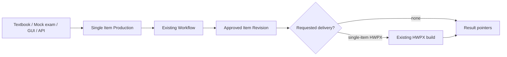
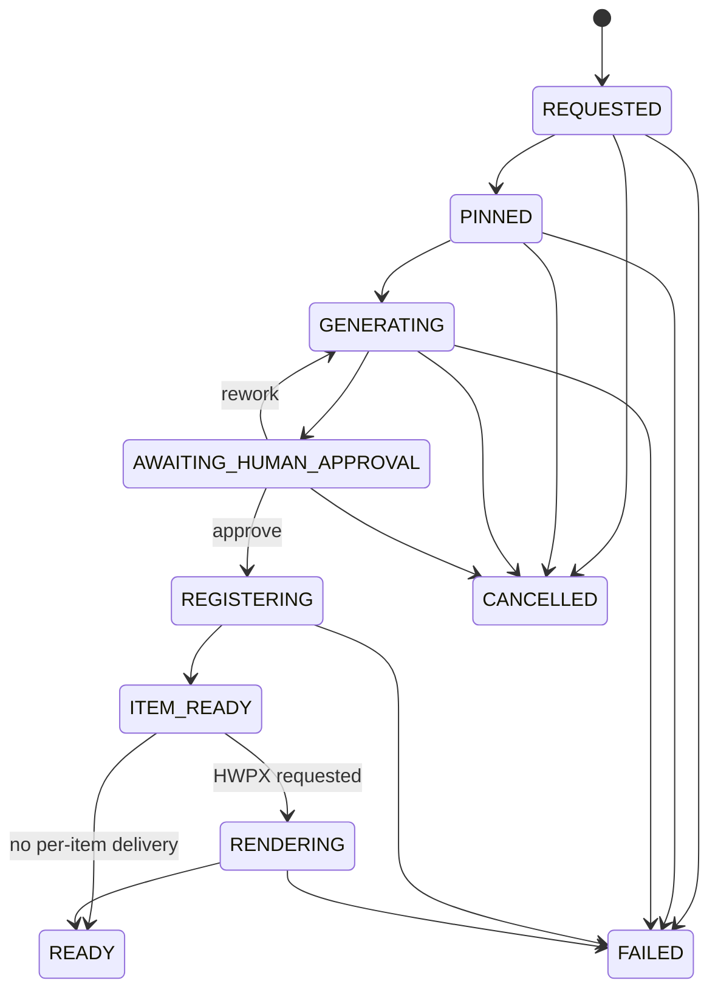
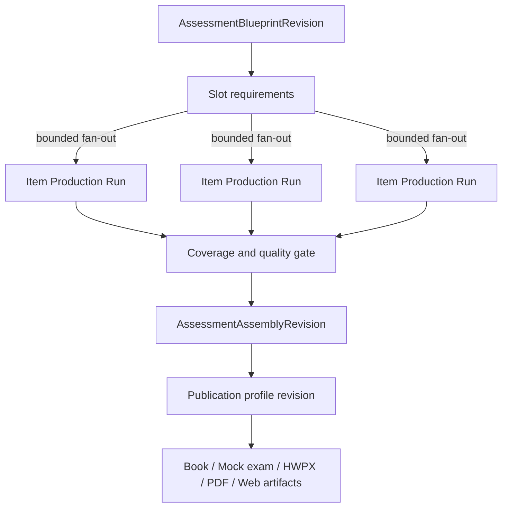

# Single Item Production Capability — design space

Status: **EXPLORATORY / NOT AN ADR**
Date: **2026-08-23**

## Purpose and non-decision

이 문서는 현재의 “1문제 만들기”를 교재, 모의고사, 문항은행, 학습 경로가 안정적으로 재사용할
수 있도록 캡슐화하는 설계 공간을 정리한다. **아직 하나의 구현을 확정하지 않는다.** 특히 다음을
이 문서만으로 결정하지 않는다.

- 별도 `ItemProductionRun` aggregate를 즉시 만들지 여부
- 단일 문항 capability가 HWPX까지 책임질지, 승인 Item Revision에서 끝날지
- 기존 Workflow를 composite workflow로 확장할지, application process manager를 둘지
- 같은 process 안에서 시작할지, 장래 별도 coordinator service로 분리할지
- 품질 평가를 모든 문항에 동일하게 적용할지, risk/blueprint에 따라 단계적으로 적용할지

문서의 목적은 공통 불변식, 후보 계약, 대안의 장단점, 선택을 위한 측정값, 대안 간 migration
경로를 먼저 합의하는 것이다. 코드, DB migration, runtime 배포는 이 문서 범위에 포함되지 않는다.

모든 대안이 지켜야 할 공통 방향은 다음과 같다.

- 새 agent framework나 worker 간 직접 통신망을 만들지 않는다.
- 기존 Workflow, Catalog, Item Registry, HWPX를 정본으로 유지한다.
- 상위 계층은 문항 payload가 아니라 pinned pointer와 작은 typed command/result를 사용한다.
- 브라우저가 장기 실행의 coordinator가 되지 않는다.
- 자동화 수준이 높아져도 사람 승인과 artifact integrity gate를 우회하지 않는다.

가장 단순한 facade에서 durable process manager, composite workflow, 별도 coordinator까지 단계적으로
진화할 수 있다. 현재 증거만으로는 **same-platform durable process manager가 유력한 시작 가설**이지만,
아래 측정과 prototype 없이 최종 ADR로 승격하지 않는다.



The diagram shows the product-shaped flow, not a commitment to which component stores its state.

## Current baseline and the gap to close

The repository already has durable components for every material production boundary:

| Existing boundary | Owns | Does not own |
| --- | --- | --- |
| Request Draft / Studio | bounded user input, review before submit, browser projection | long-running orchestration |
| Workflow Engine | role DAG, attempts, leases, approval/rework, final registration pointer | HWPX delivery lifecycle |
| Orchestrator | worker launch, schema validation, artifact commit | Item lifecycle, product-level batch plan |
| Catalog / Item Registry | canonical Item and immutable Item Revision | worker execution, publication layout |
| HWPX Application | pinned Item Revision delivery build and secure download | canonical question content |
| Observability | read-only operational projection | commands or domain mutation |

For one operator in the GUI, these boundaries already form a successful path. The gap appears when
an upper layer needs to say “produce 30 questions for this mock-exam blueprint” and survive browser
disconnects, approval delays, partial failures, or a deployment between stages. Today that upper layer
would have to understand several IDs and lifecycles and could accidentally duplicate a child command.

The capsule should reduce that coordination burden without erasing the child identities that make the
system auditable.

## Goals, non-goals, and consumers

### Goals

- expose a stable product-level contract for producing one canonical question;
- allow a caller to resume by one correlation identity after minutes or days;
- make every resolved default and external pointer reproducible;
- preserve approval, rework, cancellation, and failure evidence;
- support optional delivery without treating HWPX as canonical content;
- make N-item composition bounded, observable, and idempotent;
- evolve from a low-cost facade to a durable coordinator without changing consumer meaning.

### Non-goals

- replace the Workflow Engine, Catalog, Registry, HWPX Manager, or their tables;
- give workers direct access to one another, PostgreSQL, NAS, or product APIs;
- make an LLM score the sole publishing authority;
- automatically resurrect terminal failures until something succeeds;
- hide logical/revision/artifact/hash identities behind one uninspectable blob;
- introduce Kafka, a new workflow framework, or a new microservice before load requires it;
- make a per-item HWPX the assembly unit for textbooks or mock exams.

### Consumer shapes

| Consumer | What it needs from one-item capability | What remains above it |
| --- | --- | --- |
| Scientific Studio | start, observe, approve/rework, download optional HWPX | operator UX and session state |
| Item bank | approved exact Item Revision with searchable metadata | discovery, curation, usage history |
| Mock exam | items satisfying slot constraints and quality policy | blueprint coverage, ordering, scoring |
| Textbook | reusable item/stimulus pointers | chapter structure, pedagogy, layout |
| Adaptive learning | item identity plus calibrated evidence | learner state and selection policy |
| Offline evaluation | exact snapshot and receipts | benchmark split, repeated trials, analysis |

## Architecture options

The options are intentionally compatible at the public contract level. They differ mainly in who owns
the product-level state and when that ownership becomes worth its operational cost.

### Option A — projection/facade over existing resources

The Application API accepts a one-item request by delegating to the existing Workflow command and
returns a synthetic status assembled from Workflow, Item Registration, and optional HWPX resources.
It stores no new aggregate.

```text
SingleItem API facade
  -> existing Workflow command
  <- derive state from Workflow + Item + HWPX queries
```

**Strengths**

- smallest implementation and no new migration;
- no duplicated state or reconciliation loop;
- suitable for improving GUI discoverability and testing the public vocabulary;
- easy to remove.

**Weaknesses**

- no durable owner for “after approval, request delivery” automation;
- reconstructing one product state from multiple histories can become ambiguous;
- idempotency spans several APIs rather than one aggregate;
- parent textbook/mock-exam progress still needs another coordinator.

**Choose when** the immediate need is one-item UX/read model and a human explicitly triggers each
stage. **Leave when** automatic continuation across a long approval wait or N-item fan-out is required.

### Option B — same-platform durable process manager

Add a small `ItemProductionRun` aggregate and reconciler to the existing application/runtime. It owns
only the resolved request snapshot, coarse state, child pointers, event sequence, and next action. It
calls existing application ports and never writes their private tables directly.

```text
ItemProductionRun
  -> Workflow command/pointer
  -> Item Revision pointer
  -> optional HWPX command/pointer
```

**Strengths**

- one durable correlation and idempotency boundary;
- can pause at human approval without holding resources;
- handles lost responses and process restarts cleanly;
- naturally becomes the child primitive for textbook/mock-exam assembly;
- reuses current PostgreSQL queue, transaction, and deployment model.

**Weaknesses**

- introduces a projection that must reconcile with authoritative child states;
- requires migration, transition tests, indexes, and failure-code mapping;
- careless implementation could become a god service or duplicate child rules.

**Choose when** automatic cross-boundary continuation and parent/child tracking are current product
requirements. This is the leading starting hypothesis, not a locked decision.

### Option C — composite Workflow definition

Extend the Workflow Engine so a definition can include deterministic application steps such as
registration and delivery in addition to agent/human/terminal steps. “One question” then remains one
Workflow instance whose final manifest includes the HWPX pointer if requested.

**Strengths**

- one state machine, event stream, rework model, and observability surface;
- versioned DAG visibly describes the whole process;
- batch parents can depend on terminal Workflow pointers.

**Weaknesses**

- current Workflow semantics are centered on role results and registration;
- adding general application steps changes core protocol and execution boundaries;
- HWPX delivery failures have different retry semantics from authoring failures;
- tying delivery to generation may reduce reuse of the approved Item Revision.

**Choose when** several real workflows need the same non-agent step abstraction and the extension is
smaller than maintaining a separate process layer. Do not add a generic step-plugin framework for this
single use case.

### Option D — separate production coordinator service

A dedicated service owns one-item and assembly process aggregates, consumes typed child events, and
issues commands through public application contracts.

**Strengths**

- independent scaling, deployment, quotas, and product-team ownership;
- clean fit if textbook/mock-exam production becomes a large workload;
- can isolate complex scheduling from the core API.

**Weaknesses**

- another runtime identity, DB role, deployment, readiness, audit, and incident surface;
- asynchronous event delivery/outbox requirements become unavoidable;
- risks duplicating the existing runner and introducing eventual-consistency bugs too early.

**Choose when** measured queue volume, independent release cadence, or failure isolation exceeds what
the current application process can safely provide. It is an evolution target, not a V1 default.

### Option E — client-side choreography

The GUI or parent product calls Workflow, Item, and HWPX APIs in sequence and stores its own progress.

This is acceptable only for disposable prototypes. It is not a production target because browser
closure, token expiry, duplicate submissions, and competing clients make correctness client-dependent.

## Qualitative comparison

| Criterion | A. Facade | B. In-platform process | C. Composite workflow | D. Coordinator service |
| --- | --- | --- | --- | --- |
| New persistent model | none | small aggregate/events | workflow protocol expansion | aggregate/events + service state |
| Long human wait | projected only | native | native | native |
| Automatic HWPX continuation | weak | strong | strong but coupled | strong |
| Child identity preservation | strong | strong if pointers-only | strong in final manifest | strong if protocol-enforced |
| N-item composition | external | natural child primitive | possible parent DAG | natural |
| Operational cost | lowest | low–medium | medium–high core risk | highest |
| Removal/reversal cost | lowest | medium | high after protocol use | medium–high |
| Best trigger | UX vocabulary | real durable use case | repeated cross-domain step need | measured scale/isolation need |

No numeric score is assigned before representative load and failure-recovery experiments. A weighted
decision matrix would create false precision without those measurements.

## Independent design axes

The following choices should remain independent rather than bundled into one large architecture vote.

### Terminal output boundary

1. **Item-only core:** success means one approved Item Revision; all delivery is separate.
2. **Item plus optional delivery:** request contains a closed `deliverables` set; `READY` waits for all.
3. **Two terminal milestones:** `ITEM_READY` is durable success, while delivery has its own sub-status.

Option 3 often gives the best reuse semantics: a transient renderer problem does not invalidate a valid
question, but a caller asking for HWPX can still wait for a delivery-complete projection. This remains a
policy choice to validate with product UX.

### State ownership

- calculated projection only;
- persisted current state plus authoritative append-only events;
- event-derived state with rebuildable projection;
- parent-owned child pointer with no independent one-item aggregate.

EOM does not need full event sourcing merely to gain an audit log. Persisted state plus append-only
events is simpler unless projection rebuilding becomes a demonstrated requirement.

### Continuation mechanism

- explicit operator command after each gate;
- periodic reconciler of due runs;
- child event/outbox notification with periodic reconciliation as safety net;
- parent workflow transition.

Polling child tables with repeated full scans is rejected. If reconciliation is used, an indexed
`next_action_at` claim is required. Event notification may reduce latency, but reconciliation remains
the correctness backstop.

### Quality policy

- one baseline policy for every item;
- profile by subject/item type;
- risk-tiered policy (new pack, novel diagram, high-stakes exam);
- parent blueprint policy that can strengthen but not weaken mandatory baseline gates.

The policy identity and revision must be pinned. A mutable threshold read at approval time would make
historical decisions irreproducible.

### Candidate strategy

- one candidate with targeted rework;
- bounded K candidates with deterministic filters;
- contrast pairs around difficulty;
- staged generation only for uncovered blueprint cells.

The default should remain one candidate until measurements show that extra candidates improve accepted
quality enough to justify worker time and review load.

### Deployment topology

- module in the Application API/runtime;
- same package, separate runner process;
- independent service behind typed protocol.

Contracts must not expose the topology. That permits later extraction without changing textbook or GUI
semantics.

## Why this boundary

최근 agent 연구는 복잡한 multi-agent 구성이 자동으로 신뢰성을 높이지 않으며, 실패가 역할
명세, agent 간 정렬, 검증·종료 판정에서 발생한다는 점을 보여준다. EOM은 worker를 더 자유롭게
연결하는 대신, 기존 중앙 Orchestrator와 typed handoff를 유지하고 application layer에서 전체
진행을 관리한다.

교육 문항 연구도 문법적으로 유효한 출력과 교육적으로 좋은 문항을 구분한다. 따라서 Schema
validation은 필수 입구일 뿐이며, 정답 가능성·정답 일관성·난이도·교육목표·자극 자료의 의미를
독립 gate와 사람의 승인으로 다룬다.

## Required design procedure

1. **Responsibility and boundary.** Capability는 최소한 단일 문항 production use case의 typed
   facade와 결과 projection을 소유한다. durable option에서는 child command 조정과 human wait도
   소유한다. 어떤 option도 Workflow, Registry, HWPX의 domain rule이나 persistence를 복제하지
   않는다.
2. **Canonical source.** 승인된 Item Revision과 그 component Artifact Revisions가 정본이다.
   선택적으로 추가되는 Capability row, worker result, workspace, HWPX는 각각 process projection,
   provenance, temporary materialization, delivery다.
3. **Logical entity and revision model.** durable option의 `ItemProductionRun`은 한 실행
   occurrence이며 facade option에서는 Workflow occurrence가 그 역할을 한다. 어느 쪽이든 입력은
   immutable request snapshot으로 고정하고, logical Item ID와 exact Item Revision ID를 분리한다.
   상위 publication은 Item을 복사하지 않고 Revision pointer를 순서대로 고정한다.
4. **Pointers and resolution.** Workflow definition/version/hash, Content Pack release/hash,
   request schema/version, optional Intake/media pointers, resulting Workflow ID, Item/Revision,
   HWPX Build/Artifact Revision/SHA를 검증한다. implicit latest는 금지한다.
5. **Primary access patterns.** production/workflow ID와 idempotency key의 key lookup,
   operator/project별 ordered iteration, active-work membership, immutable output snapshot, 상위
   Assembly의 ordered child pointers가 공통이다. durable option은 FIFO due-action claim과
   append-only event history를 추가한다.
6. **Data structures and indexes.** persistence를 추가할 때만 DB B-tree/unique/partial index를
   도입한다. 작은 pointer set은 keyed map/set, ordered output은 tuple, dependency는 고정 DAG,
   history를 소유한다면 monotonic sequence로 표현한다.
7. **Scale and complexity.** 후보 설계 범위는 10^3–10^6 occurrence, durable option은 run당 수십
   event다. 조회·claim은 O(log n), reconcile은 O(1) child lookups, assembly validation은
   O(items)를 목표로 한다. 어느 option에서도 binary 크기와 DB row 크기가 비례하지 않는다.
8. **Transaction and concurrency.** facade는 기존 child transaction/idempotency를 그대로
   위임한다. durable option은 request accept와 idempotency claim을 한 transaction으로 처리하고,
   child command와 process event를 같은 application transaction 또는 transactional outbox로
   연결한다. reconcile을 둔다면 lease와 `FOR UPDATE SKIP LOCKED`를 사용하며 느린 agent/HWPX
   실행 중 DB lock을 유지하지 않는다.
9. **Dependency direction.** GUI/API → Item Production application service → existing Workflow,
   Catalog, HWPX ports → domain/contracts 순서를 지킨다. capability contract는 SQLAlchemy,
   filesystem, subprocess, HTTP 구현을 import하지 않는다.
10. **Failure, retry, idempotency.** at-least-once command 처리를 전제로 모든 child submission을
    idempotent하게 만든다. infrastructure pre-claim failure만 안전하게 재시도하고, terminal
    worker/build failure는 자동으로 새 실행을 만들지 않는다. rework와 새 build는 명시적 command다.
11. **Simpler alternative.** GUI choreography는 browser 종료, 중복 요청, approval wait, 부분
    실패에 약하다. 반대로 즉시 새 microservice/queue를 도입하면 현재 command/state machine을
    중복한다. 그래서 facade부터 측정하고, durable need가 확인되면 same-platform process
    manager를 검증한 뒤, scale evidence가 있을 때만 별도 service를 고려한다.

## Candidate public contract envelope

어떤 option을 선택하든 구현 전에 JSON Schema 2020-12 계약을 새 버전으로 정의한다. 아래 이름과
필드는 토론용이며 아직 runtime protocol이 아니다. facade에서는 `production_id`가 Workflow-backed
projection identity일 수 있고, durable option에서는 별도 run identity일 수 있다. 외부 client는
그 차이에 의존하지 않아야 한다.

### `single-item-production-request@1.0`

| Field | Meaning |
| --- | --- |
| `client_request_id` | optional client correlation; domain identity나 idempotency 대체 아님 |
| `idempotency_key` | 동일 actor/operation의 replay identity |
| `brief` | bounded typed educational objective와 문항 제약 |
| `source_mode` | `PINNED_INTAKE` 또는 `BUILT_IN_KNOWLEDGE` discriminant |
| `source_pointers` | mode에 맞는 immutable Intake/media pointers |
| `workflow_ref` | definition key, version, canonical hash |
| `content_pack_ref` | logical pack ID, release ID, version, bundle/manifest hash |
| `quality_policy_ref` | immutable rubric/evaluation profile revision |
| `deliverables` | `CANONICAL_ITEM`과 선택적 `SINGLE_ITEM_HWPX`의 closed set |
| `delivery_profile_ref` | template/profile revision과 hashes; HWPX 요청 때만 필요 |
| `parent_scope` | optional textbook/mock-exam/project revision pointer |

서버가 default를 해석한 뒤 **resolved request snapshot**을 기존 Workflow snapshot 또는 별도
immutable value에 고정한다. 향후 active Content Pack이나 template가 바뀌어도 이미 시작한
occurrence에는 영향을 주지 않는다.

### `single-item-production-result@1.0`

```text
Production identity (implementation-neutral public ID)
optional backing ItemProductionRun ID
Workflow ID + definition version/hash
Approval ID + decision metadata
Item ID + immutable Item Revision ID
ITEM_CONTENT Artifact ID + Revision ID + schema + SHA-256
Stimulus Artifact pointers
QualityReceipt Revision pointer
optional HWPX Build ID + output Artifact Revision ID + SHA-256
final provenance manifest Revision pointer
```

큰 content JSON이나 binary를 result에 중복하지 않는다. 각 pointer를 dereference할 때 존재,
lifecycle, permission, schema, media type, logical/revision relationship, hash를 다시 검증한다.

### Resource and command shape variants

The HTTP shape can remain stable across architecture options:

```text
POST /api/v1/item-productions
GET  /api/v1/item-productions/{production_id}
GET  /api/v1/item-productions/{production_id}/events
POST /api/v1/item-productions/{production_id}/commands/approve
POST /api/v1/item-productions/{production_id}/commands/request-rework
POST /api/v1/item-productions/{production_id}/commands/cancel
POST /api/v1/item-productions/{production_id}/commands/retry-delivery
```

This is illustrative, not an accepted route design. Alternatives include:

- expose only the create/status facade and keep approval on the existing Workflow route;
- return typed links to existing approval/HWPX resources rather than proxying commands;
- expose a GraphQL-like aggregate read later while retaining command-specific REST mutations;
- use server-sent events only as a read optimization, with GET as the authoritative recovery path.

Commands must remain action-specific. A generic `PATCH state=...` would let presentation code encode
domain transitions and should be rejected. Mutations require idempotency and the current child ETag or
expected resource version when the existing boundary uses optimistic concurrency.

### View shape

A product view can expose three independent progress values instead of collapsing everything into one
ambiguous status:

```text
content_status: REQUESTED | GENERATING | AWAITING_APPROVAL | REGISTERING | READY | FAILED
delivery_status: NOT_REQUESTED | BLOCKED_ON_CONTENT | REQUESTED | RUNNING | READY | FAILED
overall_status: ACTIVE | NEEDS_HUMAN | READY | PARTIAL | FAILED | CANCELLED
```

`overall_status` is a presentation projection. The content and delivery states plus exact child pointers
remain the diagnostic truth. In the item-only terminal policy, a delivery failure can produce
`overall_status=PARTIAL` rather than declaring the canonical Item invalid.

### Pointer resolution matrix

| Pointer | Resolution checks before use |
| --- | --- |
| Workflow definition | key/version exists, canonical hash matches, immutable row/resource |
| Content Pack release | logical pack relationship, RELEASED/active-at-snapshot evidence, bundle/manifest/source hashes |
| Intake batch | exact ID, accepted lifecycle, permission, source artifact pointers |
| quality policy | policy ID/revision/schema/hash, compatibility with item/workflow profile |
| Item Revision | Item exists, exact current/approved requirement for requested operation, component uniqueness |
| ITEM_CONTENT component | component type/ordinal/schema/media, artifact/revision ownership, approved state, SHA |
| stimulus media | artifact member containment, regular non-symlink file, media signature/dimensions/hash |
| template/profile | logical/revision identity, approval, compatibility, Artifact Revision and SHA |
| HWPX output | build/result/artifact pointer consistency, validation PASS, file type/size/hash |
| parent scope | project/blueprint revision exists, caller permission, slot identity and lifecycle |

Resolution failure never silently drops an optional-looking field if it was part of the accepted request
snapshot. A caller must submit a new request or explicit revision command.

## Aggregate and state machine

상태를 소유하는 대안을 선택할 경우 capability는 child state를 덮어쓰지 않고 다음과 같은
coarse-grained product state만 소유할 수 있다. facade/projection 대안은 이 상태를 저장하지 않고
child state에서 계산할 수 있다.



durable aggregate를 선택한다면 각 전이는 `ItemProductionEvent(sequence)`를 append하고
`prior_state`, `new_state`, actor/command, child pointer, stable reason code, UTC timestamp를
기록한다. process row의 current state는 조회용 projection이며 event history와 불일치하면
readiness가 fail closed한다. facade option은 새 event를 만들지 않고 child histories를 링크한다.

durable option에서 검토할 persistence access path와 index 후보는 다음과 같다.

| Operation | Proposed structure |
| --- | --- |
| exact run | primary key `item_production_run_id` |
| replay | unique `(operator_id, endpoint_key, idempotency_key_hash)` + request hash |
| active equivalence | partial unique request fingerprint on non-terminal states |
| child callback/reconcile | unique nullable `workflow_id`, `hwpx_build_id` |
| project history | B-tree `(parent_scope_id, created_at DESC, run_id DESC)` |
| due action claim | partial B-tree `(next_action_at, created_at, run_id)` on actionable states |
| event history | unique `(run_id, sequence)` and append-only timestamp index |

reconciler를 둔다면 한 run의 child ID를 map으로 한 번 해석해 O(1) lookup을 유지한다. 상위
batch에서 중복 Revision 검사는 set, 출제 순서는 immutable tuple을 사용한다.

## Exactly-once effects without an exactly-once illusion

- HTTP replay는 같은 key+request hash면 같은 production resource를 반환하고, 같은 key+다른
  body면 conflict다.
- Workflow submission key는 public production identity와 pinned snapshot hash에서 파생하거나,
  facade option에서는 기존 Workflow idempotency contract를 그대로 사용한다.
- Registration은 기존 workflow attempt/pack hash 기반 key를 그대로 사용한다.
- HWPX build key는 exact Item Revision, content hash, template/profile revision에서 파생한다.
- timeout 후 client는 새 command를 만들지 않고 같은 production resource를 조회한다.
- lease 만료는 command 재처리를 허용하지만 같은 child resource를 반환해야 한다.
- terminal FAILED child를 새 child로 바꾸는 행위는 `REWORK` 또는 `RETRY_DELIVERY` command와 새
  attempt number가 있을 때만 허용한다.

durable option에서는 분산 transaction을 흉내 내지 않고 각 boundary의 idempotency와 append-only
evidence로 수렴시키는 saga/process-manager 방식을 사용한다. facade option은 별도 saga를 만들지
않고 기존 resource의 replay contract를 합성해 보여준다.

## Quality gates and receipts

하나의 총점이나 LLM judge만으로 승인하지 않는다. 다음 evidence를 분리해 immutable
`QualityReceipt`로 기록한다.

1. **Contract gate:** JSON Schema, Pydantic cross-field invariant, bounded size, pointer integrity.
2. **Scientific gate:** 정답 derivation, 단위/수치, 모순, source grounding 또는 built-in knowledge
   provenance, equation/table/image consistency.
3. **Assessment gate:** fluency, clarity, conciseness, relevance, consistency, answerability,
   answer consistency를 별도 dimension으로 기록한다.
4. **Objective gate:** curriculum/knowledge component, cognitive objective, target difficulty,
   distractor quality와 blueprint coverage를 측정한다.
5. **Delivery gate:** template compatibility, media/hash validation, native equation/table 구조,
   HWPX package validation.
6. **Human gate:** reviewer가 위 evidence와 preview를 보고 approve/rework한다.

가능한 규칙은 deterministic validator가 우선한다. 모델 기반 reviewer는 설명 가능한 finding과
근거 pointer를 제출하지만 authoritative pass를 단독 결정하지 않는다. 서로 다른 worker의
출력도 직접 교환하지 않고 Orchestrator가 typed input으로 다음 단계에 전달한다.

### Difficulty and diversity

난이도는 prompt label 하나로 보장하지 않는다. `target_difficulty`와 실제 difficulty evidence를
분리하고, 상위 layer가 여러 후보를 요구할 때만 bounded candidate generation과 cross-filtering을
사용한다. 모든 요청에 무조건 N개를 생성하면 비용과 failure surface가 커지므로 high-risk 또는
coverage 부족 slot에만 정책으로 켠다.

## Using it from textbooks and mock exams

상위 제품은 Item Production 내부 단계를 알 필요가 없다.



### New upper-layer entities

- **AssessmentBlueprintRevision:** curriculum cells, item type counts, difficulty distribution,
  total score, source policy, diversity/overlap limits를 가진 immutable plan.
- **AssessmentSlot:** blueprint 안의 작은 value object. 독립 lifecycle이 없으므로 별도 logical
  entity로 과도하게 분해하지 않는다.
- **AssessmentAssemblyRevision:** ordered `(slot, ItemRevisionPointer)` tuple과 검증 receipt.
- **PublicationRevision:** Assembly pointer와 layout/template/profile revision을 고정한 delivery
  request 및 output Artifact pointers.

교재나 모의고사에서는 각 문항의 단일 HWPX를 이어 붙이지 않는다. `CANONICAL_ITEM`까지만 생성한
뒤 Assembly를 collection renderer에 전달한다. 번호, 단원 위치, 배점 표기, 정답지 포함 여부는
Item content가 아니라 Assembly/Publication metadata다.

### Scheduling and backpressure

- blueprint slot을 무제한 fan-out하지 않고 role/HWPX pool별 concurrency quota를 둔다.
- FIFO에 priority와 `not_before`를 더한 indexed queue를 사용하되 같은 project가 worker를
  독점하지 않도록 tenant/project fairness를 둔다.
- approval 대기 run은 worker slot을 점유하지 않는다.
- downstream HWPX/collection renderer가 포화되면 upstream 생성 속도를 늦춘다.
- project cancel은 아직 시작하지 않은 child만 취소하고, 이미 커밋된 artifact/history는 지우지
  않는다.

### Batch execution variants

상위 layer의 fan-out 방식도 하나로 고정하지 않는다.

| Strategy | Behavior | Suitable when | Risk |
| --- | --- | --- | --- |
| eager bounded | 최대 concurrency까지 즉시 child 생성 | 모든 slot이 독립적이고 요청량이 작음 | 뒤늦게 발견한 blueprint 결함이 많은 낭비를 만듦 |
| rolling window | 완료/실패마다 다음 slot을 보충 | 일반적인 모의고사·교재 | 구현이 조금 더 복잡함 |
| staged waves | 단원/난이도별 작은 wave를 검토 후 확장 | 새 pack/profile 또는 high-stakes | lead time 증가 |
| coverage adaptive | 기존/생성 결과를 평가해 부족 cell만 생성 | 큰 item bank와 재사용 중심 | quality/coverage model 신뢰성 필요 |

초기에는 rolling window나 staged waves가 안전하다. `max_in_flight`, per-role quota,
`not_before`, parent priority를 immutable scheduling policy에 포함할 수 있다. 실행 중 policy를
바꿀 때 이미 제출된 child를 재해석하지 않고 아직 제출되지 않은 slot에만 새 revision을 적용한다.

Partial success policy도 parent마다 명시한다.

- **all required:** 모든 slot이 승인돼야 Assembly를 만들 수 있다.
- **minimum coverage:** 필수 curriculum cell과 최소 개수를 만족하면 나머지는 별도 rework queue로
  보낸다.
- **collect for curation:** 성공한 candidate를 pool에 모으되 publication은 별도 사람 결정이다.
- **fail fast:** request/schema/blueprint 자체가 잘못된 경우에만 아직 시작하지 않은 child를 멈춘다.

실패한 child의 immutable evidence를 지우거나 같은 occurrence를 성공으로 바꾸지 않는다.

## Security and authority variants

캡슐화는 convenience를 위해 권한을 합치는 작업이 아니다.

### Minimum authority

- facade는 호출 actor의 기존 Workflow/Item/HWPX 권한을 그대로 평가한다.
- background continuation은 original actor를 가장하지 않고 별도 application runtime identity와
  recorded initiating actor를 구분한다.
- human approval command는 처리 시점에 Operator active state와 현재 permission을 다시 검사한다.
- coordinator가 생겨도 worker HOME, Codex auth, NAS path, HWPX workspace, DB owner 권한을 받지
  않는다.
- Artifact bytes는 existing Catalog/HWPX adapters만 materialize한다.
- parent project 권한은 child Item 권한을 자동으로 넓히지 않는다.

### Untrusted-input handling

Source Intake, user brief, pack text, image description, worker result는 모두 untrusted다. Schema
validity 뒤에도 크기, encoding, path, media signature, pointer lifecycle, hash, prompt interpolation
allowlist를 확인한다. 외부 text가 command, workflow transition, tool name, filesystem target을
선택할 수 없게 한다.

### Data minimization

Production resource에는 request의 canonical hash와 bounded snapshot만 둔다. Secret, token,
credential, raw prompt, chain-of-thought, full worker stdout/stderr, binary는 event/audit/telemetry에
넣지 않는다. user-facing error는 stable code와 correlation ID만 노출하며 operator forensic은
보호된 artifact/journal 경계에서 수행한다.

### Abuse and resource controls

- actor/project별 active run과 daily worker budget;
- request/pack/schema별 maximum payload and block counts;
- bounded rework and delivery attempts;
- HWPX/download size limits;
- administrative pause that stops new claims without mutating active evidence;
- queue admission failure that occurs before idempotency authorization is consumed where possible.

## Failure scenarios and convergence expectations

| Scenario | Required invariant | Facade response | Durable response |
| --- | --- | --- | --- |
| create response lost after Workflow commit | no second Workflow | same idempotency key recovers child | production resource points to same child |
| runner dies before claim | no attempt/event consumed | existing Workflow readiness behavior | run waits; no new child |
| runner dies after child commit before pointer update | committed child is discoverable by derived key | facade re-resolves existing child | reconcile attaches existing child |
| worker result fails schema | no Artifact/Item commit | Workflow exposes exact stable failure | wrapper preserves child code/category |
| approval waits for days | no worker lease or DB lock held | derived waiting state | persisted waiting state, no due claim |
| actor is disabled after click | queued approval denied at consume time | existing authorization behavior | same denial, wrapper records sanitized cause |
| Catalog commit wins but response is lost | idempotent registration finds same revision | exact Workflow reconciliation | attach same Revision pointer |
| HWPX terminal failure | approved Item remains valid | item success and build failure shown separately | delivery sub-status fails; no automatic new build |
| artifact hash changes | never substitute latest/recompute identity silently | explicit integrity error | terminal integrity category with pinned pointer |
| deployment occurs mid-run | stored version/hash remains authoritative | child services resume from existing state | reconciler uses pinned snapshot, not new defaults |
| duplicate/out-of-order notification | state cannot regress | query current child truth | event ID/sequence dedupe plus current-state check |
| parent cancelled | committed child history preserved | caller stops choreography | unsubmitted slots cancel; committed children remain |

If the implementation cannot demonstrate these convergence cases in a disposable database, it is not
ready for an upper-layer batch consumer.

## Reliability, observability, and operations

### Required telemetry

- end-to-end lead time과 단계별 queue/run/wait time
- schema failure, pointer failure, rework, human rejection, HWPX failure의 stable-code 비율
- first-pass approval rate와 revision/rework count
- request당 worker invocation, wall time, generated bytes와 local compute cost
- rubric dimension 분포와 reviewer disagreement
- idempotent replay, lease recovery, duplicate suppression count
- pinned version별 success rate; prompt/worker content와 secret은 telemetry에서 제외

모든 log/trace/event는 하나의 `item_production_run_id`를 correlation key로 사용하되 child identity를
대체하지 않는다.

### Promotion policy

1. 새 Schema/Protocol/Workflow/Pack은 기존 bytes를 바꾸지 않고 추가한다.
2. offline golden set과 holdout set에서 deterministic replay/evaluation을 수행한다.
3. 작은 canary traffic에서 기존 version과 품질·비용·latency를 비교한다.
4. acceptance 기준을 통과한 release pointer만 활성화한다.
5. rollback은 active pointer만 이전 release로 되돌리고 historical run은 재해석하지 않는다.

AFlow류의 workflow search는 향후 **offline 후보 탐색**에만 사용할 수 있다. production runtime이
자기 Workflow를 수정하게 하지 않고, 사람이 검토한 새 immutable version만 promotion한다.

### Failure taxonomy

최상위 `FAILED`만 저장하지 말고 다음 category와 원래 child code를 함께 보존한다.

- `REQUEST_CONTRACT_FAILED`
- `PIN_RESOLUTION_FAILED`
- `WORKFLOW_EXECUTION_FAILED`
- `QUALITY_GATE_FAILED`
- `HUMAN_REJECTED`
- `REGISTRATION_FAILED`
- `DELIVERY_FAILED`
- `ARTIFACT_INTEGRITY_FAILED`
- `RUNTIME_NOT_READY`

외부 응답은 sanitized stable code를 사용하고, 내부 receipt는 secret/본문 없이 정확한 stage,
component, exception class 또는 validation path를 기록한다.

## Verification strategy

- schema conformance와 canonical/package resource byte equality
- typed model cross-field negative matrix
- stale/missing/wrong-media/hash-mismatch pointer tests
- same-key replay, different-body conflict, concurrent-create loser tests
- clean-process dependency/FK composition tests
- command lease expiration과 process reconciliation tests
- human approval/rework/cancel lifecycle tests
- terminal child failure가 자동으로 새 child를 만들지 않는 테스트
- ordered assembly, duplicate Revision, slot mismatch, blueprint coverage tests
- DB row에 large binary가 없음을 확인하는 persistence test
- partial/B-tree index 사용을 확인하는 representative `EXPLAIN` test
- disposable DB end-to-end: request → approval → Item Revision → optional HWPX
- snapshot-based branching은 production state mutation이 아닌 isolated evaluation에서만 수행

## Exploration and implementation paths

The sequence below is a way to reduce uncertainty. It is not approval to implement every milestone.

### Phase 0 — vocabulary and evidence only

- agree on `production`, `content ready`, `delivery ready`, `partial`, and `rework` semantics;
- document current Workflow/Item/HWPX correlation examples without storing a new identity;
- measure end-to-end time, approval wait, duplicate-recovery cases, and operator pain;
- inventory which upper-layer consumers truly need automatic continuation;
- define decision thresholds before comparing options.

Deliverable: documentation and read-only analysis. No schema, migration, service, or behavior change.

### Phase 1A — facade experiment

- draft request/view/error JSON Schema;
- implement only if separately approved: read-only projection across existing resources;
- keep existing create/approve/HWPX commands authoritative;
- test whether one product view solves the GUI and small parent-use-case gap.

Exit evidence: if operators still perform error-prone stage choreography or batch parents cannot resume,
evaluate Option B/C. If not, stop without a durable aggregate.

### Phase 1B — process-manager experiment

- prototype state/command reconciliation in a disposable DB, not production;
- inject lost-response, duplicate-command, process-restart, delayed-approval, and terminal-HWPX failures;
- compare stored state plus events against a facade-derived view;
- use representative 1, 10, 30, and 100-item synthetic blueprints to measure queue/index behavior.

Exit evidence: adopt Option B only if it materially improves recovery and simplifies parent logic without
duplicating child rules. Otherwise retain Option A or revisit Option C.

### Phase 1C — composite-workflow spike

- specify one typed deterministic application step without a generic plugin framework;
- assess protocol churn, historical replay, delivery retry semantics, and cross-domain reuse;
- compare definition readability and failure isolation with Option B.

Exit evidence: choose Option C only if at least two real workflows need the same step semantics and the
core change is simpler than an application process manager.

### Phase 2 — quality receipt (architecture-independent)

- version deterministic scientific/assessment/delivery findings;
- define reviewer rubric and disagreement representation;
- pin quality policy revision and acceptance threshold;
- add evidence in a way that existing Item Revision remains canonical.

This work can proceed with any orchestration option because the receipt is an immutable pointer contract.

### Phase 3 — assembly layer

- define Blueprint/Assembly schemas and immutable ordered Item Revision pointers;
- validate bounded fan-out, coverage, uniqueness, scoring, and difficulty distribution;
- compare existing-item reuse versus new production for each slot;
- keep collection delivery separate from single-item HWPX.

### Phase 4 — extraction or advanced scheduling, only if measured

- separate coordinator service if queue volume/failure isolation/release cadence requires it;
- add event notification if indexed reconciliation latency is insufficient;
- introduce tenant-fair scheduling only with demonstrated contention;
- explore offline workflow search after a stable holdout/evaluation harness exists.

## Decision gates and measurements

Before an ADR selects an option, collect at least the following evidence.

| Question | Measurement | Decision use |
| --- | --- | --- |
| Is facade enough? | operator actions and cross-resource mistakes per item | A versus B/C |
| Is automatic continuation needed? | percent of runs requesting immediate delivery after approval | A versus B |
| How long are waits? | p50/p95 generation, approval, registration, HWPX times | state/lease topology |
| What fails? | stable failure category and recovery action distribution | process state and retry policy |
| Is duplicate recovery hard? | lost-response/idempotent replay test success | facade contract versus aggregate |
| What is batch size? | p50/p95 items/project and concurrent projects | in-process versus service |
| Where is saturation? | worker/HWPX queue age and utilization | bounded scheduler/quota |
| Does extra candidate generation help? | accepted quality gain per added invocation/review minute | candidate policy |
| Does automated evaluation align? | dimension-level agreement with blinded reviewers | quality gate authority |
| Is delivery coupled to acceptance? | valid Items whose delivery fails or is never requested | terminal output policy |

Suggested promotion thresholds must be chosen by product/operations owners; this document intentionally
does not invent numeric SLOs without baseline data.

## Migration and reversibility

### A → B

Keep the facade's public `production_id` and request/view contract. Back new requests with a durable
run; historical facade resources remain projections over Workflow IDs. Do not synthesize mutable events
for history. A one-time read adapter can expose `backing_kind=WORKFLOW_PROJECTION`.

### B → D

Extract behind an application port. New coordinator consumes public typed commands/events; old run rows
remain owned by the original runtime until terminal. Route only new versioned requests to the service.
Do not transfer active leases or reinterpret source commits in place.

### B ↔ C

Treat these as new protocol versions, not a storage toggle. A process-backed occurrence remains
process-backed; a composite-workflow occurrence remains workflow-backed. The public view may unify them
with a discriminated `backing_kind`, while histories retain their original owner.

### Item-only → optional delivery

Add a new request schema version or an optional closed deliverables field whose default preserves the
old terminal meaning. Never change historical `READY` from “Item ready” to “HWPX ready.” A separate
delivery sub-status avoids that reinterpretation.

### Rollback

- deactivate only the new request route/version;
- allow already accepted occurrences to finish in their original implementation;
- keep existing Workflow/Item/HWPX APIs usable independently;
- never delete committed Artifacts, Items, events, or idempotency evidence;
- no rollback should grant workers new access or require binary relocation.

## Open questions for future ADRs

1. Should the public identity be a new `itemprod_*` ID or a stable typed wrapper around Workflow ID?
2. Is `ITEM_READY` a success even when a requested HWPX delivery fails?
3. Does approval belong only to Workflow, or should the capsule expose a delegating command/link?
4. Can quality receipts attach before human approval without changing the canonical Item contract?
5. Which rubric dimensions are mandatory across subjects, and which belong to profile revisions?
6. How is observed difficulty calibrated: expert labels, pilot responses, model evidence, or a combination?
7. May an upper layer reuse an eligible existing Item Revision instead of generating a new item?
8. What similarity/overlap representation is safe without storing large embeddings or adding a premature
   vector index?
9. When does a parent cancel stop pending children, and who owns already-ready but unused Items?
10. Should parent scheduling share the existing command table or use a new queue projection?
11. Which child events need push notification, and which can be reconciled by indexed lookup?
12. What measured volume or isolation requirement justifies a separate coordinator service?
13. Does collection HWPX require a new Publication domain, or can a bounded delivery manifest remain an
    adapter-owned value initially?
14. How are Content Pack, Workflow, quality policy, and delivery profile compatibility matrices versioned
    without repeated mappings in unrelated packages?
15. Which live or usage-consuming evaluations are acceptable, and how are one-shot authorization and
    cost budgets represented?

## Research basis

아래 연구 결과를 그대로 구현하는 것이 아니라 EOM의 현재 보안·provenance 경계에 맞춰 다음처럼
해석한다.

| Research | Engineering consequence for EOM |
| --- | --- |
| [The Confidence Dichotomy (ACL 2026)](https://aclanthology.org/2026.acl-long.520/) | agent의 verbal confidence를 pass 조건으로 쓰지 않고 deterministic verification과 분리한다. |
| [Efficient Agent Evaluation via Diversity-Guided User Simulation (ACL Industry 2026)](https://aclanthology.org/2026.acl-industry.112/) | immutable snapshot에서 분기하는 coverage evaluation을 test harness에 사용하고 production replay와 분리한다. |
| [Can Multimodal LLMs Generate Pedagogical Questions? (LREC 2026)](https://aclanthology.org/2026.lrec-1.429/) | 복합 교육 기준의 LLM judge와 human alignment가 어렵기 때문에 사람 승인과 dimension별 rubric을 유지한다. |
| [High-Order Question Generation in a Multilingual Educational Context (LREC 2026)](https://aclanthology.org/2026.lrec-1.56/) | “고차 문항” label을 prompt 성공으로 간주하지 않고 teacher recognition과 answerability를 별도 측정한다. |
| [Training Verifier to Assessing Complex Real-World Tool-Use Trajectories (ACL Findings 2026)](https://aclanthology.org/2026.findings-acl.1647/) | synthesis와 verification을 분리하고, verifier 자체도 versioned evaluation 대상으로 다룬다. |
| [Failure makes the agent stronger (ACL Findings 2026)](https://aclanthology.org/2026.findings-acl.618/) | 무제한 “다시 생각” 대신 typed failure finding과 explicit rework action을 사용한다. |
| [PathBuilder (ACL Demo 2026)](https://aclanthology.org/2026.acl-demo.50/) | expert-approved item bank와 closed validation loop를 상위 학습 경로의 입력으로 삼는 방향을 참고한다. |
| [From Objectives to Questions (ACL 2025)](https://aclanthology.org/2025.acl-long.628/) | brief를 교육목표와 제약의 typed plan으로 만들고 plan–evaluate–optimize를 bounded rework로 구현한다. |
| [CrossQG (EMNLP Findings 2025)](https://aclanthology.org/2025.findings-emnlp.151/) | 목표 난이도와 관측 난이도를 분리하고 필요한 slot에만 contrast/cross-filter 정책을 적용한다. |
| [Diagram-Driven Course Questions Generation (EMNLP 2025)](https://aclanthology.org/2025.emnlp-main.305/) | 자극 자료를 장식이 아닌 course/input-constrained component로 평가하고 별도 Artifact Revision으로 고정한다. |
| [QGEval (EMNLP 2024)](https://aclanthology.org/2024.emnlp-main.658/) | 문항 평가를 fluency 하나가 아닌 7개 독립 dimension과 human review evidence로 관리한다. |
| [Generating Structured Outputs from Language Models (2025)](https://arxiv.org/abs/2501.10868) | JSON Schema coverage와 semantic correctness를 별도 gate로 시험하며 canonical schema와 execution projection을 구분한다. |
| [Why Do Multi-Agent LLM Systems Fail? (2025)](https://arxiv.org/abs/2503.13657) | 중앙 orchestration, 명확한 role contract, termination verification을 유지하고 worker 직접 통신을 금지한다. |
| [AFlow (ICLR 2025)](https://arxiv.org/abs/2410.10762) | workflow 최적화는 측정 가능한 offline search로 제한하고 검토된 immutable version만 배포한다. |
| [AI Agents That Matter (2024)](https://arxiv.org/abs/2407.01502) | 정확도뿐 아니라 비용, holdout, reproducibility를 release gate와 telemetry에 포함한다. |
| [tau-bench (ICLR 2025)](https://arxiv.org/abs/2406.12045) | 한 번의 성공보다 repeated policy-following reliability를 평가하고 pass@k 계열 지표를 별도로 본다. |
| [Magentic-One (2024)](https://arxiv.org/abs/2411.04468) | 전문 역할의 모듈성은 유지하되 plan/track/recovery 권한은 중앙 Orchestrator에 둔다. |

## Architecture-independent completion criteria

- 상위 client가 하나의 stable production identity로 생성·approval wait·registration·delivery를
  조회할 수 있다. 그 identity가 별도 run인지 Workflow-backed projection인지는 contract 밖이다.
- client/browser 재시작이나 응답 유실이 중복 Workflow, Item, Revision, HWPX build를 만들지 않는다.
- `CANONICAL_ITEM` 성공이 exact approved Item Revision pointer를 반환한다.
- optional HWPX 성공이 exact output Artifact Revision과 SHA-256을 반환한다.
- 교재/모의고사가 ordered Item Revision pointers만으로 Assembly를 만들 수 있다.
- historical schema/workflow/pack/run bytes가 새 release로 재해석되지 않는다.
- worker 직접 통신, DB/NAS 쓰기, binary DB 저장, implicit latest resolution이 없다.
- 실패 stage와 stable inner code를 통해 remediation 없이 원인을 특정할 수 있다.
- 선택하지 않은 architecture option을 나중에 도입하거나 현재 option을 제거할 수 있도록 public
  contract와 child pointers가 implementation topology에 종속되지 않는다.
