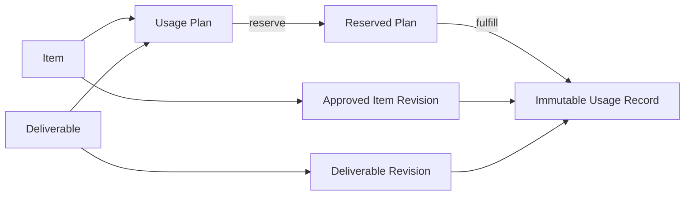

# Usage Ledger V0

Usage planning and actual usage are separate aggregates.

A plan can move `PLANNED -> RESERVED -> FULFILLED` or be cancelled before fulfillment. The
transition table rejects every other edge. Fulfillment locks the plan, pins a specific approved
or historically approved superseded Item Revision, and pins a Deliverable Revision. The actual
record is append-only and cannot follow a later current-revision pointer.

Placement uniqueness is enforced for plans and records. Reads use indexed Item, revision,
deliverable, status, and timestamp columns. At V0 scale, a B-tree-backed lookup is preferable to
a cache or search service. PostgreSQL triggers reject unapproved pointers and all Usage Record
updates/deletes. Replay is idempotent through the unique source plan pointer.

The alternative of deriving actual use from a fulfilled plan was rejected: plans may be
cancelled or amended, while publication history must remain immutable and independently auditable.
