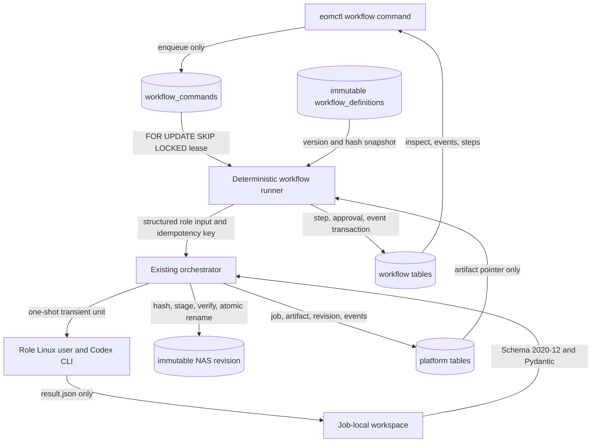
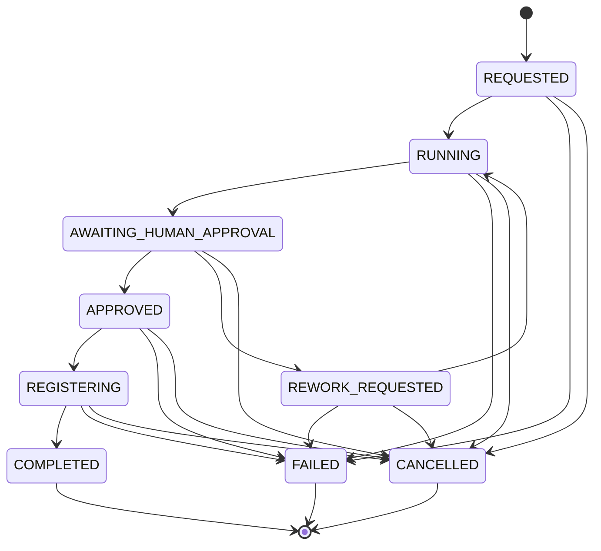

# Workflow Engine V0

## Scope

Workflow Engine V0 is a domain-neutral framework around the existing Platform Skeleton. It uses
only explicit placeholder request and result values. It does not implement scientific content,
real images, HWPX, GUI, Slack control, or external model APIs.

## Data Flow

Workers cannot access PostgreSQL, NAS, Docker, the repository, system configuration, or another
worker. They receive a read-only input, result schema, and placeholder prompt in their own local
workspace. The orchestrator remains the only component that validates worker output and commits to
NAS. Production packages do not import the development Slack reporter.

## State Machine

Workflow state and display stage are separate. The engine validates these state transitions:

The normal stages are `AUTHORING`, `IMAGE_REQUIRED` or `IMAGE_SKIPPED`, `REVIEWING`,
`AWAITING_HUMAN_APPROVAL`, `REGISTERING`, and `COMPLETED`. Step, approval, and command states have
their own explicit transition tables. No worker field is interpreted as a transition target.

## Definition Compilation

`generic-item-development@1.0.0` is validated before import. Compilation checks semantic version,
start and terminal steps, duplicate and unreachable steps, every transition target, worker role,
result schema, human roles and rework targets, limits, JSON Pointer syntax, and forbidden execution
fields. Canonical serialization produces a stable definition hash. PostgreSQL triggers prevent a
stored definition or instance snapshot from being rewritten.

## Persistence And Concurrency

Revision `20260815_0002` adds `workflow_definitions`, `workflow_instances`,
`workflow_step_runs`, `workflow_events`, `workflow_commands`, and `approval_requests`. One
transition transaction locks the workflow, updates command/workflow/step/approval rows, and appends
a workflow-local monotonic event. Codex and NAS I/O occur outside long DB transactions.

Runners claim commands with `FOR UPDATE SKIP LOCKED` and bounded leases. The default lease exceeds
the worker timeout and is renewed before each agent subprocess. Expired leased or processing
commands return to `PENDING` before a new claim. A step platform idempotency key hashes
workflow ID, step key, attempt, and definition hash. Reconciliation can therefore reuse an existing
terminal platform job without another Codex call or artifact.

## Rework And Final Pointer

Rework marks the target and downstream runs `SUPERSEDED`, creates a higher attempt, and retains all
old output pointer manifests and NAS revisions. Replacement step links make the audit chain
explicit. Runtime context retains the complete historical pointer list; the final pointer manifest
contains only the latest active authoring/image/review chain and registration revision.

## Role Contracts

Role input and output each have strict schemas under `schemas/workflow/roles`. The role protocol is
`workflow-role/1.0.1`; role result contracts remain `authoring-result@1.0`, `image-result@1.0`,
`review-result@1.0`, and `registration-result@1.0`. The first live schema correction advanced the
role protocol rather than changing the stored `workflow-role/1.0` schema hash.

The role mapping is authoring to `eom-cdx-01`, review to `eom-cdx-02`, image to `eom-cdx-03`, and
item management to `eom-cdx-04`. Support remains outside the normal path.
