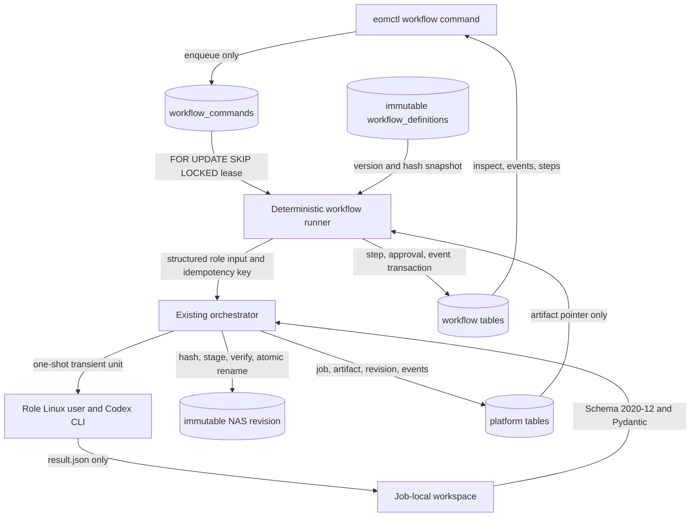
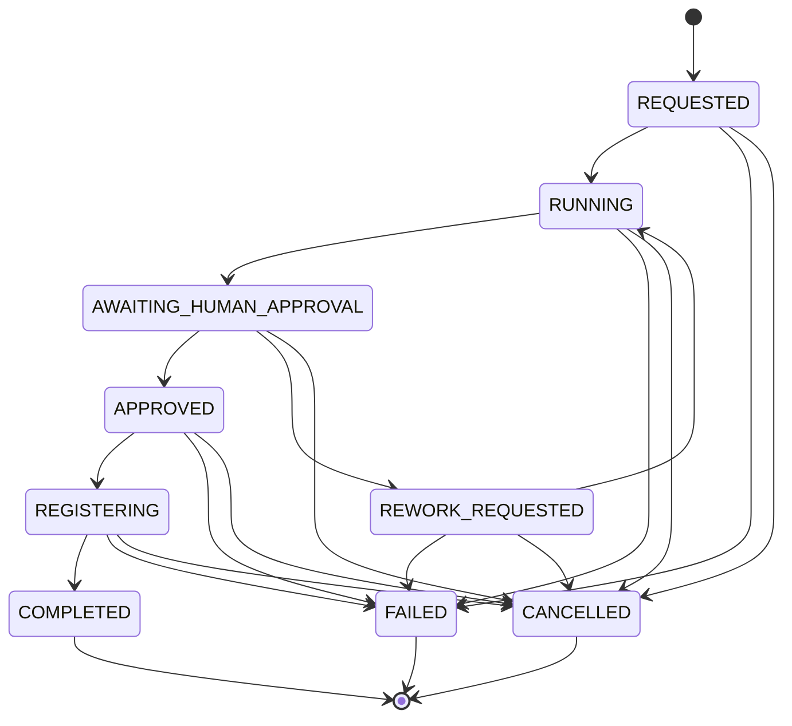
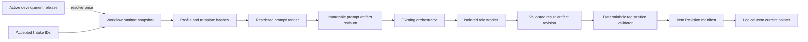

# Workflow Engine V0

## Scope

Workflow Engine V0 is a domain-neutral framework around the existing Platform Skeleton. It uses
only explicit placeholder request and result values. It does not implement scientific content,
real images, HWPX, GUI, Slack control, or external model APIs.

## Data Flow

Workers cannot access PostgreSQL, NAS, Docker, the repository, system configuration, or another
worker. They receive a read-only input, result schema, and placeholder prompt in their own local
workspace. The orchestrator remains the only component that validates worker output and commits to
NAS. Production packages do not import the development Slack reporter.

Production runtime composition and filesystem permissions are specified in
`WORKFLOW_EXECUTION_BOUNDARY.md`. The runner uses the mandatory Catalog adapter and a private-group
setgid handoff; it does not transfer workspace UID or require elevated capabilities.

## State Machine

Workflow state and display stage are separate. The engine validates these state transitions:

The normal stages are `AUTHORING`, `IMAGE_REQUIRED` or `IMAGE_SKIPPED`, `REVIEWING`,
`AWAITING_HUMAN_APPROVAL`, `REGISTERING`, and `COMPLETED`. Step, approval, and command states have
their own explicit transition tables. No worker field is interpreted as a transition target.

## Definition Compilation

`generic-item-development@1.0.0` is validated before import. Compilation checks semantic version,
start and terminal steps, duplicate and unreachable steps, every transition target, worker role,
result schema, human roles and rework targets, limits, JSON Pointer syntax, and forbidden execution
fields. Canonical serialization produces a stable definition hash. PostgreSQL triggers prevent a
stored definition or instance snapshot from being rewritten.

`generic-item-development@1.1.0` is a separate immutable definition. It retains the deterministic
graph while requiring the `eomctl` application boundary to resolve a Content Pack and registry
request before instance creation. Version 1.0.0 is unchanged and remains valid for platform-only
workflows.

## Content Pack And Registry Boundary

The snapshot stores release ID, pack key/version, bundle and manifest hashes, activation evidence,
all four profile versions/hashes, source Intake IDs, and the create/revise intent. Later activation
changes cannot affect it. Before each agent run, the adapter re-resolves that exact release and
profile, verifies all hashes, renders only declared dot-path variables, and commits `prompt.txt`
plus its prompt envelope as one artifact revision.

The worker input deliberately projects the larger workflow request back to `WorkerRequest`.
Pack activation, profile metadata, Intake provenance, and registry intent are not exposed as an
arbitrary JSON blob. The worker sees the rendered prompt and upstream immutable artifact pointers;
it does not read Git, Intake storage, PostgreSQL, or NAS.

After the item-management result is validated and committed, the catalog application service
resolves every component pointer and creates either revision 1 or a revision against the exact
requested base. Its idempotency key includes workflow, registration attempt, intent, and pinned
release hash. Terminal reconciliation therefore cannot create a second Item, revision, manifest,
or artifact.

## Persistence And Concurrency

Revision `20260815_0002` adds `workflow_definitions`, `workflow_instances`,
`workflow_step_runs`, `workflow_events`, `workflow_commands`, and `approval_requests`. One
transition transaction locks the workflow, updates command/workflow/step/approval rows, and appends
a workflow-local monotonic event. Codex and NAS I/O occur outside long DB transactions.

Runners claim commands with `FOR UPDATE SKIP LOCKED` and bounded leases. The default lease exceeds
the worker timeout and is renewed before each agent subprocess. Expired leased or processing
commands return to `PENDING` before a new claim. A step platform idempotency key hashes
workflow ID, step key, attempt, and definition hash. Reconciliation can therefore reuse an existing
terminal platform job without another Codex call or artifact.

Workflow submission identity and business equivalence are separate. `idempotency_key` identifies
one accepted submission, `request_hash` fingerprints the pinned definition and normalized request,
and `workflow_id` identifies one execution occurrence. A partial unique B-tree index on the
fingerprint applies only while the occurrence is REQUESTED, RUNNING, AWAITING_HUMAN_APPROVAL,
REWORK_REQUESTED, APPROVED, or REGISTERING. Equivalent active work is reused; FAILED and CANCELLED
remain immutable but do not poison later submissions. COMPLETED retains the V0 same-actor
deduplication policy. Concurrent insertion losers resolve the single committed active occurrence.

Before the locked claim, the runner checks whether work exists and evaluates execution readiness.
An infrastructure readiness failure leaves the command, attempt count, workflow state, and event
history unchanged. The same typed checks back `eom-workflow-runner doctor`, so doctor success is an
execution prerequisite rather than a configuration-only signal.

## Human Actor Authorization

API-created human commands preserve the authenticated canonical `operator_*` ID. At processing
time the runner's actor-authorization port reloads that Operator from the identity store, requires
ACTIVE state, and evaluates the current action-specific permission and workflow role. Static YAML
actors remain available for CLI and internal paths through a separate adapter. A composite routes
the two namespaces deterministically and never treats an unknown Operator as a static actor.

This second check is intentional defense in depth: disabling an Operator or revoking a role after
HTTP command creation but before runner processing denies the queued action. The production doctor
checks that both adapters, the identity repository, and the required permission catalog entries are
available without mutating identity or workflow state. See ADR 0033.

## Rework And Final Pointer

Rework marks the target and downstream runs `SUPERSEDED`, creates a higher attempt, and retains all
old output pointer manifests and NAS revisions. Replacement step links make the audit chain
explicit. Runtime context retains the complete historical pointer list; the final pointer manifest
contains only the latest active authoring/image/review chain and registration revision.
For 1.1.0 it also contains the pinned Content Pack snapshot and the resulting Item, Item Revision,
manifest artifact revision, and manifest SHA-256.

## Role Contracts

Role input and output each have strict schemas under `schemas/workflow/roles`. The role protocol is
`workflow-role/1.0.1`; role result contracts remain `authoring-result@1.0`, `image-result@1.0`,
`review-result@1.0`, and `registration-result@1.0`. The first live schema correction advanced the
role protocol rather than changing the stored `workflow-role/1.0` schema hash.

The role mapping is authoring to `eom-cdx-01`, review to `eom-cdx-02`, image to `eom-cdx-03`, and
item management to `eom-cdx-04`. Support remains outside the normal path.

`schemas/workflow` remains the protocol-first canonical editing location. The release wheel carries
an exact runtime mirror under `eom_workflow/resources`; `importlib.resources` is the only runtime
resolver. Tests and the Application API release inspector compare every mirrored byte to the
canonical schema, require the exact nine runtime schema names in the wheel and its `RECORD`, and
compile `generic-item-development@1.1.0` after installing the wheel into an isolated target. The
runtime therefore does
not derive a repository root from `__file__`, search the current directory, or require a source
checkout. A schema change is incomplete until its package resource mirror is updated and the drift
check passes.
