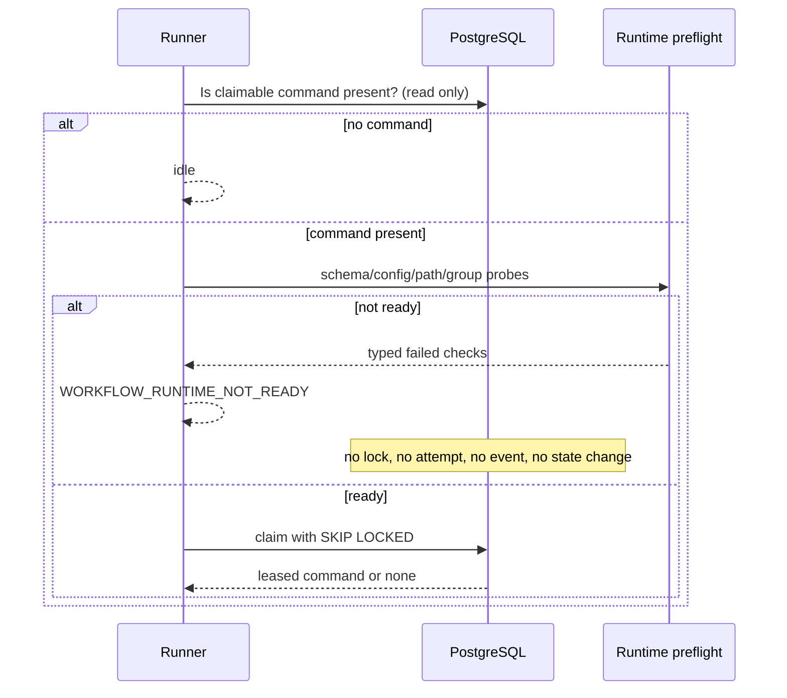

# Workflow Runtime Execution Boundary

## Responsibility

The Application API persists typed workflow commands. It does not stage prompts, create worker
workspaces, invoke Codex, or commit artifacts. An unprivileged `eom` workflow runner owns that
execution boundary and composes the workflow repository, Catalog adapter, orchestrator, worker
registry, and immutable workflow definition.

```mermaid
flowchart TD
  API[Application API] -->|typed command| DB[(PostgreSQL)]
  DB -->|read-only pending inspection| READY[Execution readiness]
  READY -->|ready, then claim| RUNNER[eom workflow runner]
  RUNNER --> CATALOG[Catalog application adapter]
  CATALOG --> STAGE[/srv/eom/staging/catalog]
  RUNNER --> ORCH[Orchestrator]
  ORCH --> WG[worker private-group workspace]
  WG --> UNIT[systemd-run as eom-cdx-N]
  UNIT --> RESULT[group-readable result]
  RESULT --> ORCH
  ORCH -->|validated artifact pointer| RUNNER
```

The composition root is `build_workflow_runtime()`. Production callers use it rather than
constructing a partially configured `WorkflowRunner`. Catalog is mandatory; test adapters remain
explicit and test-scoped.

## Canonical Paths And Ownership

Catalog prompt artifacts are temporary materializations. PostgreSQL metadata, immutable artifact
revisions, and their hashes remain canonical. `/srv/eom/staging/catalog` is owned by `eom:eom` with
mode `0750`; the API service does not write it.

Each worker has one workspace root:

| Path | Owner | Group | Mode |
| --- | --- | --- | --- |
| `/srv/eom/workspaces/eom-cdx-N` | `eom-cdx-N` | `eom-cdx-N` | `2770` |

`eom` is an intentional supplementary member of each private worker group. It creates one job
directory beneath the selected root, changes only the group to a group it already belongs to, and
sets mode `2770`. Input files use `0640`. The setgid bit pins group inheritance. The transient
worker uses `UMask=0007`, and a worker-side finalizer makes the validated result `0640` before the
worker exits. Another worker is not a member of that group and cannot traverse the job directory.

Cross-UID ownership transfer is prohibited. The normal path needs no root, `sudo`, `CAP_CHOWN`, or
`CAP_FOWNER`. The only ownership call uses UID `-1` and changes a path to an existing supplementary
group, constrained to the newly created job directory.

## Pre-Claim Readiness

The dominant access pattern is a keyed/read-only check for pending or expired-leased commands,
followed by a short locked claim. The database queue remains ordered by `(created_at, command_id)`
and continues to use `FOR UPDATE SKIP LOCKED` for concurrent claims.



Readiness verifies the mandatory Catalog adapter, Catalog staging metadata and a bounded
create/delete probe, workflow schemas and definition, worker registry, Linux user/private group,
the current process group snapshot, worker workspace metadata and probe, worker HOME metadata,
Codex, `systemd-run`, and the runner Python executable. It never invokes Codex, reads worker auth,
uses `sudo`, or writes a workflow record.

A session whose configured account groups contain a required private group but whose process group
snapshot does not returns `WORKER_GROUP_MEMBERSHIP_STALE`. The operator must start a new login or
tmux context. A readiness failure exits `run-once` with status 3 and causes `serve` to wait and retry
without consuming work.

## Data And Concurrency Design

| Access pattern | Structure | Cost and concurrency |
| --- | --- | --- |
| Worker lookup | validated registry plus keyed role selection | small bounded registry |
| Group membership | integer `set` | O(1) membership, process snapshot |
| Pending inspection | indexed command query | O(log n) index lookup, no lock |
| Command claim | ordered PostgreSQL queue | row lock with skip-locked |
| Probe cleanup | unique job-local directory | bounded O(1) files |
| Artifact handoff | typed immutable pointer | no binary database copy |

Readiness is deliberately not cached across commands because group membership and filesystem
permissions are operational state. Five configured workers make the bounded account and path checks
small. A long-lived cache would weaken correctness without measurable benefit.

## Failure And Idempotency

Infrastructure readiness failure is not a domain failure. It creates no workflow event and does not
increment command attempts. Once ready, existing command leases and step/job idempotency remain the
authoritative concurrency controls. A worker or validated domain execution failure after claim uses
the existing terminal behavior. FAILED workflows remain immutable audit evidence; this boundary
does not add retry or resurrection states.

The simpler alternative of running the runner as root or granting `CAP_CHOWN` was rejected because
it expands every job's authority. A privileged handoff daemon was also unnecessary: the existing
one-private-group-per-worker model provides the required bidirectional file access with ordinary
Unix permissions.
