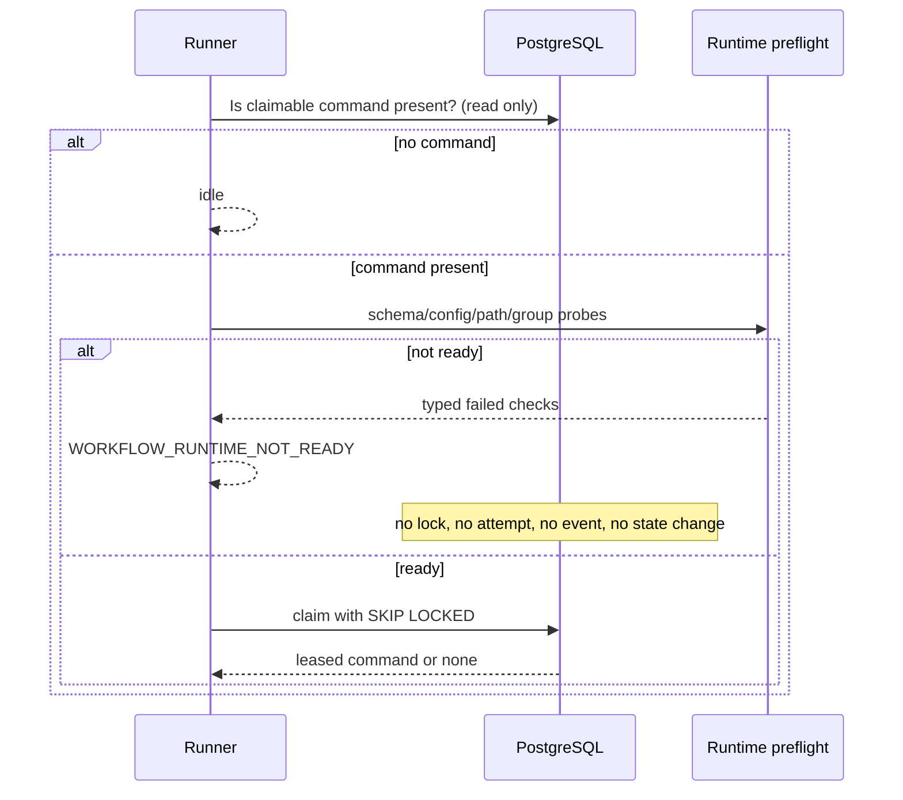

# Workflow Runtime Execution Boundary

## Responsibility

The Application API persists typed workflow commands. It does not stage prompts, create worker
workspaces, invoke Codex, or commit artifacts. An unprivileged `eom-workflow-runner` service owns that
execution boundary and composes the workflow repository, Catalog adapter, orchestrator, worker
registry, and immutable workflow definition.

```mermaid
flowchart TD
  API[Application API] -->|typed command| DB[(PostgreSQL)]
  DB -->|read-only pending inspection| READY[Execution readiness]
  READY -->|ready, then claim| RUNNER[eom-workflow-runner service]
  RUNNER --> CATALOG[Catalog application adapter]
  CATALOG --> STAGE[/srv/eom/staging/catalog fixed roots]
  RUNNER --> ORCH[Orchestrator]
  ORCH --> OSTAGE[runner-private job staging]
  ORCH --> WG[worker private-group workspace]
  WG --> UNIT[fixed systemd template for slot N]
  UNIT --> EXEC[root-owned eom-worker-exec]
  EXEC --> RESULT[group-readable result]
  RESULT --> ORCH
  ORCH -->|validated artifact pointer| RUNNER
```

The composition root is `build_workflow_runtime()`. Production callers use it rather than
constructing a partially configured `WorkflowRunner`. Catalog is mandatory; test adapters remain
explicit and test-scoped.

## Canonical Paths And Ownership

Catalog prompts, Content Pack builds, and registration manifests are temporary materializations.
PostgreSQL metadata, immutable artifact revisions, and their hashes remain canonical.
`/srv/eom/staging/catalog` and each declared fixed child are owned by `eom:eom` with mode `0750`;
the API service does not write these paths.

Orchestrator result/log staging is separate from the operator-owned Catalog tree. The long-running
runner uses `/var/lib/eom-workflow-runner/orchestrator-staging`, owned by
`eom-workflow-runner:eom` with mode `0700`. Job IDs provide exclusive operation-local children.
Workers and operator tools do not consume this path, and `/srv/eom/staging` is inaccessible from
the runner sandbox. Readiness verifies exact metadata and a bounded create/read/delete probe before
claiming a command.

The typed Catalog inventory and privileged bootstrap jointly define the fixed roots:

| Fixed root | Runtime materialization |
| --- | --- |
| `content-packs` | immutable-hash keyed Content Pack build directories |
| `registry` | registration-keyed manifest directories |
| `workflow-prompts` | workflow, step, and attempt prompt directories |

Runtime code requires each fixed root to exist and never creates or normalizes it. The runner
creates only these bounded dynamic directories beneath `workflow-prompts`:

```text
/srv/eom/staging/catalog/workflow-prompts/
  <workflow_id>/
    <step_key>-<attempt>/
      prompt.txt
      prompt-envelope.json
```

Registration creates one exclusive child beneath `registry` and never overwrites an existing
manifest. Content Pack import creates a hash-keyed child beneath `content-packs`. Intake IDs and
Catalog artifact job IDs are dynamic materializations directly beneath the Catalog parent, not
additional fixed roots. All operation children are constrained to their validated parent. Only the
orchestrator commits validated artifacts to NAS.

Each worker has one workspace root:

| Path | Owner | Group | Mode |
| --- | --- | --- | --- |
| `/srv/eom/workspaces/eom-cdx-N` | `eom-cdx-N` | `eom-cdx-N` | `2770` |

`eom` is an intentional supplementary member of each private worker group. It creates one job
directory beneath the selected root, changes only the group to a group it already belongs to, and
sets mode `2770`. Input files use `0640`. The setgid bit pins group inheritance. The fixed worker
template uses `UMask=0007`, and a worker-side finalizer makes the validated result `0640` before
the worker exits. Another worker is not a member of that group and cannot traverse the job
directory.

Cross-UID ownership transfer is prohibited. The normal path needs no per-job root, `sudo`,
`CAP_CHOWN`, or `CAP_FOWNER`. The only ownership call uses UID `-1` and changes a path to an
existing supplementary group, constrained to the newly created job directory. Root participates
only when an operator installs the reviewed unit, helper, and polkit sources.

## Fixed systemd launch contract

The five root-owned templates are `eom-worker-01@.service` through
`eom-worker-05@.service`. The instance is a canonical `job_[0-9a-f]{32}` ID. The runner can request
only `systemctl --no-ask-password --wait start <fixed-instance>`; it cannot choose a user, group,
command, environment, capability, path, or systemd property. The installed
`/usr/local/libexec/eom-worker-exec` is also root-owned and runs with root-owned
`/usr/bin/python3 -I`; it imports no EOM package from an `eom`-writable environment. It
independently validates the
slot, job ID, effective identity, workspace containment, file types/modes/groups, worker HOME, and
root-owned Codex executable before invoking the fixed Codex CLI.

| Previous transient property | Fixed-template equivalent | State and reason |
| --- | --- | --- |
| generated `eom-worker-<job>` unit | `eom-worker-<slot>@<job>.service` | changed; slot and canonical job identity are explicit |
| `--uid` / `--gid` | `User=` / `Group=` in each root-owned template | retained and no longer caller-selectable |
| `--working-directory` | fixed slot root plus validated `%i` | retained with independent containment check |
| `HOME`, `CODEX_HOME`, `PATH` | fixed `Environment=` plus helper allowlist | strengthened; caller environment is ignored |
| `NoNewPrivileges=yes` | `NoNewPrivileges=true` | retained |
| `ProtectSystem=strict` | `ProtectSystem=strict` | retained |
| `ProtectHome=read-only` | `ProtectHome=read-only` | retained |
| `PrivateTmp=yes` | `PrivateTmp=true` | retained |
| NAS, Docker, Git, `/etc/eom`, staging denial | fixed `InaccessiblePaths=` | retained; EOMIS and other worker paths are also denied |
| workspace and worker HOME writes | fixed slot-specific `ReadWritePaths=` | retained; no arbitrary path argument |
| `UMask=0007` | `UMask=0007` | retained |
| `MemoryMax=6G` | `MemoryMax=6G` | retained |
| `CPUQuota=200%` | `CPUQuota=200%` | retained |
| `TasksMax=256` | `TasksMax=256` | retained |
| client timeout and `systemctl stop` | standard server `TimeoutStartSec=1800`, client guard at 1830s | changed; no `stop` authorization is required |
| `--pipe` capture | bounded workspace stdout/stderr files | changed; correctness depends only on result/status protocols |
| `--collect` | oneshot process ends; status remains queryable | changed; no process lingers and exit metadata remains available |
| implicit capability/address policy | empty capabilities, kernel-module/control-group/SUID/personality/realtime/device/host/clock guards, fixed address families, nested-sandbox-owned proc/sys boundary | strengthened without blocking Codex sandbox construction or network access |

The fixed worker address-family allowlist includes `AF_NETLINK` solely because Bubblewrap uses a
route netlink socket to configure loopback inside the worker's private sandbox network namespace.
It does not include `AF_PACKET` or grant host-network access; the resolved Codex sandbox remains
responsible for the workload's network policy. The capability bounding, permitted, effective, and
ambient sets all remain empty; the deployer proves the latter three sets before every model-free
Bubblewrap smoke.

The outer fixed unit explicitly leaves `ProtectKernelTunables` disabled. Enabling that systemd
mount namespace prevents Codex's nested Bubblewrap from mounting its private `/proc`. This does not
give the worker permission to modify host tunables: it remains an unprivileged identity with no
capabilities and `NoNewPrivileges`, while the AppArmor-authorized Bubblewrap sandbox creates the
private proc/sys view used by the workload. Kernel modules and control groups remain protected, and
the fixed unit keeps its explicit inaccessible-path boundary.

Ubuntu 24.04 restricts the additional namespaced capabilities used by unprivileged sandbox
constructors. The root-owned `eom-codex-bwrap` AppArmor profile therefore adds only `userns,` to
Codex's bundled Bubblewrap executable. The global user-namespace restriction stays enabled. The
commit-pinned worker runtime deployer validates and loads this profile, proves the worker has no
granted host capability, then runs Bubblewrap under the same address-family and empty-capability
restrictions without contacting a model or executing a job.

The installed systemd 255/polkit 124 mechanism exposes `unit` and `verb` for `StartUnit()`. The
root-owned rule grants `eom-workflow-runner` only `verb=start` for fully anchored worker and harmless
probe instances; the interactive `eom` operator may start only a harmless probe. It explicitly
denies cross-manager and other `manage-units` requests. It grants no transient-unit,
restart, stop, unit-file, daemon-reload, or arbitrary service permission. If the installed server
cannot demonstrate these action details, deployment stops and requires a separately reviewed
narrow broker; a broad rule is never a fallback.

## Pre-Claim Readiness

The dominant access pattern is a keyed/read-only check for pending or expired-leased commands,
followed by a short locked claim. The database queue remains ordered by `(created_at, command_id)`
and continues to use `FOR UPDATE SKIP LOCKED` for concurrent claims.



Readiness verifies the mandatory Catalog adapter, the parent and all three fixed Catalog staging
directories with separate bounded create/read/delete probes, workflow schemas and definition,
worker registry, Linux user/private group, the current process group snapshot, worker workspace
metadata and probe, worker HOME metadata, Codex, `systemctl`, exact root-owned helper/template
hashes, and the runner Python executable. It then starts one fixed `/usr/bin/true` authorization
probe per enabled slot and
requires successful exit with no lingering process. It never invokes Codex, reads worker auth,
uses `sudo`, accesses NAS, or writes a workflow record. A missing, linked, stale, incorrectly
owned, incorrectly permissioned, or unauthorized worker template returns
`WORKER_SYSTEMD_TEMPLATE_INVALID` or `WORKER_SYSTEMD_AUTHORIZATION_DENIED` before the command
claim.

A session whose configured account groups contain a required private group but whose process group
snapshot does not returns `WORKER_GROUP_MEMBERSHIP_STALE`. The operator must start a new login or
tmux context. A readiness failure exits `run-once` with status 3 and causes `serve` to wait and retry
without consuming work.

## Data And Concurrency Design

| Access pattern | Structure | Cost and concurrency |
| --- | --- | --- |
| Worker lookup | validated registry plus keyed role selection | small bounded registry |
| Group membership | integer `set` | O(1) membership, process snapshot |
| Pending inspection | indexed command query | O(log n) index lookup, no lock |
| Command claim | ordered PostgreSQL queue | row lock with skip-locked |
| Probe cleanup | unique job-local directory and fixed systemd probe instance | bounded O(1) files/oneshot units |
| Artifact handoff | typed immutable pointer | no binary database copy |

Readiness is deliberately not cached across commands because group membership, filesystem
permissions, installed unit hashes, and authorization policy are operational state. Five
configured workers make the bounded account, path, and `/usr/bin/true` checks small. A long-lived
cache would weaken correctness without measurable benefit.

## Failure And Idempotency

Infrastructure readiness failure is not a domain failure. It creates no workflow event and does not
increment command attempts. Once ready, existing command leases and step/job idempotency remain the
authoritative concurrency controls. A worker or validated domain execution failure after claim uses
the existing terminal behavior. FAILED workflows remain immutable audit evidence; this boundary
does not add retry or resurrection states.

The alternatives of running the runner as root, granting `CAP_CHOWN`, granting broad
`org.freedesktop.systemd1.manage-units`, or permitting arbitrary transient units are rejected
because they expand every job's authority. A narrow root-owned broker remains the fail-closed
fallback only when an installed systemd/polkit version cannot safely filter `StartUnit()` by both
unit and verb.
